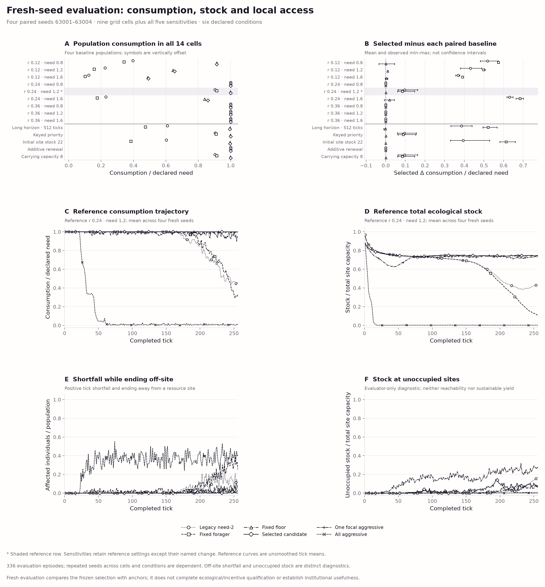
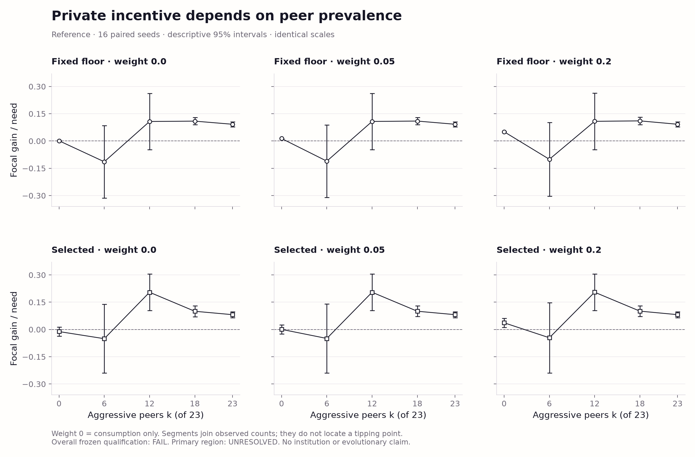
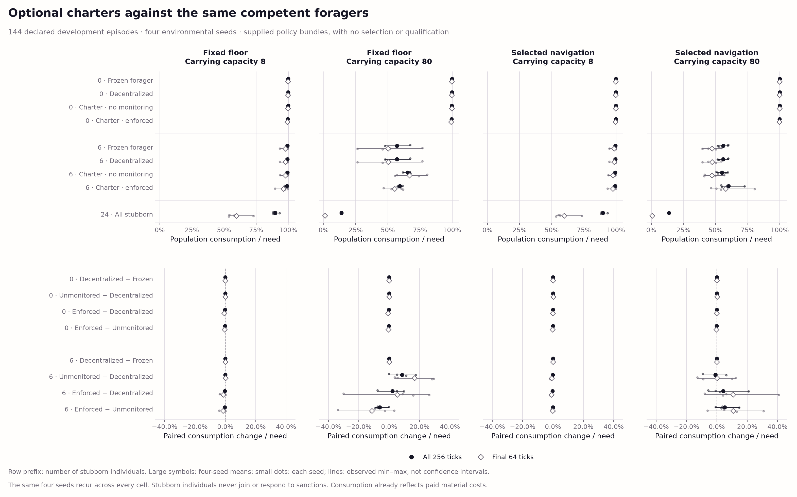

# Swarm Societies: A Research Testbed for Resources and Institutions

**Living research report · 7 October 2026**

The new commons implements mobile individuals, local sensing and stock-dependent
renewal. A separate political extension now supplies optional local institutions,
voluntary collateral and paid monitoring, with no supranational government.
Its first 144-episode development comparison finds no robust advantage for the
supplied enforced charter. Gains under high storage and mixed aggression vary
by seed and cohort; the decentralized comparator scarcely communicates.
The earlier studies remain frozen. Both fresh qualification banks
are complete: ecological viability is witnessed in five of nine cells, but
the primary joint verdict is unresolved and robust incentive qualification
fails. A new controller version now implements paid route coordination and
payoff-responsive membership, checked on constructed fixtures. The evening
review pauses comparator refinement: restrained members lack a qualified
consumption temptation, harmful outsiders are beyond charter sanctions, and
no agent adapts. The new research question is **when local exclusion conventions
emerge, what they gain members, and what they cost outsiders across storage and
scarcity**. A separate costly guarding/resistance extension now implements the
physical mechanism. Local numerical adaptation and endogenous storage value
come next; emergence and welfare benefits remain untested. No model calls.

[Study index](docs/study-index.md) ·
[Detailed archived report](docs/living-research-report-2026-10-07.md) ·
[Scientific review](docs/research-review-2026-10-07.md) ·
[Incentive results](docs/commons-v3-incentive-qualification-results-v1.md) ·
[Latest review response](docs/commons-v3-review-2026-10-07.md) ·
[Research state and next steps](docs/research-state-and-next-steps-v1.md) ·
[Political capability contract](docs/commons-v3-institutions-contract-v1.md) ·
[Institutional development results](docs/commons-v3-institutions-development-v1.md) ·
[Coordination and membership v2](docs/commons-v3-coordination-membership-v2.md) ·
[Evening steering and exclusion extension](docs/commons-v3-exclusion-conventions-v1.md) ·
[Physical commons](docs/commons-v3-foundation-v1.md) ·
[Need-targeted baselines](docs/commons-v3-need-v1.md) ·
[Local navigation and numerical baselines](docs/commons-v3-navigation-v1.md) ·
[Separate qualification protocols](docs/commons-v3-ecology-qualification-protocol-v1.md) ·
[Implementation plan](docs/commons-v3-plan.md) ·
[Current checkpoint](PROGRESS.md)

## Abstract

When do local exclusion conventions emerge, what do they gain members and
what do they cost outsiders, as storage and scarcity change? Swarm Societies
develops executable environments for this question. Its current experiments
establish accounting, program replacement, parameter learning and controlled
information sharing. **They do not establish an advantage for evolved
governance:** an exploratory simple-harvesting baseline improves all four
reported focal averages over the saved coevolved population, while slightly
reducing outsiders' welfare. Numerical controls show supplied-law learning,
a small allocation benefit dominated by wealth, and no clear active-selection
benefit in posterior-update value. The new spatial prototype supports local
depletion. Purposeful local foraging with a voluntary stock floor now sustains
near-reference demand over longer runs; an 18-candidate numerical selection
improves only slightly over the fixed-floor baseline. Private gains remain
sensitive to storage, terminal inventory and environment. A separately frozen,
16-seed ecological panel now witnesses finite-horizon viability in five of
nine cells, certifies insufficient supply in two and leaves two unresolved.
The separate 3,360-episode incentive bank leaves the common adjacent-region
verdict unresolved and fails the broader robustness criterion. At the
reference, 89.83% of the fixed-floor control's mean private gain at weight
0.05 is terminal inventory; the selected control's mean consumption gain is
negative. Consumption incentives depend on aggressive-peer prevalence.
These findings motivate an assurance/tipping-point hypothesis; they establish
neither a robust consumption temptation nor a strict stag-hunt classification.
The first prospective optional-charter comparison adds 144 episodes on four
fresh seeds. The enforced-charter bundle lowers consumption relative to the
decentralized controller in every seed of six of eight contexts. The two
positive context means have adverse seeds, and one lowers
consumption for the original eligible cohort. Rare decentralized communication,
absent exits and limited external monitoring leave institutional superiority
and its mechanism unresolved. The tested members are already restrained,
outsiders cannot be physically excluded and neither type adapts. A new versioned
extension supplies costly local guarding with costly resistance and separate
member/outsider accounting. Its constructed fixtures verify physical effects,
including harmful guarding; adaptive convention formation has not been tested.

## 1. Research question and present scope

In the legacy studies, members pursue private utility; institutions are selected for their own society's
welfare. No higher-level objective governs relations between societies. This
separation permits local gains and external harm to coexist, but does not by
itself create a consequential social dilemma or demonstrate collective
intelligence.

The world separates **physical location, political membership and claimed
jurisdiction**. The separately versioned political extension implements optional
founding, refusal, joining, exit, amendment, replacement and dissolution. Zero
institutions and failed cooperation remain valid outcomes. In that first version, local claims grant
no extraction priority or power over outsiders. Paid monitoring and settlement
can reach only voluntarily pledged collateral under supplied secure-custody
rules. These are implemented capabilities, not evidence of spontaneous formation
or useful governance. [Contract and limitations](docs/commons-v3-institutions-contract-v1.md).

The separate [v2 controller/runtime](docs/commons-v3-coordination-membership-v2.md)
adds paid remembered-site and route-intention messages, directly observed return
anchors, and an explicit own-outcome receipt supplied equally to every controller.
Local forecast/liquidity rules govern entry; repeated own shortfall, private
charges or a better outside forecast can trigger exit. The constructed demo
checks consequential route changes, actual exit and delayed refunds with full
continuation. It does not measure a population welfare improvement or establish
binding nonmembership commitment parity.

The [evening steering and new extension](docs/commons-v3-exclusion-conventions-v1.md)
pause further comparator/mechanism splitting. Physical exclusion now requires
paid, stationary guarding that forgoes harvest; resistance costs resources and
finite guard effort is divided across competing outsiders. Any individual can
guard, while opening affiliation determines shared protection at a claimed site.
A claim alone does nothing. The active sequence is physical exclusion, local
numerical imitation, then starvation/capability consequences under shocks.
The target is an eight-page ALIFE 2027 paper; it is not a claim of completed
research or publication. The completed bank remains closed.

## 2. Related work

The independent simulator and upstream ShinkaEvolve engine draw on resource
worlds, multilevel economic adaptation, program evolution and probabilistic
world models. The [literature review](docs/world-model-literature.md),
[scientific review](docs/research-review-2026-10-07.md) and
[archived references](docs/living-research-report-2026-10-07.md#7-references)
record attribution and scope. This is not a SwarmWorld reproduction.

## 3. Environment and methods

Legacy members harvest, transfer resources, guard, rest or raid. Institutions control
taxation, investment, redistribution, raid permission and reporting. A trusted
simulator resolves actions and accounts for renewal, consumption, transfers,
destruction and investment. Private utility is consumption plus 0.2 times
terminal wealth. Consumption-v2 welfare is
`0.85 − 1.5 × unmet need/member/tick` at the default consumption need of 0.85;
welfare and shortfall therefore measure the same primitive outcome.
[Environment specification](docs/model.md).

The [new physical engine](docs/commons-v3-foundation-protocol.md) has 24 mobile
individuals and 16 sites on a 12×12 grid. It implements local extraction,
consumption, transfers, costly messages and stock-dependent renewal with
recovery. Actions commit simultaneously; ledgers record every material flow.
Its development policies are audited local heuristics. There are no institutions,
affiliations, mortality or evolutionary searches in these banks.

The subsequent [ecological](docs/commons-v3-ecology-qualification-protocol-v1.md)
and [incentive](docs/commons-v3-incentive-qualification-protocol-v1.md)
protocols retain both the fixed floor and the earlier numerical winner. They
were frozen and pushed before either fresh seed set ran. Ecology uses 512 ticks
and 16 seeds per cell; incentives use 16 different seeds and matched focal
substitutions at 0, 6, 12, 18 and 23 aggressive peers. A prespecified family
of 194 scalar Student-t intervals with Bonferroni correction governs the gates.
Coverage is approximate and model-based; seeds are the replication units.
Storage, horizon, initial-stock, contention and utility sensitivities are
separately reported. [Conservative physical certificates](docs/commons-v3-feasibility-v1.md)
can prove insufficient supply; a permissive upper bound cannot prove feasible
local control.

Historical search accepts member replacements for private gains and institutions
for society gains on fixed cases. The pilot has one run per arm; transplants
estimate conditional component effects within its lineage. The later exploratory
baseline audit did not influence search.

The world-model controls estimate three coefficients of a supplied renewal
equation. They retain 1,024 particles and four rejuvenation sweeps, explicit
noisy observations and protected forecasts. Reporting preserves event provenance,
deduplicates evidence and charges matched serialized bytes. The allocation and
experiment controls hold planners and action menus fixed. Their intervals
resample independent arenas; members, branches, particles and repeated queries
are dependent observations. [Methods and protocols by study](docs/study-index.md).

## 4. Experiments and results

The legacy studies' strongest diagnostic is the missing-baseline problem. A reconstructed
policy harvests the fullest visible patch with no tax, investment or raids.
On the existing mechanism panel:

| Drought outcome | Initial | Coevolved | Simple harvest |
| --- | ---: | ---: | ---: |
| Focal consumption welfare ↑ | 0.844263 | 0.846926 | **0.848654** |
| Unmet need/member/tick ↓ | 0.003825 | 0.002050 | **0.000897** |
| Focal private utility/member/tick ↑ | 0.933662 | 0.965109 | **1.038674** |
| Outward raid loss/society/tick ↓ | 0.602067 | 0.534878 | **0** |
| Other societies' mean welfare ↑ | 0.847117 | 0.846872 | 0.845842 |

These means cover 12 environment/timing tuples, 108 focal scenarios and 216
paired drought/no-drought rollouts, with **zero new searches or model calls**.
Simple harvesting raises private utility by 7.62% versus coevolution, but reduces
outsiders' welfare by 0.001030. Focal welfare improves/ties/worsens in 23/84/1
scenarios. This bundled replacement does not isolate raid removal, establish
universal dominance or eliminate ecological externalities.


*Figure 1. Recorded drought means, with separate axis ranges and condition
markers. Means describe one saved evolutionary lineage; they are not independent
search replications. [Evidence](evidence/baseline-review-v1/README.md) and
[captions, exact means, SVG/PDF/PNG exports and hashes](figures/baseline-review-v1/README.md).*

The remaining studies establish controls and limitations that the redesign
must preserve:

| Study and replication | Supported result |
| --- | --- |
| [Initial evolution](docs/first-study-report.md): one search run | Direct infrastructure reward raised the score while post-drought shortfall increased and private utility fell 9.65%. |
| [Consumption pilot](docs/consumption-v2-run.md): one run per arm | Coevolution improved welfare by 0.000833 over member-only search, with 65.2% more raid harm and 1.8% lower private utility. |
| [Program transplants](docs/mechanism-study.md): one saved lineage, 864 rollouts | Institutional harm depended on the member background; positive welfare complementarity remained unresolved. |
| [Parameter learning](docs/world-model-v1.md): 24 arenas | Private final predictive CRPS fell from 0.9422 to 0.2496. Pooling supplied three times the evidence. |
| [Calibration](docs/world-model-calibration-v1.md): 128 prior-predictive datasets + 64 ecological arenas | All 192 references qualified. More compute modestly improved agreement at 4–5 times the fitting cost. |
| [Private sharing](docs/world-model-sharing-v1.md): 24 arenas | Complementary reports improved time-average CRPS by 0.68% at matched bytes; the terminal contrast remained unresolved and equal-evidence scores favored isolated/redundant members. |
| [Allocation decisions](docs/world-model-decision-v1.md): 24 arenas | Learned-minus-prior utility was +0.021110 [0.009014, 0.033678] per member; 85.7% came from weighted terminal wealth. |
| [Costed experiments](docs/world-model-experiment-v1.md): 24 arenas | Active-minus-random posterior-update value was −0.000969 [−0.005181, 0.002920]. A small total gain was already present with frozen coefficients. |

Bracketed ranges are paired 95% whole-arena bootstrap intervals. All numerical
world-model studies used zero evolutionary searches. Separate development gates,
negative controls, secondary endpoints and complete tables remain in the
[study index](docs/study-index.md) and linked reports.

The separate [spatial development study](docs/commons-v3-foundation-v1.md)
contains two preserved banks of 56 configurations and 224 episodes each, using
the same four seeds. The first exposed a floating-point return-fuel trap in the
navigation policy. The repaired second version recorded zero unaffordable-return
violations; it remains development data, not fresh qualification.

At the reference cell, restrained agents consume **1.200000** per agent-tick
versus **0.229769** for the greedy heuristic. A single greedy replacement gains
**zero consumption**; its **0.010685** utility gain at terminal-wealth weight
0.05 comes entirely from inventory, while peers lose **0.100769** consumption
per agent-tick. Reducing carrying capacity from 80 to 8 shrinks that private gain
to **0.000252** and removes peer consumption losses. Greedy terminal ecological
stock remains **66.70%** of capacity: local depletion and access failures coexist
with unused resources. These are descriptive means, not confidence claims.
[Recorded figures, tables and provenance](figures/commons-v3-foundation-v2/README.md).

The separate [need-targeted baseline study](docs/commons-v3-need-v1.md) adds
224 episodes on the same 56 development configurations. At capacity 80,
targeting current need with zero/two ticks of usable buffer raises reference
consumption to **1.123083/1.137248**. Greedy focal replacements now gain
**0.105842/0.095690** consumption per tick while peers lose
**0.336463/0.287450**. However, population consumption falls to
**0.798804/0.804615** at 512 ticks, and two-tick reserves reduce consumption
by **0.254884** relative to zero reserves with lower initial stock. These
reused-seed policy comparisons leave navigation and qualification unresolved.


*Recorded four-seed development means, with saved v2 controls and unsmoothed
reference trajectories. [Complete effects, sensitivities and provenance](figures/commons-v3-need-v1/README.md).*

The [navigation and numerical-baseline study](docs/commons-v3-navigation-v1.md)
adds purposeful observed-map routes, paid route-fuel saving and a finite sweep
of buffers, stock floors and routing rules. Its 18 candidates use two tuning
seeds; selection was frozen and pushed before evaluation on four disjoint
seeds. The **660 episodes** are numerical evaluations, with **zero independent
evolutionary runs or experimental model calls**. At reference need 1.2:

| Fresh-seed population consumption per agent-tick | Reference | 512 ticks | Initial stock 22 |
| --- | ---: | ---: | ---: |
| Legacy need-2 | 1.083741 | 0.731003 | 0.723430 |
| New forager, no floor | 1.097344 | 0.568493 | 0.460814 |
| Fixed half-capacity floor | 1.197891 | **1.195943** | 1.195711 |
| Selected: buffer 4, floor 0.5, nearest route | **1.199410** | 1.193929 | **1.195932** |
| All aggressive | 0.163314 | 0.086676 | 0.096235 |

The selected controller averages **88.01% of need** across the fresh grid,
versus **87.61%** for the fixed floor and **65.30%** for legacy need-2. Its
worst cell still meets only **49.28%** of need. At the reference, focal aggression
gains **0.006815** consumption and **0.021253** private utility at weight 0.05;
**67.93%** of that utility gain is terminal wealth. Peers lose **0.017507**
consumption. All-aggressive terminal stock is only **0.173%** of capacity,
unlike the earlier greedy policy's large unused stock. But capacity 8 removes
the mean peer consumption loss, and one high-need focal case loses
**0.567094** consumption per tick. Four-seed ranges remain descriptive;
selection within this controller family is not a private optimum or a
qualified social dilemma.



*All nine grid cells and five sensitivities, with paired observed ranges and
unsmoothed reference trajectories. [Candidate scores, aggressive effects,
complete CSVs and SVG/PDF/PNG provenance](figures/commons-v3-navigation-v1/README.md).*

The completed ecological qualification bank contains **288 episodes** on
16 fresh seeds per cell. Both controls pass all five ecological criteria in
the same five cells, including two adjacent pairs containing the reference:

| Renewal rate | Need 0.8 | Need 1.2 | Need 1.6 |
| --- | --- | --- | --- |
| 0.12 | Feasibility unresolved | Certified insufficient | Certified insufficient |
| 0.24 | Witnessed viable | Witnessed viable | Feasibility unresolved |
| 0.36 | Witnessed viable | Witnessed viable | Witnessed viable |

At reference need 1.2, fixed/selected mean consumption is
**1.192293/1.196167** per agent-tick; final-quarter consumption is
**1.184978/1.190646**. Late ecological stock averages about **74.1%** of
capacity, with no depleted-site time. For the two certified cells, the
conservative 512-tick supply ceiling meets at most **77.50%/58.13%** of need,
below the 95% target even under relaxed access assumptions. The other two
failed cells remain unresolved: policy failure is not an impossibility proof.
These are finite-horizon ecological findings. The separate incentive bank is
complete, with 16 different seeds and **3,360 episodes**. Its primary
common-adjacent-pair verdict is **unresolved** and broader qualification
**fails**. Every preregistered cell, sensitivity and peer curve is retained in
the [incentive results](docs/commons-v3-incentive-qualification-results-v1.md).

| Reference focal contrast per tick | Fixed floor | Selected |
| --- | ---: | ---: |
| Consumption gain, zero aggressive peers | +0.001687 | −0.013786 |
| Private gain, weight 0.05, zero aggressive peers | +0.016593 | +0.000712 |
| Consumption gain / need, 23 aggressive peers | +0.092202 | +0.081452 |

These are means of paired focal substitutions. Inventory accounts for
**89.83%** of fixed-floor reference utility gain. Reference robustness fails
at **all three weights (0, 0.05, 0.2)**; capacity 8 fails the private-gain
threshold for both controls at every weight. The strong gain against aggressive
peers motivates a prevalence-dependent coordination question. Tiny or uncertain
gains among restrained peers do not establish strict preference for restraint,
so the stronger stag-hunt label remains a hypothesis. The frozen gate verdicts
are preserved regardless of the later interpretation.



*Both frozen controls and all three utility weights, with ordinary descriptive
95% intervals over 16 paired seeds. Only 0/6/12/18/23 peers were simulated;
joining segments do not identify an interpolated tipping point. These are
separate from the simultaneous qualification gates.
[Complete curves, storage decomposition and export hashes](figures/commons-v3-incentive-review-v1/README.md).*

The first [optional-charter development bank](docs/commons-v3-institutions-development-v1.md)
is complete: **144 episodes, four fresh seeds, zero model calls or evolutionary
runs**, with complete replay and policy-memory continuation. Both navigation
backgrounds, capacities 8/80 and original stubborn cohorts 0/6 compare frozen
foraging, decentralized reporting, unmonitored charters and enforced charters;
all-stubborn anchors remain separate.

| Capacity 80, six stubborn agents | Decentralized consumption / need | Unmonitored | Enforced | Enforced−decentralized, four-seed range |
| --- | ---: | ---: | ---: | ---: |
| Fixed-floor navigation | 0.570273 | 0.654568 | 0.591890 | −0.077964 to +0.096685 |
| Selected navigation | 0.559340 | 0.549374 | 0.600614 | −0.056614 to +0.208948 |

In every other context the enforced-charter bundle lowers consumption relative
to the decentralized controller in all four seeds.
For fixed-floor navigation in the displayed context, its mean population gain
of **0.021617 of need** combines an eligible-cohort loss of **0.024235** with
a stubborn-cohort gain of **0.159173**; no violation is observed or sanctioned
there. Across all enforcement episodes, 20,453 paid monitors produce 54 observed
violations (34 self-only) and 13 sanctions. The decentralized arm sends just five
paid reports, and no arm uses caches or exits. These are supplied-policy bundle
results with an almost inactive coordination comparator, not evidence of
robust institutional superiority, optimal membership or deterrence.



*All contexts, original cohorts and anchors remain in the
[report](docs/commons-v3-institutions-development-v1.md); plotted ranges are
observed seed minima/maxima, not confidence intervals.
[Recorded tables, captions and SVG/PDF/PNG provenance](figures/commons-v3-institutions-development-v1/README.md).*

## 5. Limitations and next experiments

The legacy ecology uses additive renewal, often operates near the consumption
ceiling and has no mobility or endogenous institution formation. Raiding and
ecological appropriation impose different costs. Few accepted proposals and
one lineage per search condition cannot establish reliable evolutionary gains.

World-model results concern supplied laws and instrumented observations.
Numerical agreement does not establish universal calibration: the shared
borderline likelihood-CDF departure and the conditional ecological observation
model remain limitations. Prediction benefits alone do not establish useful
decisions. Additional allocation consumption occurred in only one arena;
experiment selection chose Early in 71/72 states and did not establish repayment
of its opportunity cost. These are integration and identification controls.

The [latest review response](docs/commons-v3-review-2026-10-07.md) chooses a
separately versioned [storage × aggressive-peer protocol](docs/commons-v3-tipping-protocol-v1.md),
with consumption-only primary endpoints and unchanged terminal weights.
It is a prospective specification, with no new panel executed. Further ecology
publication, figure and audit layers are deferred. The
[current assessment and plan](docs/research-state-and-next-steps-v1.md) advances
[Stage 2](docs/commons-v3-plan.md#stage-2-make-institutions-optional-and-baselines-strong)
development under a coordination/resilience question:
optional institutional formation, exit, change and dissolution with local,
paid enforcement and no supranational authority. The full tipping panel need
not block political interface development; institutional claims require their
own prospective comparison. The first development bank now identifies the next
requirements. Consequential coordination and locally responsive membership now
have a separately versioned engineering implementation. The evening review
supersedes that comparator work package with costly physical exclusion,
numerical local adaptation and endogenous storage value, in that order. Use
four to eight development seeds and one complete freeze before fresh independent
evaluation. Do not extend the completed bank or add archives, receipts or audit
layers before a decisive result. Separate member gains from outsider costs;
retain failure to form and harmful conventions. Numerical imitation needs no
model calls; model-driven adaptation still needs a separate protocol and
inference budget. No gate requires institutions to win.

## 6. Reproducibility

Compact records, source snapshots and figures stay in Git; full numerical
evidence is restored from [checksummed release archives](docs/evidence-archives-v1.md).
The [need-targeted public archive](artifacts/commons-v3-need-publication-v1/README.md)
restores all 56 cases byte-identically; its report gives download, offline
restoration and full regeneration commands.
The navigation bank uses separate [tuning](artifacts/commons-v3-navigation-tuning-v1/README.md)
and [evaluation](artifacts/commons-v3-navigation-evaluation-v1/README.md)
catalogs; restore both before its exact 660-episode replay or figure regeneration.
The [incentive qualification catalog](artifacts/commons-v3-incentive-qualification-v1/README.md)
restores all 224 raw files separately from ecology. Source, artifact, exact
aggregate and [complete 3,360-episode semantic replay](evidence/commons-v3-qualification-validation-v1/incentive-replay-v1.json)
checks pass. The frozen bank and its qualification verdicts are unchanged.
The supplied review probe has a [separate public catalog](artifacts/commons-v3-temptation-review-v1/README.md)
for all 64 raw episodes, with exact replay and public/offline restoration verified.
The [institutional development archive](artifacts/commons-v3-institutions-development-v1/README.md)
contains all 144 raw episodes. The [study report](docs/commons-v3-institutions-development-v1.md#verification-and-reproduction)
gives restoration, exact replay, figure and saved-frame diagnostic commands;
public and offline restoration each reproduce every raw file exactly.
Git history is unchanged, so use `git clone --depth 1` for a smaller initial
checkout; an ordinary full clone still downloads historical evidence blobs.

Use Python 3.13 and the [pinned numerical environment](requirements-world-model-v1.txt):

```bash
uv venv --python 3.13 .venv
uv pip install --python .venv/bin/python -r requirements-world-model-v1.txt -e '.[test]'
.venv/bin/python -m pytest -q
```

Exercise the optional political lifecycle and full policy-memory continuation
without an evidence download or experimental study:

```bash
.venv/bin/python scripts/demo_commons_v3_institutions_v1.py
# Add --full-trace for every commitment, transition and material ledger.
.venv/bin/python scripts/demo_commons_v3_coordination_v2.py --full-trace \
  --output /tmp/commons-v3-coordination-v2-fixture.json
```

These are constructed engineering fixtures, including explicit scripted
controls. The
[political contract](docs/commons-v3-institutions-contract-v1.md) gives the
assumptions, audited policy interfaces and scientific limitations.

Restore calibration evidence, verify it and regenerate the recorded baseline figure:

```bash
.venv/bin/python scripts/restore_evidence_v1.py --study world-model-calibration-v1
OPENBLAS_NUM_THREADS=1 .venv/bin/python scripts/verify_calibration_portable_v1.py \
  --receipt runs/calibration-portable-v1/receipt.json
.venv/bin/python scripts/visualize_baseline_review.py
```

Use `--study all` to restore the legacy catalog, or `--offline` to use verified
cached archives. The default test suite works without downloading the full banks.

The supplemental verifier preserves exact source hashes and qualification/retry
decisions; tolerance applies only to enumerated reference diagnostics. It passes
all 192 cases on Python 3.12/3.13 with the pinned numerical libraries. An older
stack's out-of-scope drift remains a documented compatibility limit. Use a new
receipt path each time. [Foundation repairs and validation](docs/foundation-repairs-v1.md).

Execute new or untrusted policies in the supported legacy engines through bounded workers:

```bash
.venv/bin/python -m swarm_societies.run_bounded_v1 episode \
  --engine consumption-v2 \
  --programs seeds/initial.py seeds/cooperative.py seeds/selfish.py \
  --seed 101 --replay --receipt runs/bounded-replay-v1/receipt.json
```

Workers enforce memory, CPU, wall and output limits; this is resource containment,
not an OS security sandbox. Frozen direct runners remain for audited trusted
policies. V3 currently runs audited built-in heuristics only; generated-policy
integration is still pending. Its [report](docs/commons-v3-foundation-v1.md#reproduction-and-engineering-scope)
gives separate restoration and replay commands. The [study index](docs/study-index.md) links full verification,
reproduction and interruption-recovery commands. Completed evidence, protocols
and simulators are preserved. The [inference route](docs/subscription-route.md)
and old budgets remain unchanged and exhausted. Local numerical checks and
recorded-data rendering require no experimental model calls.
