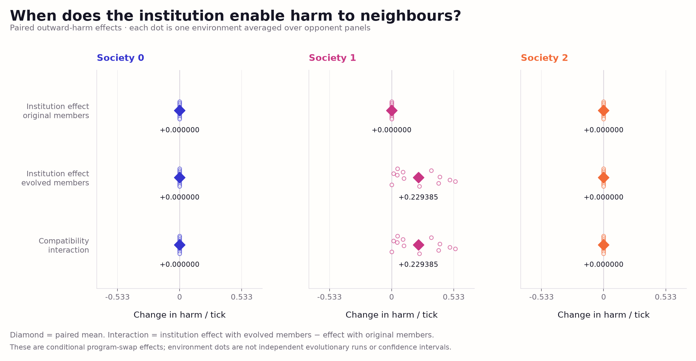
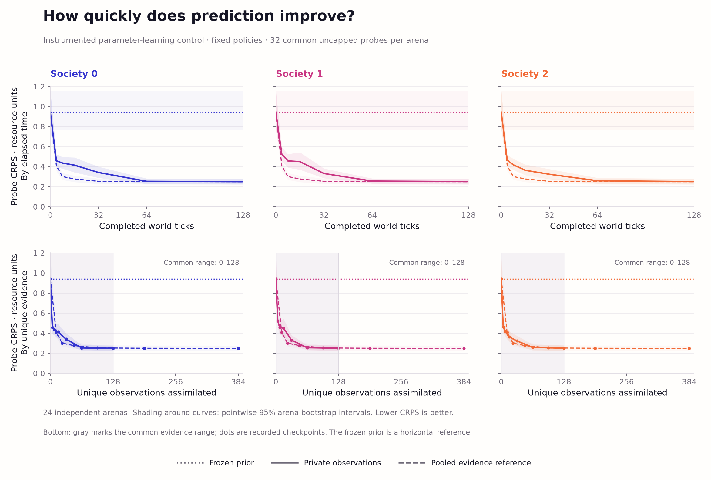
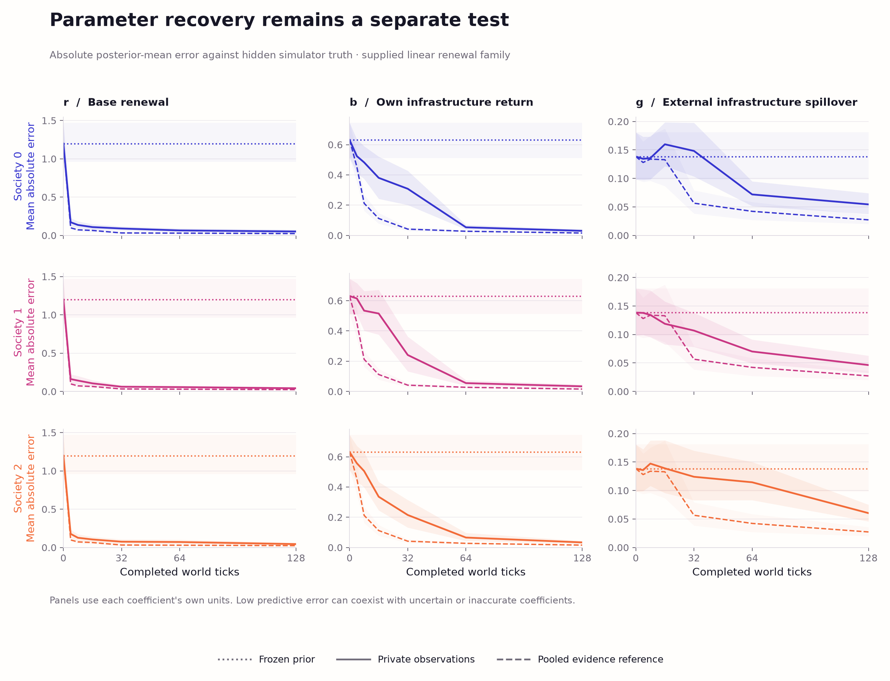
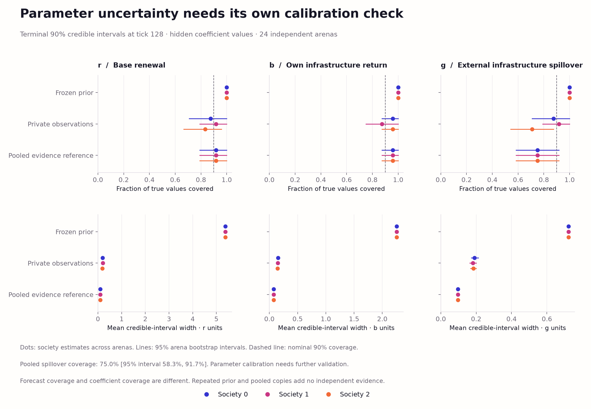
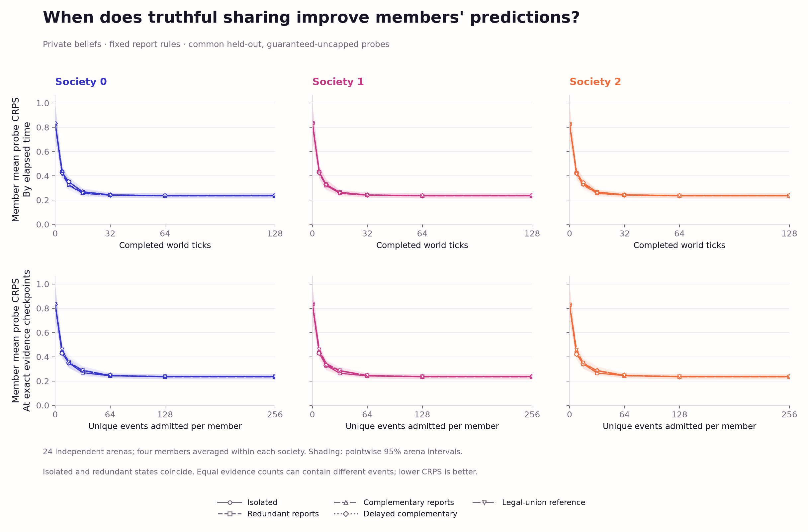
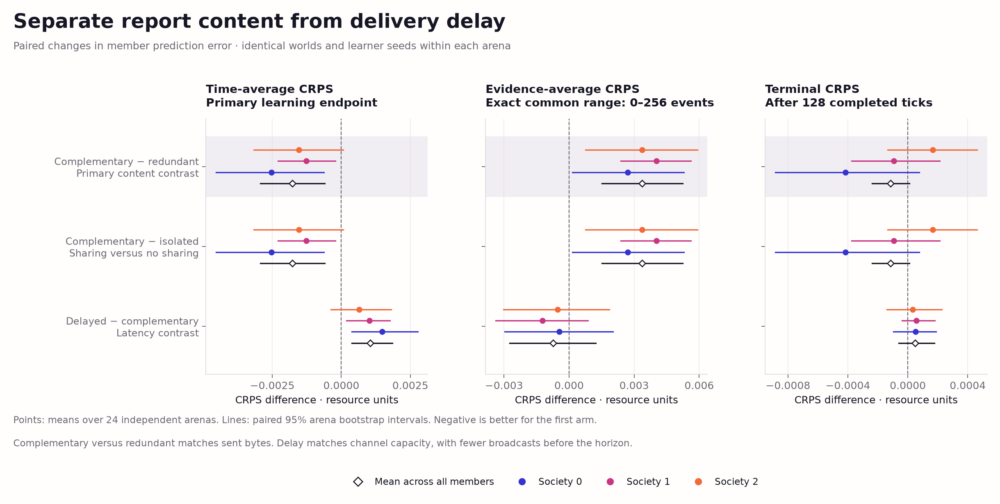
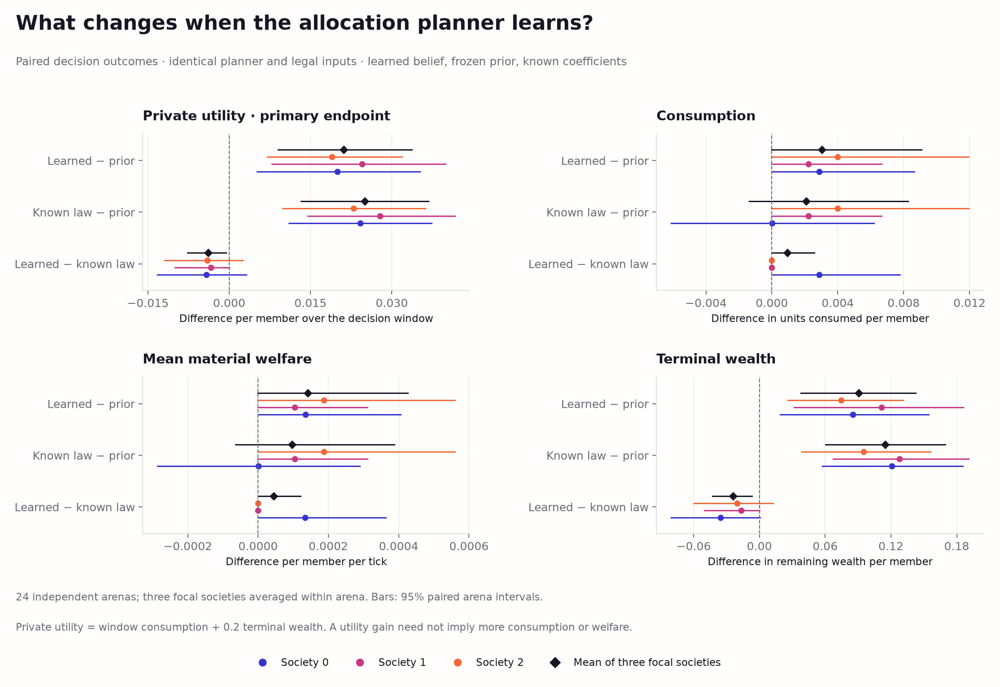
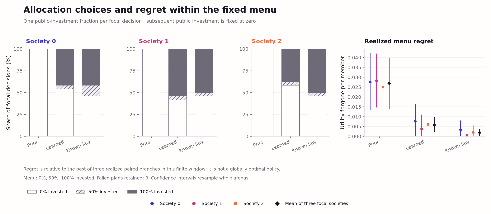

# Swarm Societies: Coevolving Institutions and Learning Shared World Dynamics

**Living research report · 6 October 2026**

[Code and reproduction](#6-reproducibility) ·
[Current results](#4-experiments-and-results) ·
[Allocation decision study](docs/world-model-decision-v1.md) ·
[Private-belief sharing study](docs/world-model-sharing-v1.md) ·
[Research roadmap](docs/research-roadmap.md) ·
[World-model proposal](docs/world-model-proposal.md) ·
[Active work record](PROGRESS.md)

## Abstract

Swarm Societies studies how interacting societies allocate resources, govern
information, and acquire knowledge of a shared environment. The platform
separates executable member policies, institutional programs, authoritative
material dynamics, and independent evaluation. We report an initial multilevel
evolution experiment, a consumption-focused matched search pilot, a factorial
intervention on saved programs, and numerical world-model studies of learning,
reporting and allocation decisions.
The evolutionary pilot produced a small consumption-welfare advantage for
institutional coevolution alongside greater harm to neighbouring societies.
The program transplant diagnostic identified a member-dependent institutional
effect on harm; beneficial welfare complementarity remained unresolved.
The world-model feature estimates hidden renewal coefficients online using
weather-aware Bayesian particles and explicit observation contracts. Across
24 independent arenas, private learners reduced final predictive CRPS from
**0.9422 to 0.2496**; pooling three times the evidence improved the learning
trajectory further. This instrumented control fixes policies and supplies the
equation family, establishing measurement before decision control. A subsequent 192-case audit
finds close agreement with an independently implemented posterior reference;
higher computation produces modest numerical gains at 4–5 times the cost.
Finite-panel calibration and the ecological observation model remain explicit
limitations. A further 24-arena experiment gives members separate beliefs and
compares truthful institutional reports at matched communication cost.
Complementary reports reduce time-averaged member CRPS by **0.68%** relative to
redundant reports; the terminal difference remains unresolved, and the advantage
does not hold at equal evidence counts. A final 24-arena control holds the
allocation planner fixed and changes its beliefs. Learned coefficients improve
32-tick consumption-plus-wealth utility by **0.0211 per member** relative to the
prior, with a paired 95% interval of **[0.0090, 0.0337]**. Terminal wealth accounts
for 86% of this small gain; additional consumption occurs in only one arena.
Active experimentation and equation discovery remain future stages. We distinguish predictive
accuracy, identifiable physical knowledge, useful control, and evolutionary
improvement throughout.

## 1. Introduction

A society can prosper without understanding its environment, and it can learn
useful facts without distributing their benefits fairly. Our research question
is therefore broader than whether many agents achieve a high shared reward:
**which institutions help interacting societies acquire accurate, transferable
knowledge and use it effectively, at what cost to members and neighbours?**

The repository provides a small economic ecology in which those questions can
be tested separately. Members pursue private utility. Institutions govern
taxation, investment, redistribution, permissions, and reporting. Societies
compete for renewable resources and can assist or harm one another. Executable
member and institutional programs can evolve independently, while a trusted
simulator determines every material consequence.

The current world contains three societies and shared resource patches. It
does not implement spatial motion, physical proximity, demographic group
reproduction, or a decentralized peer network. Here, “swarm societies” names
the research program; central institutional hubs and fixed membership describe
the implemented substrate.

The immediate progression is **parameter learning and information governance →
useful decisions → active experimentation → structural discovery**. Parameter
learning, fixed truthful reporting and a fixed-planner allocation control are
now executable features.
The later stages remain research objectives, rather than
capabilities inferred from memory fields or cooperative-looking behavior.

## 2. Related work and positioning

SwarmWorld motivates the separation of local decisions from authoritative
consequences and reusable artifacts [1]. This repository uses an independently
authored compact simulator; it is not a SwarmWorld fork or a reproduction of
its material-physics results. The AI Economist provides prior art for joint
adaptation of individual behavior and institutional economic rules [2]. Our
evolution experiments use the actual upstream ShinkaEvolve engine [3], with
separate ecological acceptance criteria for members and institutions.

Probabilistic ensembles and recurrent world models show how learned dynamics
can support prediction and planning [4,5]. Their control results do not by
themselves establish recovery of interpretable laws. Multiagent world-model
research highlights the problems of hidden interactions, shared representations,
and communication budgets [6]. These motivate explicit knowledge ownership and
information controls here.

Sparse equation discovery, executable world models, and active law-discovery
systems supply complementary methods for the next stage [7–9]. A useful
prospective contribution is a benchmark of **how institutions produce, test,
communicate, and retain causal knowledge in a shared resource world**. The
present implementation establishes part of that benchmark; it does not claim
priority for world models, multiagent learning, or hierarchical governance.
The [30-source review](docs/world-model-literature.md) distinguishes verified
conference/journal work from recent preprints and records applicability limits.

## 3. Environment and methods

### 3.1 Resource ecology and incentives

Each society has members with personal wealth and productivity, a treasury,
infrastructure, defense, institutional memory, and delayed member reports.
Members can harvest, contribute, share, guard, rest, or raid. Institutions set
taxes, expenditure fractions, reserves, redistribution weights, raid permission,
and broadcasts. Private and institutional state reset between episodes;
inherited program source persists across evolutionary updates.

Patches renew before actions, all intentions are collected before resolution,
and a seeded initiative order determines access to scarce stock. Weather,
conflict randomness, and order are drawn independently of chosen actions to
support matched comparisons. A ledger enforces

$$
L_{\mathrm{final}}=L_{\mathrm{initial}}+R-C-A-D-V-F,
$$

where liquid resources include patches, wealth, and treasuries; the right-hand
terms are renewal, consumption, action costs, raid destruction, infrastructure
investment, and defense spending. Transfers do not create resources.

Private utility is cumulative consumption plus $0.2$ times terminal wealth.
The consumption-v2 society objective is

$$
W=\frac{\sum_t(C_t-0.5S_t)}{MT}
 =0.85-1.5\frac{\sum_t S_t}{MT},
$$

with $M$ members, $T$ ticks, and unmet consumption $S_t$. Thus welfare and
shortfall are algebraically linked. The first experiment additionally rewarded
infrastructure directly; its scores must not be compared numerically with v2
as if the objectives were identical. Taxes, voluntary transfers, private
utility, inequality, and outward harm remain separate measurements.
[Full environment specification](docs/model.md).

### 3.2 Program evolution and causal interventions

ShinkaEvolve proposes restricted Python programs. A scheduled member replacement
must improve that member's utility; an institution replacement must improve
its society's welfare. Each acceptance comparison holds environmental draws,
partners, and opponents fixed. Later accepted replacements change the context
for subsequent proposals. Source inheritance, ecological incumbency, and
evaluation provenance are recorded separately.

The verified inference route is ChatGPT-authenticated Codex, `gpt-6-astra`,
`xhigh`, `fast`, through the pinned upstream Shinka Headless adapter. Previous
allowances are exhausted. Local evaluation, numerical learning, and figure
generation do not extend those allowances; another model-driven evolution
campaign requires a new declared budget. [Route and evidence](docs/subscription-route.md).

Frozen-program transplants independently exchange member and institutional
components. They identify effects conditional on the saved lineage and chosen
environment panel. They are not independent replications of evolutionary
search, and a whole-program intervention does not isolate one permission,
memory field, or reporting rule.

### 3.3 Learnable renewal model

The separately versioned
[world-model ecology](swarm_societies/ecology_world_model_v1.py) exposes explicit
measurements while preserving the older simulators. The first learner estimates
three hidden coefficients: baseline renewal $r$, local infrastructure return
$b$, and spillover return $g$. The supplied mechanism is

$$
X_{s,t}=\min\!\left(K-P^{\mathrm{end}}_{s,t-1},\;
r\omega_{s,t}+bI_{s,t}+g\overline I_{-s,t}\right),
\qquad Y_{s,t}=X_{s,t}+\epsilon_{s,t},
$$

where $I$ is infrastructure after depreciation,
$\omega\sim\mathcal U(0.85,1.15)$ is hidden weather, and
$\epsilon\sim\mathcal N(0,0.05^2)$ is independent measurement noise added
after capacity clipping. Noisy readings can be slightly negative or above
headroom; the underlying material growth remains bounded.

[RenewalSMC](swarm_societies/world_model_v1/learner.py) uses a bounded uniform
prior, 1,024 parameter particles, and sequential likelihood updates. Resampling
below half the particle count is followed by four Metropolis rejuvenation
steps targeting the complete accepted evidence history. The likelihood
integrates hidden weather and the capacity point mass; saturated observations
are retained. Future forecasts use a separate RNG and do not mutate learning
state. Snapshots include posterior particles, accepted evidence, diagnostics,
and RNG state.

| Coefficient | Public uniform prior | Evaluation law distribution |
| --- | --- | --- |
| Baseline renewal $r$ | $[2,8]$ | $[2.4,6.8]$ |
| Local infrastructure return $b$ | $[0.5,3]$ | $[0.7,2.7]$ |
| External spillover $g$ | $[0,0.8]$ | $[0.05,0.7]$ |

Evaluation ranges are a fixed task distribution, not information supplied to
the learner. Every society in an arena faces the same sampled physical laws.

This is **parameter identification in a supplied equation**. It does not
discover the equation, the observation model, or conservation. The present
experiment grants full infrastructure features through free audit sensors.
Each private society learner receives its own patch's renewal measurements;
a pooled reference receives all three patches. This instrumentation is richer
than the legacy member API and is explicitly a control, not evidence that
unmodified actors could infer these laws from stock differences alone.

### 3.4 Evaluation and replication

The renewal study compares a frozen prior, private learners, and a pooled
reference on 24 independently sampled law/environment arenas, each lasting
128 ticks with three interacting societies and four members per society.
Fixed policies vary investment by role and time; learned beliefs do not change
actions. The pooled reference receives three times as many unique observations
per tick. Its advantage therefore measures access to evidence, not algorithmic
superiority or successful institutional governance.

At seven checkpoints, each model predicts 64 common queries generated under
its arena's own hidden law with independent weather and measurement noise.
The primary endpoint uses 32 queries guaranteed uncapped across the entire
public prior support. The other 32 are capacity controls. Primary learning
quality is CRPS integrated over ticks and divided by the horizon; terminal
CRPS, parameter error, 90% interval coverage and width are secondary. CRPS
scores equally weighted empirical forecasts with 512 samples [10]. Query
outcomes never update the learner.

Uncertainty intervals resample whole arenas. Societies, ticks, repeated probe
queries, and pooled references copied across society rows are dependent
observations. Evolutionary comparisons instead require independent evolutionary
run pairs. These are different replication units.

### 3.5 Independent calibration audit

The first study's spillover interval covered truth in 18/24 pooled models.
We therefore froze a separate [calibration protocol](docs/world-model-calibration-protocol.md)
before extending the learner to institutional reporting. The audit distinguishes
128 prior-predictive datasets with exogenous features from 64 new ecological
arenas with endogenous features. Only the first panel is simulation-based
calibration under the fitted prior and likelihood [11]. The ecological panel
retains the original interior task-law distribution and pooled observation stream.

Each case compares the published particle budget (1,024 particles, four moves),
a higher budget (4,096 particles, eight moves), and an independently implemented
four-chain batch posterior reference. Reference qualification requires
rank-normalized split/folded R-hat below 1.01 and bulk/tail ESS of at least 400
for parameters and nonconstant log likelihood [12]. A failed gate triggers one
predeclared longer run; all cases, attempts and failures remain in the evidence.
These diagnostics do not prove exact sampling or global convergence.

Parameter CDF checks are supplemented by a data-dependent log-likelihood CDF
and a frozen-prior negative control [13]. Coverage uses Wilson binomial
intervals; continuous and paired summaries bootstrap independent cases.
Reference Monte Carlo error accompanies posterior-mean comparisons. Fitting
CPU is reported separately from the additional diagnostic scoring work.
The ecological inference target conditions on observed features; it does not
model the complete process by which latent growth generated those features.

### 3.6 Private beliefs and bounded institutional reports

The [sharing runtime](swarm_societies/world_model_v1/sharing.py) gives all twelve
members and three institutions independent learner state. Members sense their
home patch and one rotating other patch. Each physical event has one canonical
noisy measurement: copying a report does not create another independent
observation. In the ordinary sharing conditions, institutions learn only from
admitted reports and forward the
original event with its provenance. Per-owner deduplication prevents repeated
evidence and double-counted priors; no posterior averaging is used.

The [prospective sharing protocol](docs/world-model-sharing-protocol.md) compares
five conditions on 24 fresh arenas. Isolated members receive only private
measurements. Two fixed senders per society either report the already visible
home event (redundant) or their different other-patch events (complementary).
Each report costs 1,024 serialized bytes, including provenance and padding.
Institutions send a separately charged copy to each of four members. Both
content conditions have identical traffic and one-tick delays on each hop.
A delayed condition uses four ticks per hop; an immediate legal-union reference
supplies all events without a communication budget. Pending messages are not
flushed after the horizon.

The primary endpoint is member-mean CRPS integrated over world ticks, with a
paired complementary-minus-redundant contrast. Exact unique-evidence checkpoints
provide a separate descriptive axis; equal counts do not imply identical
examples or update order. Bootstrap intervals resample whole arenas, not
dependent members or message copies. Report content and routing remain fixed,
truthful interventions; beliefs do not affect the common physical trajectory.

### 3.7 Fixed-planner allocation control

A separately versioned [stepwise engine](swarm_societies/ecology_stepwise_v1.py)
preserves the frozen simulator's complete episode output, actor observations,
accounting and random streams. It supports strict phase boundaries and exact
snapshot restoration. Evaluators can branch complete worlds; the independent
[planner](swarm_societies/world_model_v1/decision.py) receives only legal
institution observations and the delivered previous-tick home measurement.

The [frozen decision protocol](docs/world-model-decision-protocol.md) uses 32
warmup ticks, home-only harvesting and fixed redundant reports. At tick 32,
one focal institution chooses to invest 0%, 50% or 100% of its eventual budget.
All subsequent public investment is zero. Tax remains 60%, remaining funds are
redistributed equally, and the objective is consumption plus 0.2 terminal
wealth per member over a 32-tick decision window. Consumption welfare is
reported separately. The same 512-sample planner receives the frozen prior,
the learned institutional posterior, or the true renewal coefficients.

All conditions forecast current receipts rather than seeing their realized
value, reconstruct stock from lagged noisy readings, assume unit productivity
and forecast external infrastructure by decay only. The known-law reference
retains these approximations. Forecasts and choices are committed before any
branch runs. Branches preserve the live simulator, beliefs, queues and RNG state.

A six-arena development gate checks robust coefficient-dependent ranking
switches and material realized action differences before the 24 fresh evaluation
arenas are prepared. Evaluation rotates three focal societies and reuses each
of three physical action continuations across belief conditions: **72 dependent
focal states, 216 physical branches and 216 forecasts**, from **24 independent
arenas**. Intervals use 2,000 whole-arena bootstrap draws after averaging focal
societies. The primary contrast is learned-minus-prior utility. Development
worlds and exploratory grids are excluded from evaluation estimates.

## 4. Experiments and results

| Study | Independent search runs | Evaluation scale | Main interpretation |
| --- | ---: | --- | --- |
| First multilevel experiment | 1 | 540 fresh rollouts | Infrastructure reward raised welfare without improving consumption resilience |
| Consumption-v2 | 1 matched pair: 1 run per arm | 648 drought/no-drought rollouts | Small consumption advantage with greater external harm |
| Program transplants | 0 new searches; saved coevolution lineage | 864 rollouts | Institutional harm depends on the member program background |
| World-model-v1 | 0 searches | 24 independent law/environment arenas | Stationary parameter-learning control; fixed policies and free audit sensors |
| World-model calibration-v1 | 0 searches | 128 prior-predictive datasets and 64 fresh ecological arenas | Independent posterior computation and uncertainty audit |
| World-model sharing-v1 | 0 searches | 24 fresh arenas, five information conditions, 15 private models per condition | Matched-byte truthful report-content and delay interventions |
| World-model decision-v1 | 0 searches | 24 fresh arenas and 216 physical branches; separate six-arena development gate | Small allocation-utility benefit from learned beliefs, mainly terminal wealth |

### 4.1 Initial evolution: distinguish score gains from consumption

The first 60-minute search retained three member and three institutional
replacements. Descendants' post-drought welfare rose from **0.8610 to 0.9229**.
The gain decomposed into **+0.06679** from the direct infrastructure reward
and **−0.00490** from the consumption/shortfall term. Cumulative post-drought
shortfall increased from **0.770 to 1.162**, and member utility fell **9.65%**.
These outcomes motivated removal of the infrastructure bonus.

The [archived first-study report](docs/first-study-report.md) preserves the
complete results, lineage descriptions, execution accounting, figures, source
attribution, and historical reproduction commands. Its historical status
statements are not the current project status.

### 4.2 Consumption-focused matched pilot

Each arm received 30 minutes of search from the same initial population.
Fresh cases varied environment, drought timing, episode length, opponent panel,
and focal society; each drought case had a matched no-drought counterpart.

| Population | Consumption welfare ↑ | Unmet need/member/tick ↓ | Outward harm/tick ↓ | Private utility/tick ↑ |
| --- | ---: | ---: | ---: | ---: |
| Initial | 0.843162 | 0.004559 | 0.619992 | 0.931941 |
| Evolved members, fixed institutions | 0.846405 | 0.002396 | 0.332363 | 0.978720 |
| Member–institution coevolution | 0.847238 | 0.001841 | 0.549101 | 0.961051 |

Coevolution improved welfare by **0.000833** over the fixed-institution arm,
with **23.2% less unmet consumption**, **65.2% more outward harm**, and **1.8%
lower private utility**. One paired pilot cannot establish a reliable advantage
for the search procedure. The schedule ended before members could evolve again
under their changed institutions.


*Figure 1. Recorded fresh-case means from the consumption pilot. Welfare and
shortfall represent the same primitive consumption outcome; private utility
and harm expose distinct tradeoffs. [Captions, data and exports](figures/consumption-v2/README.md).*

### 4.3 Frozen-program transplants

Crossing original/evolved members and institutions on a new environmental
panel yielded welfare **0.844263** for the original combination,
**0.845106** for evolved members alone, **0.845648** for evolved institutions
alone, and **0.846926** for both. The additive welfare interaction was
**+0.000434**, with an environmental cluster interval of
**[−0.000550, +0.001612]**. Positive welfare complementarity remains unresolved.

Swapping evolved institutions onto evolved members increased outward harm by
**0.076462 units/tick**, interval **[0.041531, 0.113561]**. The same swap onto
original members added exactly zero harm. The extra harm was concentrated in
society 1. This identifies a conditional effect of complete institutional
programs, not its internal cause. [Study and portable evidence](docs/mechanism-study.md).



*Figure 2. Institutional transplant effects by society and member background.
Points show conditional environmental variation within one lineage, not
independent search replications. [Figure provenance](figures/mechanism-v1/README.md).*

### 4.4 Learning unknown renewal coefficients

The completed study contains **24 independent arenas**, **9,216 unique
environmental observations**, and **18,432 learner updates** across private
and pooled conditions. No update failed. The experiment used no evolutionary
inference. The following means and 95% whole-arena bootstrap intervals come
from the [recorded summary](evidence/world-model-v1/summary.json).

| Condition | Observations/model at tick 128 | Time-averaged CRPS ↓ [95% interval] | Final CRPS ↓ | Final 90% predictive coverage |
| --- | ---: | ---: | ---: | ---: |
| Frozen prior | 0 | 0.9422 [0.7683, 1.1577] | 0.9422 | 94.4% |
| Private society learner | 128 | 0.3088 [0.2844, 0.3340] | 0.2496 | 89.0% |
| Pooled reference | 384 | 0.2703 [0.2454, 0.2967] | 0.2481 | 89.1% |

Private learning substantially improved prediction over the frozen prior.
Pooling lowered time-averaged CRPS by **0.038445**, paired interval
**[0.030612, 0.047006]** for the improvement, or **12.5%** relative to private
learning. Its terminal advantage was much smaller: **0.001595**, paired
interval **[0.000590, 0.002651]**. The principal difference is earlier useful
prediction with more evidence per tick; equal-evidence efficiency has not
been established.



*Figure 3. Common-probe CRPS by completed tick and society. Lines distinguish
conditions; society colors remain fixed. Bands resample independent arenas.
Prior and pooled references repeat across panels for comparison, not as
additional replicates. The primary probe subset excludes capacity-dominated
queries. [Data, captions and vector exports](figures/world-model-v1/README.md).*

Mean normalized parameter error fell from **0.2319** under the prior to
**0.0405** privately and **0.0203** with pooling. This metric averages each
model's root-mean-square coefficient error after scaling each coefficient by
its public prior width; it is not an equation-discovery score. Separate
coefficient trajectories remain necessary because accurate aggregate forecasts
can conceal a weakly identified spillover coefficient.



*Figure 4. Mean absolute coefficient error by society and checkpoint, in each
coefficient's own units. Columns use different scales. Hidden simulator truth
is used by the evaluator only, never as learner input.*

| Parameter | Private mean absolute error | Pooled mean absolute error | Private 90% parameter-interval coverage | Pooled 90% parameter-interval coverage |
| --- | ---: | ---: | ---: | ---: |
| Baseline renewal $r$ | 0.04557 | 0.02359 | 87.5% | 91.7% |
| Local return $b$ | 0.03247 | 0.01561 | 93.1% | 95.8% |
| Spillover $g$ | 0.05367 | 0.02725 | 83.3% | **75.0%** |

Parameter uncertainty needs further work. The pooled spillover interval
contained the true coefficient in only **18 of 24 arenas**, despite lower
point-estimate error. Good predictive coverage does not establish calibrated
parameter beliefs. Private coverage averages 72 society models nested within
24 arenas; pooled coverage uses 24 models, not their repeated plotting rows.
Finite-particle accuracy and weak excitation of particular coefficients are
possible explanations to test, not established causes. The evaluation panel
has not been reused to tune away this result.



*Figure 5. Coverage and width of 90% parameter credible intervals, distinct
from predictive intervals for future outcomes. The spillover result motivates
further calibration tests. Intervals resample whole arenas.*

Final predictive interval widths were **6.398** resource units for the prior,
**1.319** privately, and **1.309** with pooling. Learned intervals retained
approximately nominal 90% coverage while becoming much narrower. This is
empirical calibration on the declared stationary task distribution, not a
guarantee under hidden features or changed mechanisms. The
[calibration and endpoint panels](figures/world-model-v1/README.md),
[full study report](docs/world-model-v1.md), and
[frozen design](evidence/world-model-v1/design.json) retain the complete
comparison and scope.

### 4.5 Independent calibration and compute audit

All **192 final batch references qualified**, with one prescribed retry and
zero failed SMC updates across **40,960 unique observations**. On the fresh
ecological panel, published spillover coverage is **57/64 (89.06%)**, with
95% Wilson interval **[79.10%, 94.60%]**. Higher compute and the reference each
cover **58/64 (90.63%)**. The earlier 18/24 finding did not recur; neither panel
alone establishes why that difference occurred.

| Panel | Method | 90% interval coverage: r / b / g | Mean posterior discrepancy / reference SD | Mean fitting CPU seconds |
| --- | --- | --- | ---: | ---: |
| Prior-predictive, 128 datasets | Published SMC | 91.41% / 94.53% / 92.19% | 0.0451 | 0.492 |
| Prior-predictive, 128 datasets | Higher compute | 90.63% / 94.53% / 92.19% | 0.0255 | 2.094 |
| Prior-predictive, 128 datasets | Batch reference | 89.84% / 95.31% / 92.19% | — | 2.898 |
| Ecological, 64 arenas | Published SMC | 84.38% / 85.94% / 89.06% | 0.0424 | 2.053 |
| Ecological, 64 arenas | Higher compute | 82.81% / 87.50% / 90.63% | 0.0284 | 10.082 |
| Ecological, 64 arenas | Batch reference | 82.81% / 85.94% / 90.63% | — | 3.845 |

Discrepancy averages absolute mean gaps, standardized by reference SD, over
coefficients within each case and then cases. Published/reference interval-width
ratios average 0.990–1.002 across panel/parameter combinations. The larger budget
improves numerical agreement, but its remaining gaps approach the reference's
own mean Monte Carlo error, about 0.026–0.027 posterior SD. These results support
keeping the published setting as the working default; they do not show a large
particle-induced narrowing that more computation must repair.


*Figure 6. All-case parameter coverage with Wilson intervals. Controlled
prior-predictive calibration and coverage on the ecological task are distinct
questions. The reference's ecological renewal coverage is 53/64 (82.81%).*


*Figure 7. Paired posterior agreement, with reference Monte Carlo uncertainty
shown alongside mean gaps. Higher compute costs 4.26× in the controlled panel
and 4.91× in ecology. SMC updates sequentially; the batch reference fits the
final history once, so this is not a matched online-latency comparison.*

The data-dependent calibration check preserves an unresolved qualification.
Controlled log-likelihood CDF departures are **0.11800**, **0.12100**, and
**0.12275** for published, higher-compute and reference inference. The declared
single-ECDF 95% DKW bound is **0.12004**: the latter two slightly exceed it.
All coefficient CDF curves stay within the band, including the frozen prior,
whose likelihood-CDF departure is **0.99707**. Parameter checks alone can thus
accept a learner that ignores data. Related checks were not multiplicity-adjusted;
this finite panel and an approximate reference do not certify perfect calibration.

The [complete audit](docs/world-model-calibration-v1.md) reports parameter-wise
coverage, paired differences, failure handling and model scope. The
[Chromatic Field gallery](figures/world-model-calibration-v1/README.md) includes
four figures, five derived tables, SVG/PDF/PNG exports and source/output hashes.

### 4.6 Private beliefs and matched-cost institutional reports

Across **24 fresh independent arenas**, complementary reports modestly improve
member prediction over world time relative to redundant reports at identical
byte cost and delay. The primary paired CRPS difference is **−0.001778**, with
95% whole-arena bootstrap interval **[−0.002939, −0.000604]**: a **0.68%**
reduction relative to the redundant mean. No evolutionary search was run.

| Information condition | Member time-average CRPS | Terminal CRPS | CRPS averaged over 0–256 events | Terminal events/member | KiB sent/society |
| --- | ---: | ---: | ---: | ---: | ---: |
| Isolated | 0.260293 | 0.235840 | 0.260293 | 256 | 0 |
| Redundant reports | 0.260293 | 0.235840 | 0.260293 | 256 | 1,272 |
| Complementary reports | 0.258516 | 0.235725 | 0.263656 | 382 | 1,272 |
| Delayed complementary | 0.259564 | 0.235773 | 0.262921 | 376 | 1,248 |
| Legal-union reference | 0.257289 | 0.235693 | 0.263616 | 384 | Unpriced |

Redundant reports leave member posteriors exactly equal to isolation: traffic
alone supplies no new evidence. Complementary reports add **126 distinct events
per member** by tick 128. The longer delay reduces this to **120** and increases
time-average CRPS by **+0.001048 [0.000382, 0.001842]** relative to ordinary
complementary sharing. Its sender schedule and channel capacity match, but fewer
downlinks are sent before the horizon; pending messages are not flushed.



*Figure 8. Recorded member learning over world time and unique-event count,
with pointwise whole-arena bootstrap intervals. Colors identify societies;
markers identify information conditions. Each member already privately senses
two of three patches. Equal counts need not contain identical examples or
update orders.*

At the terminal horizon, complementary minus redundant CRPS is only
**−0.000114 [−0.000238, +0.000010]**. The equal-evidence difference goes in the
opposite direction: **+0.003363 [0.001506, 0.005242]**. Thus the time advantage
does not establish better inference per event. These secondary intervals are
descriptive and are not multiplicity-adjusted.



*Figure 9. Paired report-content and delay interventions on member CRPS. Black
diamonds average dependent members and societies within each arena before
resampling; colored points preserve society-specific estimates. The primary
contrast is complementary minus redundant on the time axis.*

The archive contains **9,216 distinct physical measurements**, **549,288
successful owner-specific updates**, and zero failed updates across **1,800
terminal models**. The **152,568 duplicate attempts** add no likelihood factors.
Member predictive 90% coverage ranges from **90.27% to 90.59%**. Complementary
member coefficient coverage is **91.67% / 83.33% / 89.24%** for r/b/g, averaged
within arenas; the 288 member intervals per condition are dependent. These
conditional ecological beliefs retain the earlier calibration limitations.

The [complete sharing report](docs/world-model-sharing-v1.md) includes
institutional learning, communication accounting and limitations. Its
[Chromatic Field gallery](figures/world-model-sharing-v1/README.md) contains five
figures, five tables, SVG/PDF/PNG exports and source/output hashes. This passive
intervention establishes a small effect on learning under fixed reporting rules;
it does not demonstrate improved decisions, welfare or evolved governance.

### 4.7 Learned beliefs improve a restricted allocation decision

The development gate passed before evaluation: **17/18** legal focal states
showed robust ranking switches under low versus high infrastructure return.
Realized branches included **11** states favoring redistribution and **six**
favoring full investment; seven known-law investment choices improved realized
utility over redistribution. These designed cases establish task sensitivity,
not general performance.

On the separate 24-arena evaluation, learned beliefs improved utility relative
to the prior by **+0.021110 [0.009014, 0.033678] per member**, or **0.0675%** of
the prior mean. There were no failed plans or learner updates.

| Planner beliefs | Utility/member ↑ | Consumption/member ↑ | Terminal wealth/member ↑ | Realized menu regret ↓ | Choices: 0% / 50% / 100% investment |
| --- | ---: | ---: | ---: | ---: | ---: |
| Frozen prior | 31.282372 | 26.339709 | 24.713315 | 0.026949 | 72 / 0 / 0 |
| Learned posterior | 31.303481 | 26.342737 | 24.803725 | 0.005840 | 37 / 3 / 32 |
| Known coefficients | 31.307353 | 26.341783 | 24.827853 | 0.001968 | 33 / 5 / 34 |

Terminal wealth increased by **0.090409 [0.037642, 0.142692] per member**;
its weighted contribution accounts for **85.7%** of the utility improvement.
Consumption increased by only **0.003028 [0, 0.009084]** over the entire
32-tick window, with all additional consumption in **one of 24 arenas**.
This does not establish a general consumption-welfare benefit. Outward harm
is zero by the prescribed no-raid policy, not a learned reduction.



*Figure 10. Realized paired differences for the same fixed planner with different
coefficient beliefs. Diamonds average the three focal societies within each
arena; intervals resample whole arenas. Utility includes terminal wealth.
Consumption welfare rescales consumption here and is not an independent endpoint.
Secondary intervals are descriptive and have no multiplicity adjustment.*

Learning changed **35/72** choices across 15 arenas: 33 improved realized
utility, two worsened it, and 37 were unchanged. Learned and known-law choices
agreed in **62/72** states. The known-law condition still had positive regret.
It retains state approximations and cannot know future weather; this experiment
does not isolate their contributions to the remaining error. The
78.3% reduction in realized menu regret is algebraically the same utility
contrast against a shared best branch, not separate corroborating evidence.



*Figure 11. Public-investment choices and realized regret among three paired
action branches over the declared window. Conditions use labels and neutral
fills; society colors retain their identities. This finite-menu hindsight
benchmark is not a globally optimal controller.*

The archive retains **2,304 distinct warmup measurements**, **20,736 accepted
owner-specific updates**, **20,160 duplicate attempts**, 360 learner models and
all 216 committed forecasts. Full semantic verification refits every learner,
regenerates forecasts and replays branches, including the copied development
proof. The [complete decision report](docs/world-model-decision-v1.md),
[evaluation gallery](figures/world-model-decision-v1/README.md) and separate
[development gallery](figures/world-model-decision-development-v1/README.md)
contain forecast diagnostics, exact tables, captions and hashed SVG/PDF/PNG
exports. This result concerns supplied-law learning and one fixed allocation
task; it does not establish active experimentation or evolved governance.

## 5. Discussion, limitations, and next experiments

The experiments support a disciplined separation of outcomes. A reward function
can favor infrastructure accumulation while consumption worsens. Institutional
changes can improve local consumption while increasing harm. A learned model
can predict accurately without identifying every coefficient, especially when
infrastructure features are correlated or growth is consistently capped.

The first numerical learner addresses the measurement problem under explicit
instrumentation. The fixed-planner control now demonstrates a small allocation
utility benefit from learned coefficients. These studies do not establish
collective intelligence, autonomous experimentation, equation discovery, evolved reporting
institutions, or decentralized knowledge formation. Pooled evidence is a
reference condition, with additional data and no communication price. Posterior
intervals are numerical approximations whose empirical calibration must be
reported, not assumed.

Private member beliefs and bounded institutional reports now provide an
executable information-governance control. Equal-time and equal-evidence
comparisons answer different questions. Keep the shared likelihood-CDF departure
and ecological-model limitations visible before using uncertainty to suppress
reports or claiming robust calibration. Later experiments will reduce sensor
access and independently change physical laws, opponent policies, and report
reliability to test whether a society revises the correct explanation.

The [completed allocation control](docs/world-model-decision-v1.md) shows why
decision horizons and outcome definitions matter. Investment occurs after
current growth and harvesting; delayed returns changed rankings in the
development gate. Learned coefficients then improved allocation utility on
fresh worlds, mainly through terminal wealth. A fixed planner, generous sensors,
nominal productivity and lagged external features limit that result. The next
controlled stage is **costed active experimentation**, compared with fixed and
random interventions under matched resource and communication opportunities.
It must separate information acquired from the direct material effects of an
intervention and report consumption, scarcity, wealth and outward harm separately.

Stage 2 will first compare supplied mechanism families, then permit terms,
interactions, and branches to change within a declared expression grammar.
That transition separates model selection from structural discovery. Active
experimentation will test whether deliberately acquired knowledge improves
subsequent decisions enough to repay its cost; broader welfare and harm effects
remain open. Any model-driven program search
will receive a separately specified budget.

The economic substrate itself remains limited: fixed membership, central
institutions, no spatial movement, no death or migration, and many regimes
near the consumption ceiling. Results about evolutionary search remain based
on individual pilot lineages. The [roadmap](docs/research-roadmap.md) prioritizes
scarcity maps, targeted mechanism interventions, cross-play, invasion, and
independent search replications alongside the new learning program.

## 6. Reproducibility

Use Python 3.13 to match the recorded environment. The current package includes
the numerical learner and its dependencies; the historical requirements lock
belongs to the first experiment and is retained unchanged. The new
[world-model environment](requirements-world-model-v1.txt) pins the versions
used for numerical inference, plotting and tests.

```bash
uv venv --python 3.13 .venv
uv pip install --python .venv/bin/python -r requirements-world-model-v1.txt -e '.[test]'
.venv/bin/python -m pytest -q
```

Audit the completed world-model evidence and regenerate its figures:

```bash
.venv/bin/python scripts/run_world_model_study.py verify
.venv/bin/python scripts/visualize_world_model_study.py
OPENBLAS_NUM_THREADS=1 .venv/bin/python scripts/run_world_model_calibration.py verify
.venv/bin/python scripts/visualize_world_model_calibration.py
OPENBLAS_NUM_THREADS=1 .venv/bin/python scripts/run_world_model_sharing.py verify
.venv/bin/python scripts/visualize_world_model_sharing.py
OPENBLAS_NUM_THREADS=1 .venv/bin/python scripts/run_world_model_decision.py verify
.venv/bin/python scripts/visualize_world_model_decision.py
.venv/bin/python scripts/visualize_world_model_decision_gate.py
```

Reproduce the same deterministic case bank in a new directory, without model
generation or evolutionary search:

```bash
.venv/bin/python scripts/run_world_model_study.py prepare --output runs/world-model-reproduction
.venv/bin/python scripts/run_world_model_study.py run --output runs/world-model-reproduction
.venv/bin/python scripts/run_world_model_study.py verify --output runs/world-model-reproduction
OPENBLAS_NUM_THREADS=1 .venv/bin/python scripts/run_world_model_calibration.py prepare --output runs/calibration-reproduction
OPENBLAS_NUM_THREADS=1 .venv/bin/python scripts/run_world_model_calibration.py run --output runs/calibration-reproduction --workers 4
OPENBLAS_NUM_THREADS=1 .venv/bin/python scripts/run_world_model_calibration.py verify --output runs/calibration-reproduction
OPENBLAS_NUM_THREADS=1 .venv/bin/python scripts/run_world_model_sharing.py prepare --output runs/sharing-reproduction
OPENBLAS_NUM_THREADS=1 .venv/bin/python scripts/run_world_model_sharing.py run --output runs/sharing-reproduction --workers 4
OPENBLAS_NUM_THREADS=1 .venv/bin/python scripts/run_world_model_sharing.py verify --output runs/sharing-reproduction
```

The [decision report](docs/world-model-decision-v1.md#5-verification-scope-and-reproduction) gives the
separate development-gate and evaluation reproduction commands. Evaluation
preparation requires a verified passing gate and archives its full evidence.

Numerical results are deterministic under the recorded software environment;
CPU measurements and timestamps depend on the machine. Existing completed
studies are not overwritten. To recover an interrupted sharing run while
preserving complete arenas, use
`OPENBLAS_NUM_THREADS=1 .venv/bin/python scripts/resume_world_model_sharing.py --workers 4`.
The separate recovery command verifies saved cases, archives partial output and
computes only unfinished arenas; its elapsed time covers recovery only.
The current suite passes **282 tests and 102
subtests**, including exact legacy trajectory preservation, likelihood checks,
planted and confounded parameter controls, deduplication, snapshot restoration,
forecast isolation, independent posterior quadrature checks, and failed-reference
retention with semantic evidence reconstruction. Private-report tests cover
ownership, future events, byte budgets, delivery delays, duplicate invariance,
direct event-stream replay, and evidence tampering after checksum rewrites.
Recovery tests check completed-case preservation, partial archives, corrupt-case
refusal and competing-run guards.
Decision tests cover phase-by-phase restoration, exact actor and RNG parity,
analytic planner timing, protected branches, forecast commitment, development
gate enforcement and full case reconstruction after checksum tampering.

Existing evidence and figures can be checked locally without evolutionary
inference:

```bash
.venv/bin/python scripts/verify_evidence.py --require-final
.venv/bin/python scripts/verify_mechanism_evidence.py
.venv/bin/python -m swarm_societies.visualize_consumption
.venv/bin/python scripts/visualize_mechanism_study.py
```

Evidence includes frozen designs, exact program sources, data tables, accounting,
and source/output hashes. The world-model study additionally records noisy
measurements, forecasts, parameter estimates, learner snapshots, and computation.
The calibration audit archives exact datasets, weighted particles, reference
chains, retried samples and convergence diagnostics.
The sharing study adds full private learner and transport snapshots, message
provenance, exact evidence-count checkpoints and paired communication controls.
The decision study adds compound world/learning/transport checkpoints, committed
action forecasts, all menu branches and a replayable development-gate proof.
Every empirical figure follows [Chromatic Field v1](docs/visual-reference.md):
warm paper, stable cobalt/magenta/orange society identities, explicit condition
markers, and inspected SVG/PDF/PNG exports. Visuals represent recorded data;
design illustrations are labeled separately.

The [first-study archive](docs/first-study-report.md),
[consumption protocol](docs/protocol-consumption-v2.md),
[mechanism diagnostic](docs/mechanism-study.md), and
[world-model implementation plan](docs/world-model-implementation-plan.md)
retain detailed methods. [PROGRESS.md](PROGRESS.md) records active work and
verification status. Upstream Shinka is required only for its evolutionary
route, not for fitting the numerical world model or rendering recorded results.

## 7. References

1. Pal, Wang & Buehler (2026). [SwarmWorld: Stigmergic technological evolution in societies of language-model agents](https://arxiv.org/abs/2608.26081). Preprint. [Repository integration decision](docs/upstream.md).
2. Zheng et al. (2022). [The AI Economist: Taxation policy design via two-level deep multiagent reinforcement learning](https://www.science.org/doi/10.1126/sciadv.abk2607). *Science Advances*.
3. Lange, Imajuku & Cetin (2025/2026). [ShinkaEvolve](https://arxiv.org/abs/2509.19349). ICLR 2026. Actual engine pinned to [revision 9912af1](https://github.com/SakanaAI/ShinkaEvolve/tree/9912af12d423504b8d580f4179fd15f5f88b8c50).
4. Chua et al. (2018). [Deep Reinforcement Learning in a Handful of Trials using Probabilistic Dynamics Models](https://proceedings.neurips.cc/paper_files/paper/2018/hash/3de568f8597b94bda53149c7d7f5958c-Abstract.html). NeurIPS.
5. Hafner et al. (2019). [Learning Latent Dynamics for Planning from Pixels](https://proceedings.mlr.press/v97/hafner19a.html). ICML.
6. Zeng & Zhang (2025). [Efficient Information Sharing for Training Decentralized Multi-Agent World Models](https://rlj.cs.umass.edu/2025/papers/Paper103.html). *Reinforcement Learning Journal*.
7. Brunton, Proctor & Kutz (2016). [Discovering governing equations from data by sparse identification of nonlinear dynamical systems](https://doi.org/10.1073/pnas.1517384113). *PNAS*.
8. Tang, Key & Ellis (2024). [WorldCoder: Building World Models by Writing Code and Interacting with the Environment](https://proceedings.neurips.cc/paper_files/paper/2024/hash/820c61a0cd419163ccbd2c33b268816e-Abstract-Conference.html). NeurIPS.
9. Cao et al. (2026). [ALDER: Discovering the Laws of a World by Acting in It](https://arxiv.org/abs/2609.33728). September preprint.
10. Gneiting & Raftery (2007). [Strictly Proper Scoring Rules, Prediction, and Estimation](https://sites.stat.washington.edu/people/raftery/Research/PDF/Gneiting2007jasa.pdf). *JASA*.
11. Talts et al. (2018). [Validating Bayesian Inference Algorithms with Simulation-Based Calibration](https://arxiv.org/abs/1804.06788). Preprint.
12. Vehtari et al. (2021). [Rank-Normalization, Folding, and Localization: An Improved R-hat for Assessing Convergence of MCMC](https://doi.org/10.1214/20-BA1221). *Bayesian Analysis*.
13. Modrák et al. (2025; online 2023). [Simulation-Based Calibration Checking for Bayesian Computation: The Choice of Test Quantities Shapes Sensitivity](https://doi.org/10.1214/23-BA1404). *Bayesian Analysis*.

The [full research review](docs/world-model-literature.md) annotates 30 primary
sources. Visual conventions derive from the read-only
[actir-backprop-neat reference](https://github.com/ReloadLightly/actir-backprop-neat/tree/9472743f1cb7ea12eafcf489126b1a43b8f5735f);
its numerical results are not reused.
