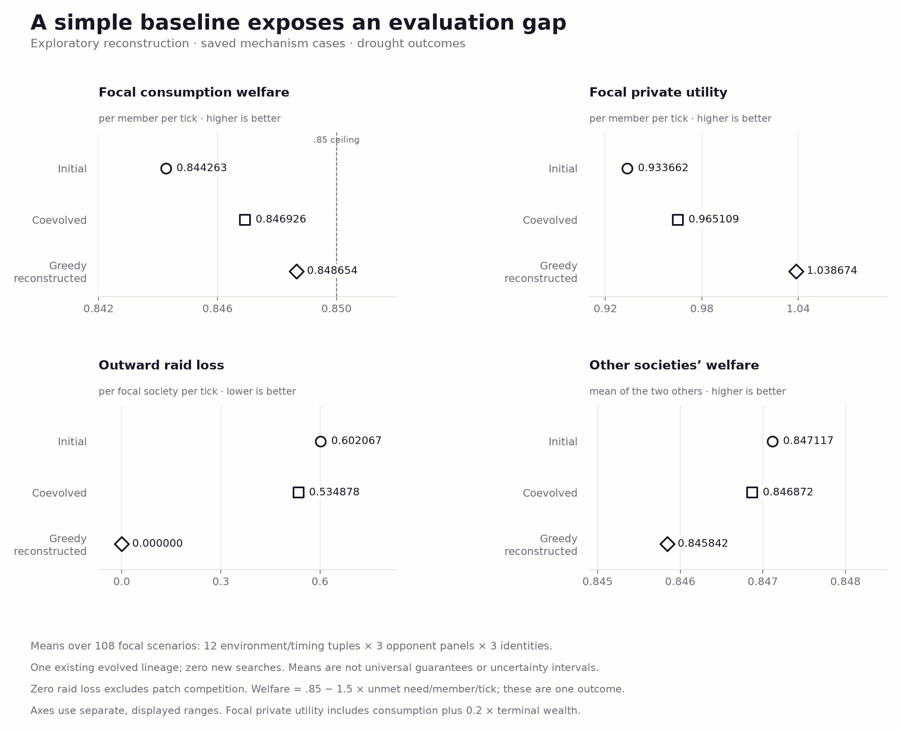
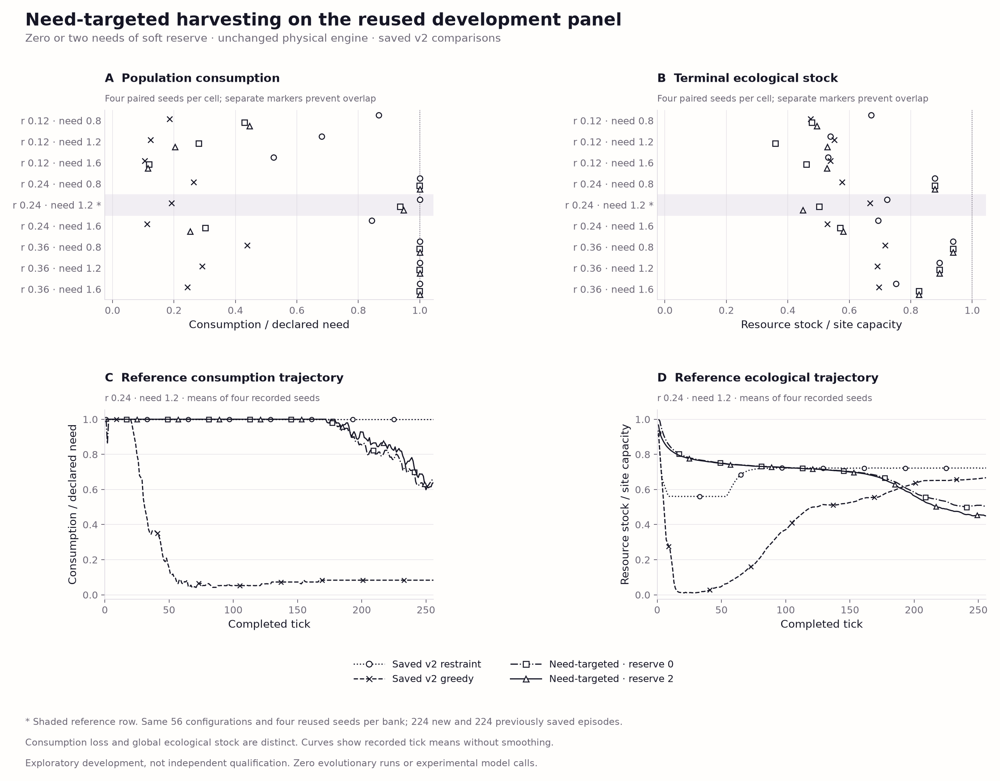

# Swarm Societies: A Research Testbed for Resources and Institutions

**Living research report · 7 October 2026**

The new physical commons implements mobile individuals, local sensing and
stock-dependent renewal, with no institutions or supranational government.
The earlier nonspatial studies remain frozen. Optional institutional formation
and change are still planned; ecological qualification and strong baselines
must precede further experimental model spending.

[Study index](docs/study-index.md) ·
[Detailed archived report](docs/living-research-report-2026-10-07.md) ·
[Scientific review](docs/research-review-2026-10-07.md) ·
[Physical commons](docs/commons-v3-foundation-v1.md) ·
[Need-targeted baselines](docs/commons-v3-need-v1.md) ·
[Implementation plan](docs/commons-v3-plan.md) ·
[Current checkpoint](PROGRESS.md)

## Abstract

Under what conditions do locally formed institutions improve their members'
welfare without exporting costs to outsiders, and how does the relative rate
of member and institutional adaptation change that outcome? Swarm Societies
develops executable environments for this question. Its current experiments
establish accounting, program replacement, parameter learning and controlled
information sharing. **They do not establish an advantage for evolved
governance:** an exploratory simple-harvesting baseline improves all four
reported focal averages over the saved coevolved population, while slightly
reducing outsiders' welfare. Numerical controls show supplied-law learning,
a small allocation benefit dominated by wealth, and no clear active-selection
benefit in posterior-update value. The new spatial prototype supports local
depletion, but its development comparisons remain sensitive to navigation,
storage and terminal inventory. Need-targeted harvesting raises reference
consumption relative to greedy, but longer runs still deteriorate. A qualified social
dilemma and stronger navigation baselines remain scientific requirements.

## 1. Research question and present scope

In the legacy studies, members pursue private utility; institutions are selected for their own society's
welfare. No higher-level objective governs relations between societies. This
separation permits local gains and external harm to coexist, but does not by
itself create a consequential social dilemma or demonstrate collective
intelligence.

The proposed world separates **physical location, political membership and
claimed jurisdiction**. Membership will be optional; claims will require
material means to enforce. Zero institutions and failed cooperation remain
valid outcomes. Movement is implemented in the separate physical prototype;
institutional formation and political transitions remain future capabilities.

## 2. Related work

The independent simulator and upstream ShinkaEvolve engine draw on resource
worlds, multilevel economic adaptation, program evolution and probabilistic
world models. The [literature review](docs/world-model-literature.md),
[scientific review](docs/research-review-2026-10-07.md) and
[archived references](docs/living-research-report-2026-10-07.md#7-references)
record attribution and scope. This is not a SwarmWorld reproduction.

## 3. Environment and methods

Legacy members harvest, transfer resources, guard, rest or raid. Institutions control
taxation, investment, redistribution, raid permission and reporting. A trusted
simulator resolves actions and accounts for renewal, consumption, transfers,
destruction and investment. Private utility is consumption plus 0.2 times
terminal wealth. Consumption-v2 welfare is
`0.85 − 1.5 × unmet need/member/tick` at the default consumption need of 0.85;
welfare and shortfall therefore measure the same primitive outcome.
[Environment specification](docs/model.md).

The [new physical engine](docs/commons-v3-foundation-protocol.md) has 24 mobile
individuals and 16 sites on a 12×12 grid. It implements local extraction,
consumption, transfers, costly messages and stock-dependent renewal with
recovery. Actions commit simultaneously; ledgers record every material flow.
Its development policies are audited local heuristics. There are no institutions,
affiliations, mortality or evolutionary searches in these banks.

Historical search accepts member replacements for private gains and institutions
for society gains on fixed cases. The pilot has one run per arm; transplants
estimate conditional component effects within its lineage. The later exploratory
baseline audit did not influence search.

The world-model controls estimate three coefficients of a supplied renewal
equation. They retain 1,024 particles and four rejuvenation sweeps, explicit
noisy observations and protected forecasts. Reporting preserves event provenance,
deduplicates evidence and charges matched serialized bytes. The allocation and
experiment controls hold planners and action menus fixed. Their intervals
resample independent arenas; members, branches, particles and repeated queries
are dependent observations. [Methods and protocols by study](docs/study-index.md).

## 4. Experiments and results

The legacy studies' strongest diagnostic is the missing-baseline problem. A reconstructed
policy harvests the fullest visible patch with no tax, investment or raids.
On the existing mechanism panel:

| Drought outcome | Initial | Coevolved | Simple harvest |
| --- | ---: | ---: | ---: |
| Focal consumption welfare ↑ | 0.844263 | 0.846926 | **0.848654** |
| Unmet need/member/tick ↓ | 0.003825 | 0.002050 | **0.000897** |
| Focal private utility/member/tick ↑ | 0.933662 | 0.965109 | **1.038674** |
| Outward raid loss/society/tick ↓ | 0.602067 | 0.534878 | **0** |
| Other societies' mean welfare ↑ | 0.847117 | 0.846872 | 0.845842 |

These means cover 12 environment/timing tuples, 108 focal scenarios and 216
paired drought/no-drought rollouts, with **zero new searches or model calls**.
Simple harvesting raises private utility by 7.62% versus coevolution, but reduces
outsiders' welfare by 0.001030. Focal welfare improves/ties/worsens in 23/84/1
scenarios. This bundled replacement does not isolate raid removal, establish
universal dominance or eliminate ecological externalities.



*Figure 1. Recorded drought means, with separate axis ranges and condition
markers. Means describe one saved evolutionary lineage; they are not independent
search replications. [Evidence](evidence/baseline-review-v1/README.md) and
[captions, exact means, SVG/PDF/PNG exports and hashes](figures/baseline-review-v1/README.md).*

The remaining studies establish controls and limitations that the redesign
must preserve:

| Study and replication | Supported result |
| --- | --- |
| [Initial evolution](docs/first-study-report.md): one search run | Direct infrastructure reward raised the score while post-drought shortfall increased and private utility fell 9.65%. |
| [Consumption pilot](docs/consumption-v2-run.md): one run per arm | Coevolution improved welfare by 0.000833 over member-only search, with 65.2% more raid harm and 1.8% lower private utility. |
| [Program transplants](docs/mechanism-study.md): one saved lineage, 864 rollouts | Institutional harm depended on the member background; positive welfare complementarity remained unresolved. |
| [Parameter learning](docs/world-model-v1.md): 24 arenas | Private final predictive CRPS fell from 0.9422 to 0.2496. Pooling supplied three times the evidence. |
| [Calibration](docs/world-model-calibration-v1.md): 128 prior-predictive datasets + 64 ecological arenas | All 192 references qualified. More compute modestly improved agreement at 4–5 times the fitting cost. |
| [Private sharing](docs/world-model-sharing-v1.md): 24 arenas | Complementary reports improved time-average CRPS by 0.68% at matched bytes; the terminal contrast remained unresolved and equal-evidence scores favored isolated/redundant members. |
| [Allocation decisions](docs/world-model-decision-v1.md): 24 arenas | Learned-minus-prior utility was +0.021110 [0.009014, 0.033678] per member; 85.7% came from weighted terminal wealth. |
| [Costed experiments](docs/world-model-experiment-v1.md): 24 arenas | Active-minus-random posterior-update value was −0.000969 [−0.005181, 0.002920]. A small total gain was already present with frozen coefficients. |

Bracketed ranges are paired 95% whole-arena bootstrap intervals. All numerical
world-model studies used zero evolutionary searches. Separate development gates,
negative controls, secondary endpoints and complete tables remain in the
[study index](docs/study-index.md) and linked reports.

The separate [spatial development study](docs/commons-v3-foundation-v1.md)
contains two preserved banks of 56 configurations and 224 episodes each, using
the same four seeds. The first exposed a floating-point return-fuel trap in the
navigation policy. The repaired second version recorded zero unaffordable-return
violations; it remains development data, not fresh qualification.

At the reference cell, restrained agents consume **1.200000** per agent-tick
versus **0.229769** for the greedy heuristic. A single greedy replacement gains
**zero consumption**; its **0.010685** utility gain at terminal-wealth weight
0.05 comes entirely from inventory, while peers lose **0.100769** consumption
per agent-tick. Reducing carrying capacity from 80 to 8 shrinks that private gain
to **0.000252** and removes peer consumption losses. Greedy terminal ecological
stock remains **66.70%** of capacity: local depletion and access failures coexist
with unused resources. These are descriptive means, not confidence claims.
[Recorded figures, tables and provenance](figures/commons-v3-foundation-v2/README.md).

The separate [need-targeted baseline study](docs/commons-v3-need-v1.md) adds
224 episodes on the same 56 development configurations. At capacity 80,
targeting current need with zero/two ticks of usable buffer raises reference
consumption to **1.123083/1.137248**. Greedy focal replacements now gain
**0.105842/0.095690** consumption per tick while peers lose
**0.336463/0.287450**. However, population consumption falls to
**0.798804/0.804615** at 512 ticks, and two-tick reserves reduce consumption
by **0.254884** relative to zero reserves with lower initial stock. These
reused-seed policy comparisons leave navigation and qualification unresolved.



*Recorded four-seed development means, with saved v2 controls and unsmoothed
reference trajectories. [Complete effects, sensitivities and provenance](figures/commons-v3-need-v1/README.md).*

## 5. Limitations and next experiments

The legacy ecology uses additive renewal, often operates near the consumption
ceiling and has no mobility or endogenous institution formation. Raiding and
ecological appropriation impose different costs. Few accepted proposals and
one lineage per search condition cannot establish reliable evolutionary gains.

World-model results concern supplied laws and instrumented observations.
Numerical agreement does not establish universal calibration: the shared
borderline likelihood-CDF departure and the conditional ecological observation
model remain limitations. Prediction benefits alone do not establish useful
decisions. Additional allocation consumption occurred in only one arena;
experiment selection chose Early in 71/72 states and did not establish repayment
of its opportunity cost. These are integration and identification controls.

The [ordered plan](docs/commons-v3-plan.md) next tests purposeful local foraging
and numerical baselines, following the completed need-targeted comparison.
Sustainable scarcity, robust private temptation and collective losses still
need a separate qualification panel. Optional institutions and costed enforcement then face
hand-designed and numerical baselines. Replicated adaptation, cross-play,
invasion and unfamiliar scarcity follow a new protocol and explicitly authorized
inference budget. No gate requires institutions or coevolution to win.

## 6. Reproducibility

Compact records, source snapshots and figures stay in Git; full numerical
evidence is restored from [checksummed release archives](docs/evidence-archives-v1.md).
The newest [need-targeted archive](artifacts/commons-v3-need-v1/README.md) is
verified locally and not yet published; its report gives offline restoration
and full regeneration commands.
Git history is unchanged, so use `git clone --depth 1` for a smaller initial
checkout; an ordinary full clone still downloads historical evidence blobs.

Use Python 3.13 and the [pinned numerical environment](requirements-world-model-v1.txt):

```bash
uv venv --python 3.13 .venv
uv pip install --python .venv/bin/python -r requirements-world-model-v1.txt -e '.[test]'
.venv/bin/python -m pytest -q
```

Restore calibration evidence, verify it and regenerate the recorded baseline figure:

```bash
.venv/bin/python scripts/restore_evidence_v1.py --study world-model-calibration-v1
OPENBLAS_NUM_THREADS=1 .venv/bin/python scripts/verify_calibration_portable_v1.py \
  --receipt runs/calibration-portable-v1/receipt.json
.venv/bin/python scripts/visualize_baseline_review.py
```

Use `--study all` to restore the legacy catalog, or `--offline` to use verified
cached archives. The default test suite works without downloading the full banks.

The supplemental verifier preserves exact source hashes and qualification/retry
decisions; tolerance applies only to enumerated reference diagnostics. It passes
all 192 cases on Python 3.12/3.13 with the pinned numerical libraries. An older
stack's out-of-scope drift remains a documented compatibility limit. Use a new
receipt path each time. [Foundation repairs and validation](docs/foundation-repairs-v1.md).

Execute new or untrusted policies in the supported legacy engines through bounded workers:

```bash
.venv/bin/python -m swarm_societies.run_bounded_v1 episode \
  --engine consumption-v2 \
  --programs seeds/initial.py seeds/cooperative.py seeds/selfish.py \
  --seed 101 --replay --receipt runs/bounded-replay-v1/receipt.json
```

Workers enforce memory, CPU, wall and output limits; this is resource containment,
not an OS security sandbox. Frozen direct runners remain for audited trusted
policies. V3 currently runs audited built-in heuristics only; generated-policy
integration is still pending. Its [report](docs/commons-v3-foundation-v1.md#reproduction-and-engineering-scope)
gives separate restoration and replay commands. The [study index](docs/study-index.md) links full verification,
reproduction and interruption-recovery commands. Completed evidence, protocols
and simulators are preserved. The [inference route](docs/subscription-route.md)
and old budgets remain unchanged and exhausted. Local numerical checks and
recorded-data rendering require no experimental model calls.
