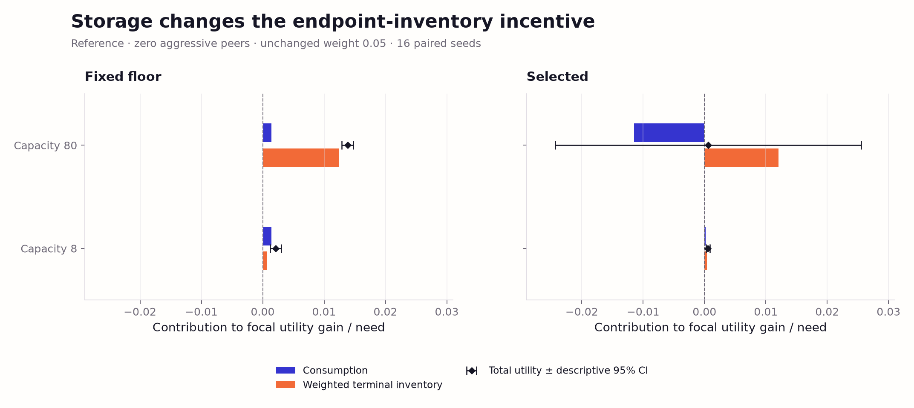

# Commons v3: completed incentive qualification, results v1

The frozen incentive bank is complete. **The overall qualification verdict is
fail.** The primary adjacent-region verdict is unresolved, and reference
robustness fails at all three registered utility weights: 0, 0.05 and 0.2.
A material population consumption loss is established across the primary grid,
but a robust private incentive to choose the supplied aggressive policy is not.
These results do not qualify a general tragedy of the commons or establish a
strict assurance-game ordering. They motivate a separately versioned test of
storage capacity and aggressor prevalence before making that classification.

This report reads the completed [manifest](../evidence/commons-v3-incentive-qualification-v1/manifest.json)
and [summary](../evidence/commons-v3-incentive-qualification-v1/summary.json).
It does not restart, extend or alter the bank, its design or source closure.
The [frozen incentive protocol](commons-v3-incentive-qualification-protocol-v1.md)
controls every verdict. The external review of 7 October changes interpretation
and the next study, not any acceptance rule. Further ecology publication,
ecology figures and ecology audit layers are deferred while this framing is settled; earlier
published ecology evidence remains preserved.

## Completed design and uncertainty

The bank has 224 configurations, 3,360 episodes, 884,736 physical ticks and
21,233,664 individual decisions. The primary grid contributes 2,880 episodes;
the five reference sensitivities contribute 480. There are **16 independent
incentive seeds, 65001–65016**, reused across cells, controls and conditions.
The ecological bank uses a separate seed set. There are zero experimental model
calls, evolutionary runs and new numerical selection runs. Both frozen controls
are mandatory; a favorable result from one cannot substitute for the other.

Utility is `(cumulative consumption + weight × terminal inventory) / horizon`.
The supplied aggressive policy removes the voluntary floor and need target
while retaining its background's route rule. These are whole-policy substitutions;
movement, inventories and subsequent ecology can all change. They do not identify
a private optimum, an equilibrium or an extraction-only causal mechanism.

All qualification intervals below use the unchanged 194-interval simultaneous
family, Student-t critical value 4.750567324005865 and 15 degrees of freedom.
A lower-bound criterion passes when the lower bound reaches the registered
margin, fails when its upper bound is below the margin, and otherwise remains
unresolved. The margins are 0.01 of need for focal private gain and 0.05 of need
for both whole-run and final-quarter population consumption loss. These are
material-effect tests: failing them need not imply a zero or negative effect.
Reference intervals duplicated across primary and robustness requirements retain
the frozen multiplicity denominator. Other intervals are ordinary descriptive
95% intervals with critical value 2.131449545559776; they never change a verdict.

Values are seed means. Display rounding is six decimals; decisions use the exact
saved values. The model-based intervals are approximate, with 16 independent
seeds rather than thousands of independent agents or episodes.

## Every primary-grid verdict

The following table contains all 54 registered primary scalar criteria. Each
entry gives mean [simultaneous lower, upper] and its exact verdict. Population
loss is all restrained minus all aggressive. Focal gain changes only the focal
policy against zero aggressive peers. Each cell requires both controls.

| Rate / need | Control | Focal gain, weight 0.05 | Population loss | Late population loss | Control verdict |
| --- | --- | --- | --- | --- | --- |
| 0.12 / 0.8 | Fixed floor | 0.091397 [-0.032831, 0.215626] unresolved | 0.743983 [0.727073, 0.760893] pass | 0.873911 [0.837828, 0.909993] pass | unresolved |
| 0.12 / 0.8 | Selected | 0.064578 [-0.114014, 0.243171] unresolved | 0.747476 [0.732190, 0.762761] pass | 0.883330 [0.847170, 0.919490] pass | unresolved |
| 0.12 / 1.2 | Fixed floor | 0.305898 [0.095016, 0.516781] pass | 0.532271 [0.526183, 0.538359] pass | 0.609581 [0.593846, 0.625315] pass | pass |
| 0.12 / 1.2 | Selected | 0.325749 [0.102153, 0.549345] pass | 0.538565 [0.529930, 0.547200] pass | 0.612963 [0.593814, 0.632113] pass | pass |
| 0.12 / 1.6 | Fixed floor | 0.407276 [0.214652, 0.599901] pass | 0.406129 [0.396754, 0.415504] pass | 0.461572 [0.451471, 0.471673] pass | pass |
| 0.12 / 1.6 | Selected | 0.208282 [-0.116224, 0.532788] unresolved | 0.412777 [0.408184, 0.417370] pass | 0.462596 [0.453930, 0.471262] pass | unresolved |
| 0.24 / 0.8 | Fixed floor | 0.018926 [0.018926, 0.018926] pass | 0.795513 [0.793529, 0.797498] pass | 0.988447 [0.985885, 0.991009] pass | pass |
| 0.24 / 0.8 | Selected | 0.018535 [0.018535, 0.018535] pass | 0.794719 [0.792079, 0.797358] pass | 0.987231 [0.982639, 0.991822] pass | pass |
| 0.24 / 1.2 | Fixed floor | 0.013828 [0.011796, 0.015859] pass | 0.861436 [0.859545, 0.863326] pass | 0.987571 [0.982531, 0.992611] pass | pass |
| 0.24 / 1.2 | Selected | 0.000593 [-0.055008, 0.056194] unresolved | 0.861708 [0.857406, 0.866009] pass | 0.989675 [0.982700, 0.996650] pass | unresolved |
| 0.24 / 1.6 | Fixed floor | 0.086048 [-0.152609, 0.324706] unresolved | 0.735020 [0.711982, 0.758058] pass | 0.811795 [0.768823, 0.854767] pass | unresolved |
| 0.24 / 1.6 | Selected | 0.050230 [-0.220090, 0.320551] unresolved | 0.756704 [0.733038, 0.780369] pass | 0.815993 [0.770304, 0.861681] pass | unresolved |
| 0.36 / 0.8 | Fixed floor | 0.018926 [0.018926, 0.018926] pass | 0.724295 [0.701869, 0.746720] pass | 0.968657 [0.947256, 0.990058] pass | pass |
| 0.36 / 0.8 | Selected | 0.018535 [0.018535, 0.018535] pass | 0.725508 [0.702328, 0.748687] pass | 0.972102 [0.960408, 0.983795] pass | pass |
| 0.36 / 1.2 | Fixed floor | 0.012422 [0.012422, 0.012422] pass | 0.819215 [0.803338, 0.835092] pass | 0.983443 [0.973022, 0.993865] pass | pass |
| 0.36 / 1.2 | Selected | 0.012031 [0.012031, 0.012031] pass | 0.819351 [0.803832, 0.834870] pass | 0.979169 [0.963660, 0.994677] pass | pass |
| 0.36 / 1.6 | Fixed floor | 0.009170 [0.009170, 0.009170] fail | 0.864322 [0.855816, 0.872828] pass | 0.981724 [0.961168, 1.002279] pass | fail |
| 0.36 / 1.6 | Selected | 0.008779 [0.008779, 0.008779] fail | 0.865508 [0.856616, 0.874400] pass | 0.985492 [0.978454, 0.992530] pass | fail |

The primary incentive cell conjunction passes at (0.12, 1.2), (0.24, 0.8),
(0.36, 0.8) and (0.36, 1.2); fails at (0.36, 1.6); and is unresolved at the
other four cells, including the reference (0.24, 1.2). All 36 population-loss
criteria pass. Private temptation is the limiting endpoint. The combined region
also requires the same adjacent pair to pass the already bound ecological gates.

| Reference-containing pair (rate, need) | Combined ecology + incentive verdict |
| --- | --- |
| grid-r0.12-n1.2 + grid-r0.24-n1.2 | fail |
| grid-r0.24-n0.8 + grid-r0.24-n1.2 | unresolved |
| grid-r0.24-n1.2 + grid-r0.24-n1.6 | fail |
| grid-r0.24-n1.2 + grid-r0.36-n1.2 | unresolved |

No pair passes; two remain unresolved and two fail. Therefore the primary
capacity-80, 256-tick qualified region is **unresolved**, separately from the
broader canonical-weight verdict, which **fails** its robustness requirements.

## Every reference-robustness verdict

The next two tables contain all 50 registered additional scalar intervals.
Population losses are shared across utility weights; rescorings add no episodes.
The reference and four logistic sensitivities must all pass for both controls.

| Panel | Control | Focal gain, weight 0 | Focal gain, weight 0.05 | Focal gain, weight 0.2 |
| --- | --- | --- | --- | --- |
| Reference | Fixed floor | 0.001406 [-0.000626, 0.003438] fail | 0.013828 [0.011796, 0.015859] pass | 0.051093 [0.049061, 0.053125] pass |
| Reference | Selected | -0.011488 [-0.067073, 0.044098] unresolved | 0.000593 [-0.055008, 0.056194] unresolved | 0.036836 [-0.018813, 0.092484] unresolved |
| 512 ticks | Fixed floor | 0.003762 [0.000277, 0.007247] fail | 0.009979 [0.006483, 0.013475] unresolved | 0.028631 [0.025102, 0.032159] pass |
| 512 ticks | Selected | -0.002467 [-0.032033, 0.027099] unresolved | 0.003572 [-0.025997, 0.033142] unresolved | 0.021691 [-0.007890, 0.051273] unresolved |
| Storage 8 | Fixed floor | 0.001406 [-0.000626, 0.003438] fail | 0.002109 [0.000077, 0.004141] fail | 0.004218 [0.002186, 0.006250] fail |
| Storage 8 | Selected | 0.000199 [-0.000468, 0.000866] fail | 0.000561 [-0.000092, 0.001214] fail | 0.001647 [0.000937, 0.002357] fail |
| Initial stock 22 | Fixed floor | -0.112273 [-0.398348, 0.173802] unresolved | -0.101939 [-0.393432, 0.189555] unresolved | -0.070935 [-0.378702, 0.236832] unresolved |
| Initial stock 22 | Selected | -0.150653 [-0.420756, 0.119451] unresolved | -0.141154 [-0.415806, 0.133497] unresolved | -0.112659 [-0.401299, 0.175981] unresolved |
| Keyed contention | Fixed floor | 0.001406 [-0.000626, 0.003438] fail | 0.013828 [0.011796, 0.015859] pass | 0.051093 [0.049061, 0.053125] pass |
| Keyed contention | Selected | -0.011488 [-0.067073, 0.044098] unresolved | 0.000593 [-0.055008, 0.056194] unresolved | 0.036836 [-0.018813, 0.092484] unresolved |

| Panel | Control | Population loss | Late population loss |
| --- | --- | --- | --- |
| Reference | Fixed floor | 0.861436 [0.859545, 0.863326] pass | 0.987571 [0.982531, 0.992611] pass |
| Reference | Selected | 0.861708 [0.857406, 0.866009] pass | 0.989675 [0.982700, 0.996650] pass |
| 512 ticks | Fixed floor | 0.923835 [0.922093, 0.925578] pass | 0.985777 [0.982112, 0.989442] pass |
| 512 ticks | Selected | 0.924080 [0.919923, 0.928237] pass | 0.985421 [0.974548, 0.996294] pass |
| Storage 8 | Fixed floor | 0.090888 [0.034570, 0.147206] unresolved | 0.358305 [0.143728, 0.572882] pass |
| Storage 8 | Selected | 0.091932 [0.033908, 0.149957] unresolved | 0.360393 [0.139811, 0.580975] pass |
| Initial stock 22 | Fixed floor | 0.914931 [0.912823, 0.917038] pass | 0.985100 [0.979092, 0.991109] pass |
| Initial stock 22 | Selected | 0.915513 [0.912570, 0.918457] pass | 0.986335 [0.979343, 0.993328] pass |
| Keyed contention | Fixed floor | 0.862336 [0.860906, 0.863765] pass | 0.989506 [0.986453, 0.992559] pass |
| Keyed contention | Selected | 0.862262 [0.859273, 0.865251] pass | 0.990121 [0.983038, 0.997205] pass |

| Registered conjunction | Verdict |
| --- | --- |
| Reference robustness, weight 0.0 | fail |
| Reference robustness, weight 0.05 | fail |
| Reference robustness, weight 0.2 | fail |
| Primary region | unresolved |
| Broader qualification, canonical weight 0.05 | fail |

Storage 8 fails the private-gain threshold at **every weight for both controls**.
Its population mean-loss criterion is unresolved for both controls; its late-loss
criterion passes. A small positive gain is not the registered 1%-of-need
material incentive. The 512-tick fixed-floor canonical gain is unresolved;
lower initial stock gives negative mean focal gains for both controls. These
stress tests are retained rather than dropped, and changing the terminal weight
is not a remedy.

## Reference decomposition and adverse individual outcomes



Consumption and weighted terminal inventory contributions at the unchanged
weight 0.05, against zero aggressive peers. Diamonds are total utility means
with descriptive 95% intervals; all quantities are divided by need. Both
capacities were frozen before execution. [SVG](../figures/commons-v3-incentive-review-v1/storage-decomposition.svg)
and [PDF](../figures/commons-v3-incentive-review-v1/storage-decomposition.pdf).

At the reference, the all-restrained population consumes 99.8217% of need under
fixed floor and 99.9129% under selected. With the fixed-floor background, the
focal canonical utility gain is 0.013828 of need: consumption contributes
0.001406 and weighted terminal inventory contributes 0.012422. Thus **89.83%**
of that mean gain comes from terminal inventory. The mean additional inventory
is 76.32 units. With the selected background, consumption contributes −0.011488,
terminal inventory contributes +0.012081 and net utility contributes +0.000593
of need. A percentage decomposition of that small net selected gain would be
misleading because the terms largely cancel.

The selected reference has one adverse seed, **65013**, with focal consumption
loss 0.224385 units per tick (0.186988 of need). Thirteen seeds give zero focal
consumption change and two give positive change. Fixed floor has four zeros,
12 positives and no negatives. The selected uncertainty must not be removed
as an outlier. Under initial stock 22, mean focal consumption changes are
−0.112273 and −0.150653 of need for fixed floor and selected; the corresponding
canonical utility changes are −0.101939 and −0.141154. The selected lower-stock
ordinary 95% consumption interval is [−0.271840, −0.029465], but its simultaneous
qualification interval remains unresolved. These are different uncertainty uses.

Storage 8 reduces the canonical mean gain to **0.002109 of need** for fixed floor
and **0.000561** for selected. At that capacity, the unchanged-peer mean consumption
change from one focal substitution is −0.000109 and +0.000132 of need respectively;
both ordinary 95% intervals span zero. The capacity-80 reference changes are
−0.012869 and −0.017133, with descriptive intervals below zero. Losses caused
by one substitution and losses under an entirely aggressive population are
separate contrasts.

## Every 0–23 aggressive-peer curve


Both frozen controls and every registered utility weight, on identical scales.
Points are matched focal gains at the five observed peer counts; error bars
are descriptive 95% intervals across 16 seeds. Lines join observed counts
and do not locate a tipping point. Weight zero is consumption only.
[SVG](../figures/commons-v3-incentive-review-v1/reference-peer-curves.svg) and
[PDF](../figures/commons-v3-incentive-review-v1/reference-peer-curves.pdf).

The frozen design observes **0, 6, 12, 18 and 23** aggressive peers, not every
integer prevalence. k is divided by 23 for peer prevalence. The total aggressive
population is k/24 before, and (k+1)/24 after, focal substitution. Peer identities
are unchanged within a pair and nested across k. Sensitivity panels have only
the three frozen endpoint arms; they provide no intermediate-peer stress curves.

The reference curve below reports focal consumption gain with descriptive 95%
intervals, and all three utility weights. Weight-zero utility equals consumption.
Every gain is aggressive minus restrained at the same peer assignment, divided
by need. Inventory is retained separately in resource units in the next table.

| Control | Aggressive peers k | Consumption / weight-0 gain | Weight-0.05 gain | Weight-0.2 gain |
| --- | --- | --- | --- | --- |
| Fixed floor | 0 | 0.001406 [0.000494, 0.002317] | 0.013828 | 0.051093 |
| Fixed floor | 6 | -0.114081 [-0.312978, 0.084816] | -0.110681 | -0.100479 |
| Fixed floor | 12 | 0.107428 [-0.047270, 0.262127] | 0.107658 | 0.108348 |
| Fixed floor | 18 | 0.109436 [0.089812, 0.129060] | 0.109800 | 0.110891 |
| Fixed floor | 23 | 0.092202 [0.078571, 0.105832] | 0.092207 | 0.092221 |
| Selected | 0 | -0.011488 [-0.036428, 0.013452] | 0.000593 | 0.036836 |
| Selected | 6 | -0.050639 [-0.239897, 0.138618] | -0.049388 | -0.045632 |
| Selected | 12 | 0.204745 [0.104608, 0.304882] | 0.204817 | 0.205031 |
| Selected | 18 | 0.100139 [0.070697, 0.129581] | 0.100340 | 0.100942 |
| Selected | 23 | 0.081452 [0.064718, 0.098186] | 0.081459 | 0.081480 |

| Control | k | Additional focal inventory | Unchanged-peer consumption change / need | Population consumption change / need |
| --- | --- | --- | --- | --- |
| Fixed floor | 0 | 76.320000 | -0.012869 [-0.017850, -0.007889] | -0.012275 [-0.017058, -0.007492] |
| Fixed floor | 6 | 20.892395 | -0.091928 [-0.129127, -0.054730] | -0.092851 [-0.132183, -0.053520] |
| Fixed floor | 12 | 1.411733 | -0.033541 [-0.049474, -0.017609] | -0.027667 [-0.047051, -0.008284] |
| Fixed floor | 18 | 2.234536 | -0.010846 [-0.016547, -0.005145] | -0.005834 [-0.011715, 0.000046] |
| Fixed floor | 23 | 0.030238 | -0.006752 [-0.008795, -0.004710] | -0.002629 [-0.004736, -0.000522] |
| Selected | 0 | 74.225000 | -0.017133 [-0.027065, -0.007202] | -0.016898 [-0.026846, -0.006950] |
| Selected | 6 | 7.691035 | -0.102609 [-0.148945, -0.056274] | -0.100444 [-0.145941, -0.054947] |
| Selected | 12 | 0.439451 | -0.033535 [-0.049447, -0.017624] | -0.023607 [-0.038745, -0.008469] |
| Selected | 18 | 1.233774 | -0.007993 [-0.013213, -0.002773] | -0.003488 [-0.009176, 0.002201] |
| Selected | 23 | 0.042818 | -0.007599 [-0.009877, -0.005321] | -0.003889 [-0.006369, -0.001408] |

Against 23 aggressive peers, aggression raises mean focal consumption by
0.092202 of need with fixed floor and 0.081452 with selected; both ordinary 95%
intervals are positive. This is a different comparison from invading an otherwise
restrained population. Both reference means become negative at six aggressive
peers, but those intervals span zero. The measured curves are nonmonotonic and
do not justify interpolating a unique tipping point between sampled counts.

The following complete grid table gives the consumption-only mean curve for
both backgrounds. Its intervals, the full weight-0/0.05/0.2 curves, terminal
inventory, unchanged-peer and whole-population effects are in the linked CSV
projection and original summary, with every seed value retained.

| Rate / need | Control | k=0 | k=6 | k=12 | k=18 | k=23 |
| --- | --- | --- | --- | --- | --- | --- |
| 0.12 / 0.8 | Fixed floor | 0.072821 | 0.164555 | 0.252864 | 0.163570 | 0.137629 |
| 0.12 / 0.8 | Selected | 0.047004 | 0.203976 | 0.273051 | 0.129617 | 0.130086 |
| 0.12 / 1.2 | Fixed floor | 0.294239 | 0.187188 | 0.102479 | 0.091272 | 0.078502 |
| 0.12 / 1.2 | Selected | 0.313943 | 0.178915 | 0.120407 | 0.091523 | 0.070441 |
| 0.12 / 1.6 | Fixed floor | 0.400778 | 0.201216 | 0.107707 | 0.065768 | 0.051571 |
| 0.12 / 1.6 | Selected | 0.203585 | 0.190288 | 0.087348 | 0.062309 | 0.043682 |
| 0.24 / 0.8 | Fixed floor | 0.000000 | -0.187506 | 0.096870 | 0.215949 | 0.160868 |
| 0.24 / 0.8 | Selected | 0.000000 | -0.209519 | 0.130220 | 0.218976 | 0.148750 |
| 0.24 / 1.2 | Fixed floor | 0.001406 | -0.114081 | 0.107428 | 0.109436 | 0.092202 |
| 0.24 / 1.2 | Selected | -0.011488 | -0.050639 | 0.204745 | 0.100139 | 0.081452 |
| 0.24 / 1.6 | Fixed floor | 0.077862 | 0.125367 | 0.016776 | 0.081185 | 0.059896 |
| 0.24 / 1.6 | Selected | 0.041843 | 0.061385 | 0.054524 | 0.044861 | 0.052302 |
| 0.36 / 0.8 | Fixed floor | 0.000000 | -0.047505 | -0.058975 | 0.300705 | 0.170783 |
| 0.36 / 0.8 | Selected | 0.000000 | -0.075429 | -0.093848 | 0.121347 | 0.162822 |
| 0.36 / 1.2 | Fixed floor | 0.000000 | -0.233279 | -0.089405 | 0.194401 | 0.101889 |
| 0.36 / 1.2 | Selected | 0.000000 | -0.194717 | -0.166056 | 0.136028 | 0.088212 |
| 0.36 / 1.6 | Fixed floor | 0.000000 | -0.125487 | 0.079270 | 0.085364 | 0.082381 |
| 0.36 / 1.6 | Selected | 0.000000 | -0.192816 | 0.096072 | 0.099538 | 0.066550 |

These results support studying prevalence-dependent incentives and coordination
failure. They do **not** establish a strict stag hunt: fixed floor's reference
zero-peer consumption gain is small but positive even under its descriptive
interval, while selected's sign is uncertain. Failing a material-gain threshold
is not the same as demonstrating that restraint strictly pays. Neither the
supplied pair of controllers nor five prevalence points exhaust the strategy
space. The review's assurance interpretation remains a scientific hypothesis,
not a replacement label declared by this bank.

## Branch cohorts, population outcomes and access

The following reference branch means show population consumption as the imposed
aggressor share increases. The full projection retains focal, restrained and
aggressive cohort means in each branch, including cohort sizes and their seed
intervals. A cohort's composition changes across prevalence conditions; a cohort
comparison is not another matched focal effect. No agent learns, copies or
spreads a policy inside these episodes: prevalence is assigned before execution.
The raw bank retains per-tick trajectories and physical snapshots; none are
reconstructed from endpoint averages.

| Control | k | Population, focal R | Population, focal A | R branch normal / aggressive cohorts | A branch normal / aggressive cohorts |
| --- | --- | --- | --- | --- | --- |
| Fixed floor | 0 | 0.998218 | 0.985943 | 0.998218 / — | 0.985332 / 1.000000 |
| Fixed floor | 6 | 0.599698 | 0.506846 | 0.581079 / 0.655554 | 0.497700 / 0.529060 |
| Fixed floor | 12 | 0.253122 | 0.225454 | 0.176899 / 0.329344 | 0.143299 / 0.294970 |
| Fixed floor | 18 | 0.164608 | 0.158774 | 0.080464 / 0.192656 | 0.069262 / 0.182329 |
| Fixed floor | 23 | 0.139411 | 0.136782 | 0.053187 / 0.143160 | — / 0.136782 |
| Selected | 0 | 0.999129 | 0.982231 | 0.999129 / — | 0.981966 / 0.988313 |
| Selected | 6 | 0.608894 | 0.508450 | 0.600662 / 0.633590 | 0.486792 / 0.561047 |
| Selected | 12 | 0.259248 | 0.235641 | 0.180181 / 0.338315 | 0.154745 / 0.304091 |
| Selected | 18 | 0.166019 | 0.162532 | 0.087799 / 0.192093 | 0.081998 / 0.183725 |
| Selected | 23 | 0.141310 | 0.137421 | 0.062961 / 0.144717 | — / 0.137421 |

All-restrained versus all-aggressive endpoints across every reference panel
are shown below. Consumption is divided by need; stock is a fraction of total
site capacity. These quantities distinguish consumption harm, overall resource
depletion and hungry agents unable to access sites.

| Panel | Control | Consumption R / A | Late consumption R / A | Terminal stock R / A | Hungry off-site fraction R / A |
| --- | --- | --- | --- | --- | --- |
| Reference | Fixed floor | 0.998218 / 0.136782 | 0.996349 / 0.008778 | 0.738960 / 0.002358 | 0.007507 / 0.333537 |
| Reference | Selected | 0.999129 / 0.137421 | 0.997531 / 0.007856 | 0.738797 / 0.001930 | 0.001678 / 0.331685 |
| 512 ticks | Fixed floor | 0.996056 / 0.072221 | 0.993423 / 0.007645 | 0.743680 / 0.002324 | 0.019714 / 0.358490 |
| 512 ticks | Selected | 0.996886 / 0.072806 | 0.993451 / 0.008030 | 0.740413 / 0.001867 | 0.005157 / 0.355194 |
| Storage 8 | Fixed floor | 0.998218 / 0.907330 | 0.996349 / 0.638044 | 0.738960 / 0.114894 | 0.007507 / 0.048187 |
| Storage 8 | Selected | 0.999129 / 0.907197 | 0.997531 / 0.637138 | 0.738797 / 0.113565 | 0.001678 / 0.046448 |
| Initial stock 22 | Fixed floor | 0.995161 / 0.080231 | 0.993298 / 0.008198 | 0.734833 / 0.002007 | 0.020691 / 0.355794 |
| Initial stock 22 | Selected | 0.996150 / 0.080637 | 0.995348 / 0.009013 | 0.740037 / 0.002647 | 0.006938 / 0.353363 |
| Keyed contention | Fixed floor | 0.998218 / 0.135882 | 0.996349 / 0.006843 | 0.738960 / 0.001911 | 0.007507 / 0.322276 |
| Keyed contention | Selected | 0.999129 / 0.136867 | 0.997531 / 0.007410 | 0.738797 / 0.001841 | 0.001678 / 0.310689 |
| Additive renewal | Fixed floor | 1.000000 / 0.999864 | 1.000000 / 0.999942 | 0.895413 / 0.582387 | 0.000000 / 0.000295 |
| Additive renewal | Selected | 1.000000 / 0.999402 | 1.000000 / 0.999418 | 0.839012 / 0.573055 | 0.000000 / 0.001363 |

At capacity 80, all-aggressive reference terminal stock is only 0.2358% of
capacity under fixed floor and 0.1930% under selected; whole-commons depletion
is present here, unlike earlier banks with large unused stocks. Storage 8
retains about 11.49% and 11.36% terminal stock and much more whole-run
consumption, although late consumption losses remain material. Navigation
and contention costs still exist; these results do not attribute every loss
to one mechanism. All saved conditions report zero unaffordable known-return
violations. Maximum absolute ledger residual is 5.8931×10⁻¹³ and maximum
relative residual is 2.7525×10⁻¹⁶.

## Additive-renewal negative control

The negative control is excluded from qualification. The table gives
all-restrained minus all-aggressive consumption loss, divided by need, using
ordinary descriptive 95% intervals. Every upper bound is below the registered
0.05 material-harm scale. Thus material harm at that scale is absent within
these descriptive intervals; exact zero harm is not established. In particular,
fixed-floor whole-run loss is small and its interval is strictly positive.

| Control | Mean consumption loss | Late consumption loss | Descriptive finding |
| --- | --- | --- | --- |
| Fixed floor | 0.000136 [0.000013, 0.000258] | 0.000058 [-0.000027, 0.000143] | Below 0.05 material harm |
| Selected | 0.000598 [-0.000094, 0.001291] | 0.000582 [-0.000484, 0.001647] | Below 0.05 material harm |

The focal additive-renewal consumption gain is zero in all 16 seeds for both
controls. Nevertheless the canonical utility gains are 0.012422 and 0.012031
of need, entirely terminal inventory. That dissociation is retained: utility
incentives produced by the endpoint inventory term can exist without material
population consumption harm. Additive renewal changes the physical growth law;
it is not an isolated intervention on one behavior inside the logistic world.

## Evidence projections and verification scope

The new, separate review directory contains readable scalar projections:

- [Every primary and robustness criterion](../evidence/commons-v3-review-v1/incentive-gates-v1.csv):
  104 registered rows, including the six intentionally duplicated reference rows.
- [Every matched peer effect](../evidence/commons-v3-review-v1/incentive-peer-effects-v1.csv):
  all 90 primary-grid pairs and 10 sensitivity pairs, at every saved endpoint
  and utility weight, including missing cohorts, intervals and seed values.
- [Branch and cohort outcomes](../evidence/commons-v3-review-v1/incentive-branch-outcomes-v1.csv):
  all 210 condition/control combinations, all agent endpoints, and selected
  population, ecological and access diagnostics with intervals and seed values.
- [Projection receipt](../evidence/commons-v3-review-v1/incentive-projection-receipt-v1.json):
  input and output hashes and the scalar-check scope.

The CSV effect and branch endpoints retain the original physical units. Divide
per-tick consumption or utility by the row's need to obtain the normalized
reporting scale. Do not divide raw terminal inventory or stock fractions by
need. Null endpoint fields mean an empty cohort, not a zero outcome. The
original summary retains every additional diagnostic and all unrounded values.

Projection checks recompute every exported nonempty interval from its 16 stored
seed values and verify every exported threshold verdict; they perform no policy
execution. This is a check of saved scalar arithmetic, not independent raw-case
semantic replay. The frozen runner can check all hashes and reaggregate every
saved incentive case without simulating:

```bash
python3 scripts/run_commons_v3_qualification_v1.py verify \
  --output evidence/commons-v3-incentive-qualification-v1 --hashes-only
```

Its bound `ecology-input.json` supplies the already frozen ecological result;
no new ecology bank run is needed. Removing `--hashes-only` requests exact
semantic replay of all 3,360 episodes and is a separate, substantial verification
operation. The [incentive-only figure gallery](../figures/commons-v3-incentive-review-v1/README.md)
contains inspected SVG/PDF/PNG exports and a manifest of source and output hashes.
Its separately versioned renderer reads recorded incentive scalars without
running a simulator or reading the ecological bank. The
[separate public archive](../artifacts/commons-v3-incentive-qualification-v1/README.md)
now restores all **224 raw files / 453,051,247 bytes** byte-identically from
an empty cache and through offline restoration. Its
[publication receipts](../evidence/commons-v3-qualification-validation-v1/publication/incentive/README.md)
bind source checkpoint `e895b72` and preserve earlier ecology asset identities.
No new ecological audit or complete incentive semantic replay is claimed.
The finished bank remains preserved, including all null and adverse outcomes.
