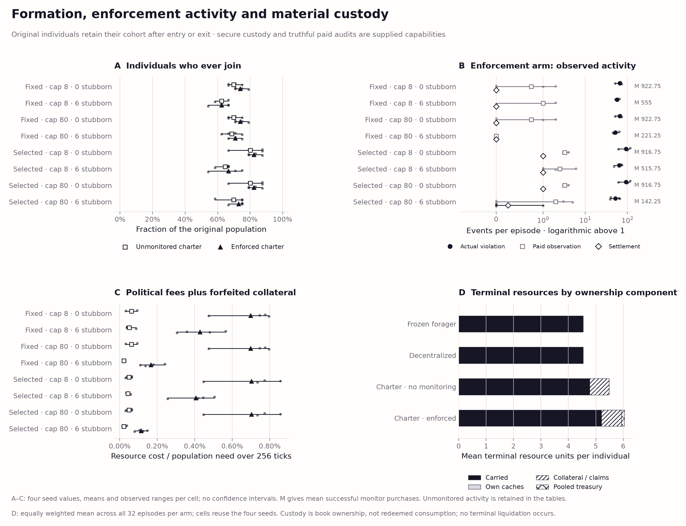

# Optional-charter development results v1

The first prospective institutional development comparison is complete:
**144 episodes on four fresh environment seeds, with no robust consumption
advantage for the supplied enforced charter.** The enforced-charter bundle lowers consumption
relative to the decentralized controller in every seed of six of the eight
contexts. Its two positive context means occur with capacity 80 and six
stubborn aggressors, vary substantially across seeds, and need not benefit
the original eligible cohort. This is useful development evidence about the
current controllers, not institutional qualification or evolved governance.

The [protocol](commons-v3-institutions-development-protocol-v1.md), executable
design and complete source closure were pushed at
`a4c84e67cc7d6d05ef4d05c13e75c7fafe90e6c2` before any panel episode.
The [freeze receipt](../evidence/commons-v3-institutions-development-validation-v1/freeze.json)
records remote verification and zero completed episodes. No source, seed,
parameter or comparison changed after execution. Earlier physical and incentive
banks remain unchanged; their unresolved and failed qualification verdicts
remain in force.

## Design and interpretation

The panel crosses two competent frozen navigation backgrounds, carrying
capacities 8/80, original stubborn cohorts of 0/6 of 24 agents, and four arms:
the frozen restrained forager (F), decentralized reporting/cache controller
(D), optional unmonitored charter (U), and optional enforced charter (E).
Four seeds 93001–93004 give 128 episodes, with 16 all-stubborn anchors.
Every episode lasts 256 ticks; the final 64 ticks are also reported. The
total is **36,864 physical ticks and 884,736 individual decisions**, with
**zero experimental model calls, evolutionary runs or policy-selection runs**.
The four environment seeds are the replication units. Repeated conditions,
individuals, organizations and actions are not independent replications.

Nonstubborn agents retain restrained navigation in every arm. Stubborn agents
never join, communicate, use caches or respond to threats. The charter has
quota 2, entry bond 1, suggested dues 0.1 and fine 0.5. Enforcement uses paid
local monitoring and voluntary collateral; it cannot seize outsider inventory.
The response rule uses a supplied anticipated monitoring probability of 0.5,
not an estimated detection rate or optimized best response. The unmonitored
arm anticipates zero enforcement and does not fund unused monitoring.

Generic physical opportunities are shared, but formal boards and binding
escrow lack a full nonmembership bilateral-contract analogue. These are
**policy-bundle comparisons**, not a cost-matched intervention isolating
organization or sanctions. The decentralized controller is one candidate;
its limited activity below prevents calling it a strong coordination benchmark.
Secure custody and truthful paid auditing are supplied capabilities.

## Consumption and all declared comparisons

Values below are mean realized consumption divided by need across four seeds.
They are fractions, so 0.01 corresponds to one percentage point of need.
No confidence intervals or qualification thresholds were declared for this bank.

| Navigation | Capacity | Stubborn | Frozen F | Decentralized D | Unmonitored U | Enforced E |
| --- | ---: | ---: | ---: | ---: | ---: | ---: |
| Fixed floor | 8 | 0 | 0.998639 | 0.998639 | 0.998275 | 0.996141 |
| Fixed floor | 8 | 6 | 0.993359 | 0.993359 | 0.993452 | 0.988973 |
| Fixed floor | 80 | 0 | 0.998639 | 0.998639 | 0.998275 | 0.996141 |
| Fixed floor | 80 | 6 | 0.570273 | 0.570273 | 0.654568 | 0.591890 |
| Selected | 8 | 0 | 0.999282 | 0.999282 | 0.999463 | 0.998548 |
| Selected | 8 | 6 | 0.996412 | 0.996412 | 0.994112 | 0.993302 |
| Selected | 80 | 0 | 0.999282 | 0.999282 | 0.999463 | 0.998548 |
| Selected | 80 | 6 | 0.559344 | 0.559340 | 0.549374 | 0.600614 |

Every declared paired contrast is retained: **D−F, U−D, E−D and E−U** for
all eight contexts. The [paired table](../figures/commons-v3-institutions-development-v1/paired-contrasts.json)
contains every seed value, mean and observed minimum/maximum for population,
late population and both original cohorts. The
[episode table](../figures/commons-v3-institutions-development-v1/episode-outcomes.csv)
retains every absolute episode outcome; the
[full summary](../evidence/commons-v3-institutions-development-v1/summary.json)
also retains per-agent measures, costs, custody, membership and all three
utility weights. Empty cohorts remain null.

| Navigation | Capacity | Stubborn | E−D mean | Four-seed range | E−D, final 64 ticks |
| --- | ---: | ---: | ---: | ---: | ---: |
| Fixed floor | 8 | 0 | −0.002497 | −0.003531 to −0.001203 | −0.006494 |
| Fixed floor | 8 | 6 | −0.004387 | −0.011007 to −0.000181 | −0.013904 |
| Fixed floor | 80 | 0 | −0.002497 | −0.003531 to −0.001203 | −0.006494 |
| Fixed floor | 80 | 6 | +0.021617 | −0.077964 to +0.096685 | +0.052403 |
| Selected | 8 | 0 | −0.000734 | −0.001203 to −0.000454 | −0.001793 |
| Selected | 8 | 6 | −0.003110 | −0.006058 to −0.000241 | −0.010804 |
| Selected | 80 | 0 | −0.000734 | −0.001203 to −0.000454 | −0.001793 |
| Selected | 80 | 6 | +0.041273 | −0.056614 to +0.208948 | +0.107553 |

The population means conceal an important distributional result. At capacity
80 with six stubborn agents, fixed-floor E−D is **−0.024235 for the original
eligible cohort** and **+0.159173 for the stubborn cohort**. The positive
population mean therefore does not establish a benefit to potential members.
For selected navigation the corresponding means are +0.030201 and +0.074489;
the population effect is strongly influenced by seed 93002's +0.208948 gain.
Both comparisons have adverse seeds. Current members are a selected group,
so they cannot replace the original cohorts in this interpretation.

Unmonitored charters also give mixed results. At capacity 80 with six stubborn
agents, U−D is **+0.084295** for fixed-floor navigation (range −0.001804 to
+0.175388), but **−0.009967** for selected navigation (−0.092913 to +0.061418).
In the fixed-floor context, E−U is **−0.062678** and negative in all four
seeds. Thus the largest favorable context mean does not require the enforced
variant. D−F is zero in seven contexts and about −0.0000033 in the eighth.
These results do not identify whether changes arise from charter response,
timing, collateral, expenditures or altered resource competition.

Absolute outcomes remain poor in the high-storage mixed population:
enforced consumption reaches only 59.19%/60.06% of need for fixed/selected
navigation; its final-64-tick values are 55.40%/57.91%. Relative gains do not
establish satisfactory resilience. The all-stubborn anchors are worse:

| Navigation | Capacity | All ticks / need | Final 64 ticks / need |
| --- | ---: | ---: | ---: |
| Fixed floor | 8 | 0.898474 | 0.596426 |
| Fixed floor | 80 | 0.137519 | 0.009623 |
| Selected | 8 | 0.898546 | 0.596713 |
| Selected | 80 | 0.137248 | 0.007398 |


*Recorded-data means, seed points and observed ranges; these are not confidence
intervals. All ticks and the final 64 ticks remain separate.
[Full captions, tables, SVG/PDF/PNG exports and hashes](../figures/commons-v3-institutions-development-v1/README.md).*

## What the political mechanisms actually did

All 64 charter episodes form organizations under supplied local rules. There
are **no exits or cache operations**, and no organization deactivates within
the horizon. Static terms remain acceptable to the supplied rule; persistence
does not establish attractive membership, payoff-responsive exit, spontaneous
institutional discovery or long-term political stability.

| Recorded total | Unmonitored, 32 episodes | Enforced, 32 episodes |
| --- | ---: | ---: |
| Activations | 238 | 236 |
| Terminal members, summed over episodes | 543 | 562 |
| Member-ticks | 122,129 | 123,512 |
| Political operating fees | 106.20 | 1,147.61 |
| Collateral destroyed | 0 | 6.50 |
| Actual charter violations | 1,809 | 2,164 |
| Observed violations, deduplicated | 0 | 54 |
| Successful monitor purchases | 0 | 20,453 |
| Successful sanctions | 0 | 13 |

These are pooled counts across repeated contexts, not 32 independent seeds.
Actual violations use opening charter membership and harvest records;
evaluator visibility is distinct from purchased evidence. A separate
[retrospective recorded-frame diagnostic](../evidence/commons-v3-institutions-development-validation-v1/recorded-diagnostics.json)
finds 34 of the 54 observed violations have only a self-observer and 20 have
another observer. The 13 successful sanctions occur in 13 episodes; no bond
is exhausted at the terminal snapshot. In particular, fixed-floor/capacity-80/
six-stubborn enforcement records **207 actual violations and 885 paid monitors,
but zero observed violations or sanctions**. Its positive mean is therefore
not evidence that realized sanctions produced the gain. Anticipated threat and
other bundle differences remain unresolved alternatives.

The decentralized arm sends just **five paid reports in three of 32 episodes**,
at total cost 0.215; seven committed attempts include two failures. The
unmonitored arm sends four reports in two episodes (cost 0.171), and enforcement
sends 12 in four episodes (cost 0.516). Thus the intended communication/cache
comparison is almost inactive. This is a substantive baseline limitation to
resolve before a larger institutional evaluation, not evidence that effective
decentralized coordination cannot compete. The diagnostic reads saved frames
and verifies their manifest hashes without executing policies or physics.

## Consumption, costs and terminal custody

Paid fees and forfeiture already affect available material and consumption;
they are not subtracted again. The declared book-ownership convention adds
personal caches, active collateral, released claims and an equal share of
active treasury to carried inventory. Mature claims are a subset of released
claims. Ownership is counted once without liquidation or extra consumption
ticks; remote custody and possible liabilities do not guarantee usable welfare.

The saved records retain carried-only and book utility at **0, 0.05 and 0.2**,
alongside consumption. At weight 0, both conventions equal consumption. At
weight 0.05, including custody adds only 0.000117–0.000151 of need to the
mean E−D context contrasts. At capacity 80 with six stubborn agents, fixed-floor
E−D is +0.021617 consumption, +0.022468 carried utility and +0.022599 book
utility; selected E−D is +0.041273, +0.041378 and +0.041512 respectively.
The positive context consumption means are therefore not created by valuing
terminal custody. Their seed variability, cohort losses and mechanism ambiguity
still prevent a general institutional-benefit claim. No terminal weight changed.



*Recorded formation, violations, costs and terminal material components.
The gallery defines the count scale, repeated-seed pooling and ownership
conventions; every exported figure is bound to recorded input/output hashes.*

## Verification and reproduction

The relevant source/controller, measurement, recovery and physical/political
suite passes **230 tests**. Execution took 192.95 seconds with four workers.
[Full semantic replay](../evidence/commons-v3-institutions-development-validation-v1/replay.json)
then verified every raw episode, exact summary reconstruction and restored
policy-memory continuation from every midpoint in 244.83 seconds. Replay
recomputes decisions rather than substituting saved actions. Completion
manifest SHA-256:
`f06884dc2cb893b3b387f350ee6fbca4749bc7da128bca6d24cd89c49ac7fec6`.

The separately identified [raw archive](../artifacts/commons-v3-institutions-development-v1/README.md)
contains all 144 compressed episode files (17,133,617 original bytes;
15,473,215 archive bytes). Compact evidence, complete sources, receipts,
figures and this report remain in Git. Public and offline restoration each
reproduce all 144 files byte-identically into empty destinations; hosted catalog
and manifest bytes also match. The release targets results commit `2c59d9e`.
The archive page links the receipts. Existing archive identities are preserved.

From the repository root, restore raw evidence before full verification:

```bash
.venv/bin/python scripts/restore_evidence_v1.py \
  --catalog artifacts/commons-v3-institutions-development-v1/catalog.json \
  --study commons-v3-institutions-development-v1
.venv/bin/python scripts/run_commons_v3_institutions_development_v1.py verify \
  --output evidence/commons-v3-institutions-development-v1 --workers 4 \
  --receipt /tmp/institutions-development-replay.json
.venv/bin/python scripts/plot_commons_v3_institutions_development_v1.py \
  --output /tmp/institutions-development-figures
.venv/bin/python scripts/analyze_commons_v3_institutions_development_v1.py \
  --output /tmp/institutions-recorded-diagnostics.json
```

Use new receipt/output paths. Do not run the completed bank again or extend its
panel. Default tests need no raw-evidence download.

## Consequences for the next design

Stage 2 now has an executable political lifecycle and a completed first
scientific development comparison. It has not demonstrated a useful institution
or qualified decentralized coordination. The next increment should address
these specific deficiencies before an independent, larger evaluation:

1. Define a decentralized controller that makes consequential legal local
   coordination decisions, with explicit commitment and information parity.
   Verify its activity and accounting on development fixtures; do not force
   wasteful messages or caches merely to make counts nonzero.
2. Separate charter response, collateral locking, political timing and paid
   monitoring with prospective interventions. State who can observe whom and
   when external evidence can actually support settlement. Preserve a zero-fine
   or no-monitoring outcome if sanctions are unnecessary.
3. Make refusal and exit respond to a declared local payoff/cost rule, with
   original-cohort and outsider outcomes retained. A controller that accepts
   static terms throughout cannot establish that remaining is beneficial.
4. Freeze any revised development menu as a new version, then reserve fresh
   seeds for independent evaluation. Preserve this bank as the first attempted
   comparison, including its near-inactive comparator and adverse results.

This is a controller and identification problem, not a reason to retune terminal
weights, restart qualification, add an ecology audit layer or buy a model-driven
search campaign. Parameter learning, structural discovery and reciprocal
adaptation remain later stages with their own contracts and budgets.
