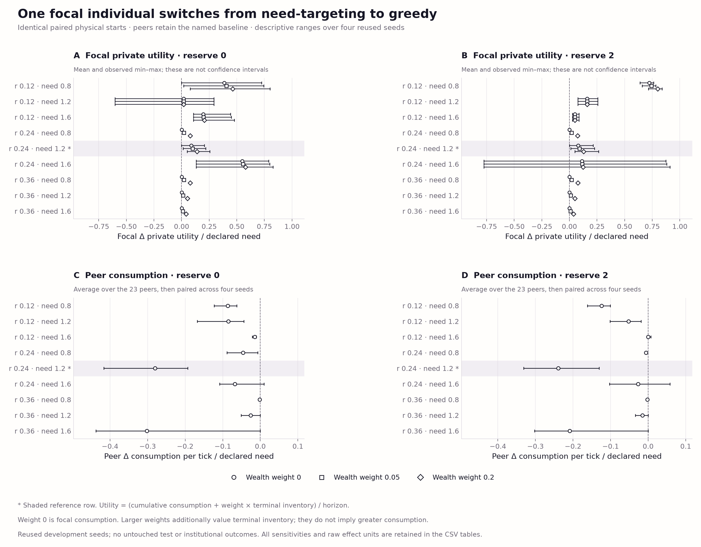

# Commons v3: need-targeted harvesting and usable reserves

This separately frozen development study adds the next missing local baseline
after the [physical-foundation controls](commons-v3-foundation-v1.md): harvest
toward current need, with zero or two further ticks of desired inventory.
Carrying capacity remains 80 in the primary grid. The physical engine,
ecological parameters and utility weights are unchanged. The two earlier banks
remain preserved, including the original navigation failure.

Need-targeting closes much of the reference consumption gap to restraint, but
does not establish sustainable foraging. A greedy focal replacement now gains
consumption on average while peers lose consumption. Longer runs deteriorate,
and the two-tick buffer is substantially worse at lower initial stock.
These adverse outcomes keep the strong-baseline and qualification gates open.

## Method and comparison

The [protocol](commons-v3-need-protocol-v1.md) and
[machine-readable design](../evidence/commons-v3-need-v1/design.json) were
frozen before panel execution. The policies receive only legal local packets,
remember observed site coordinates and their own visits, and retain the v2
prospective travel-fuel margin. They request enough gross harvest to cover
current need, the declared desired buffer and travel fuel, accounting for
extraction costs and storage before consumption. Only fuel is withheld from
consumption; the desired buffer remains usable when harvest is insufficient.
Waiting and yield-acceptance guards avoid scouting solely because the agent
already has enough inventory. Moving to a site still delays harvest until a
later action. These are improved harvesting controls with inherited navigation
limitations, not optimized controllers.

The study reuses all **56 configurations and four development seeds** from
foundation v2: nine rate/need cells plus the five fixed reference sensitivities.
Each configuration runs all need-0, all need-2, and a greedy focal replacement
against each matching baseline. That is **224 new episodes, 61,440 physical
ticks and 1,474,560 individual decisions**. There are **zero evolutionary runs
and zero experimental model calls**. Seeds, agents, ticks and parameter cells
are dependent; this is not untouched qualification. The capacity-8 condition is
retained as an explicitly separate sensitivity.

The saved v2 all-restraint and all-greedy results provide exactly matched
comparators. Their source banks are neither restarted nor modified. Replacing
the focal agent changes its entire policy, including navigation decisions;
it does not isolate extraction as a mechanism. The two new baseline policies
differ only in desired buffer size, but their resulting physical paths can
diverge. Private utility is consumption plus weighted terminal inventory,
divided by horizon, with weights 0, 0.05 and 0.2 reported separately.

## Recorded outcomes

At the preselected reference (`rate=0.24`, `need=1.2`, 256 ticks), four-seed
means are:

| Population | Consumption/agent/tick | Final-quarter consumption | Terminal ecological stock/capacity |
| --- | ---: | ---: | ---: |
| Saved v2 restraint | 1.200000 | 1.200000 | 0.722566 |
| Saved v2 greedy | 0.229769 | 0.100000 | 0.667041 |
| Need-targeted, zero buffer | 1.123083 | 0.910158 | 0.501802 |
| Need-targeted, two-tick buffer | 1.137248 | 0.959462 | 0.449560 |
| Greedy focal among zero-buffer peers | 0.805049 | 0.502168 | 0.534510 |
| Greedy focal among two-tick-buffer peers | 0.865762 | 0.604374 | 0.480520 |

The two-tick buffer adds **0.014165** population consumption per agent-tick
relative to zero buffer at the reference mean, with two positive and two
negative seed pairs. Across the nine grid-cell means it improves consumption
in six and reduces it in three. These fixed choices do not establish a best
reserve size or universal advantage. All-restraint still has higher reference
consumption than either new private rule.


*Recorded means on the reused development grid, with exact saved v2 comparisons.
The unsmoothed reference trajectories distinguish consumption from ecological
stock. Conditions use markers and line styles; there are no society identities.*

For each greedy focal replacement, the paired change is measured against the
corresponding all-need-targeted population:

| Reference focal outcome | Zero-buffer baseline | Two-tick-buffer baseline |
| --- | ---: | ---: |
| Focal consumption change/tick | +0.105842 | +0.095690 |
| Observed consumption-change range | 0 to +0.245805 | 0 to +0.257013 |
| Configurations with positive consumption change | 3/4 | 2/4 |
| Private utility change/tick, wealth weight 0.05 | +0.121224 | +0.110419 |
| Of which weighted terminal inventory/tick | +0.015382 | +0.014729 |
| Peer consumption change/peer/tick | −0.336463 | −0.287450 |
| Whole-population consumption change/agent/tick | −0.318034 | −0.271486 |

Each reference seed has positive weighted private utility and lower mean peer
consumption. Unlike the preceding focal replacement among restrained peers,
these average private returns include additional consumption. They remain
conditional whole-policy effects on inspected development cases. A positive
gain in only some seeds, weaker alternatives and inherited navigation limits
do not establish the intended robust social dilemma.



*Means and observed minimum–maximum paired differences across four reused
seed/focal configurations. Weight zero shows consumption alone. Whiskers are
not confidence intervals; all grid cells and utility weights remain visible.*

The fixed sensitivities retain important failures:

| Reference setting | Need-0 population consumption | Need-2 population consumption | Focal consumption gain, need-0 | Focal consumption gain, need-2 |
| --- | ---: | ---: | ---: | ---: |
| Base | 1.123083 | 1.137248 | +0.105842 | +0.095690 |
| Horizon 512 | 0.798804 | 0.804615 | +0.505180 | +0.253776 |
| Keyed priority | 1.121374 | 1.112836 | +0.106247 | +0.082277 |
| Initial stock 55% | 1.063570 | 0.808686 | +0.186486 | +0.246037 |
| Additive renewal | 1.199349 | 1.200000 | +0.000977 | 0.000000 |
| Carrying capacity 8 | 1.123083 | 1.137248 | +0.055942 | +0.052012 |

At 512 ticks, final-quarter consumption falls to **0.383088/0.385710** for
need-0/need-2, while **56.95%/52.13%** of ecological stock remains at the end.
This is not evidence of global resource collapse or sustained need satisfaction.
Lower starting stock makes the two-tick buffer worse in all four seed pairs,
by **0.254884** consumption per agent-tick on average. The additive control
restores near-ceiling consumption; its need-2 focal utility gain is entirely
terminal inventory. This control changes realized resource supply as well as
stock dependence.

With capacity 8, both all-baseline populations reproduce their capacity-80
consumption, but focal greedy consumption gains persist and peer losses
shrink to **0.004146/0.003195** per peer-tick. Unlike the preceding restraint
comparison, those mean losses do not disappear entirely. Storage changes
interact with the substituted policy and its peers; no mechanism-specific
conclusion follows from the complete bundle alone.

The complete cell, sensitivity and paired-effect tables are exported with the
[recorded-data gallery](../figures/commons-v3-need-v1/README.md). Reported
four-seed ranges are observed minima and maxima, not confidence intervals.

## Verification and reproduction

The [source freeze](../evidence/commons-v3-need-v1/sources.json) records the
unchanged engine and v2 greedy comparator alongside the new policy, runner,
CLI and protocols. Every episode checks material accounting, extraction waste,
return-fuel affordability and paired weather. The preselected reference case
also checks physical snapshot continuation under identical future actions;
private policy-memory recovery is not claimed.

All 224 episodes completed with zero recorded extraction waste or unaffordable
known-site returns. The maximum recorded accounting residual is
**2.15×10⁻¹³** resource units. An independent standard-library audit performs
29,055 numerical checks on raw agent and trajectory primitives, including
all 14 aggregate cells and utility decompositions; it passes with maximum
absolute discrepancy **1.08×10⁻¹²**. Its separate `2e-12 * max(1, |a|, |b|)`
comparison tolerance covers accumulation order in the audit only. It does not
change engine thresholds or the exact canonical-JSON semantic replay.

New policy tests cover gross extraction costs, pre-consumption storage limits,
buffer drawdown, useful small top-ups, waiting, legal information and numerical
fuel boundaries. Runner tests cover matching focal contrasts, exact design
preservation, source hashes, interruption recovery, completed/failed-bank
protection, unexpected artifacts and strict boolean-versus-number replay.

All **224 episodes pass exact semantic replay**. The full default test
invocation passed 769 tests and 123 subtests, with eight existing archive
tests blocked by the sandbox's refusal to create localhost HTTP sockets.
Those eight passed on a targeted rerun with loopback access, without source
changes: **777 unique tests and 123 subtests pass across the two invocations**.
Both logs are retained alongside the independent numerical audit, preserved
source checks, figure rerender and offline restoration receipts in the
[validation record](../evidence/commons-v3-need-validation-v1/README.md).

Create a separate reproduction without overwriting a completed bank:

```bash
.venv/bin/python scripts/run_commons_v3_need_v1.py prepare \
  --output runs/commons-v3-need-reproduction
OPENBLAS_NUM_THREADS=1 .venv/bin/python scripts/run_commons_v3_need_v1.py run \
  --output runs/commons-v3-need-reproduction
OPENBLAS_NUM_THREADS=1 .venv/bin/python scripts/run_commons_v3_need_v1.py verify \
  --output runs/commons-v3-need-reproduction
.venv/bin/python scripts/visualize_commons_v3_need_v1.py \
  --source runs/commons-v3-need-reproduction --output runs/commons-v3-need-figures
```

The separate [public case archive](../artifacts/commons-v3-need-publication-v1/README.md)
is published in release `commons-v3-need-2026-10-07`, targeting implementation
commit `536ed64`. All three public assets match their hashes; unauthenticated
download into an empty cache restores all 56 files byte-identically, and offline
verification passes. [Publication receipts](../evidence/commons-v3-need-publication-v1/README.md)
preserve those checks. The earlier [local-only metadata](../artifacts/commons-v3-need-v1/README.md)
and validation receipts remain unchanged as the pre-publication record. Compact designs,
summaries, source snapshots, figures and validation records remain in the
repository; raw cases remain ignored. Download and replay with:

```bash
.venv/bin/python scripts/restore_evidence_v1.py \
  --catalog artifacts/commons-v3-need-publication-v1/catalog.json
OPENBLAS_NUM_THREADS=1 .venv/bin/python scripts/run_commons_v3_need_v1.py verify \
  --output evidence/commons-v3-need-v1 --receipt runs/need-replay.json
```

Add `--offline` to restore from a verified cached archive. A fresh checkout
can also regenerate the bank with the first command block. Existing foundation,
legacy and pre-publication archive identities remain unchanged. Hashes detect
altered assets; GitHub administrators can still remove or replace hosted files.

## Remaining scientific work

This study tests two fixed private harvesting rules, not the full strong-baseline
matrix. Purposeful local foraging and numerical baselines come next. Separate
ecological and incentive qualification must then establish sustainable
alternatives, private temptation and collective losses on a declared new panel.
Do not tune terminal-wealth weights or remove adverse outcomes to obtain the
intended dilemma. Optional institutions, their lifecycle and paid enforcement
remain later work, followed by any separately budgeted evolutionary campaign.
