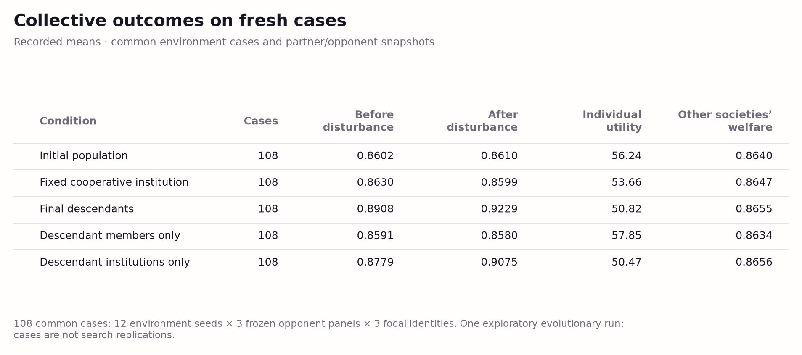
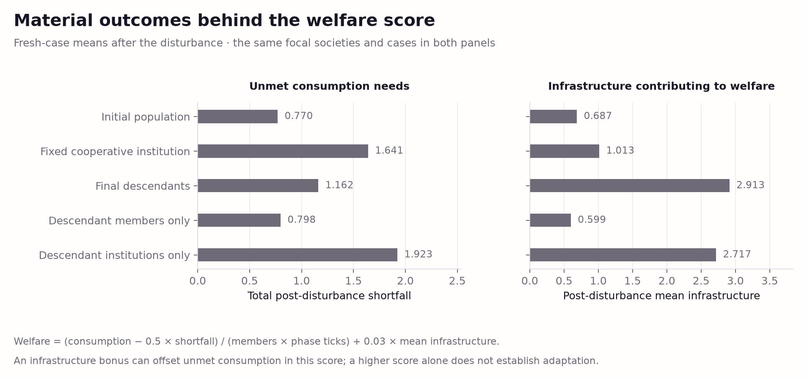
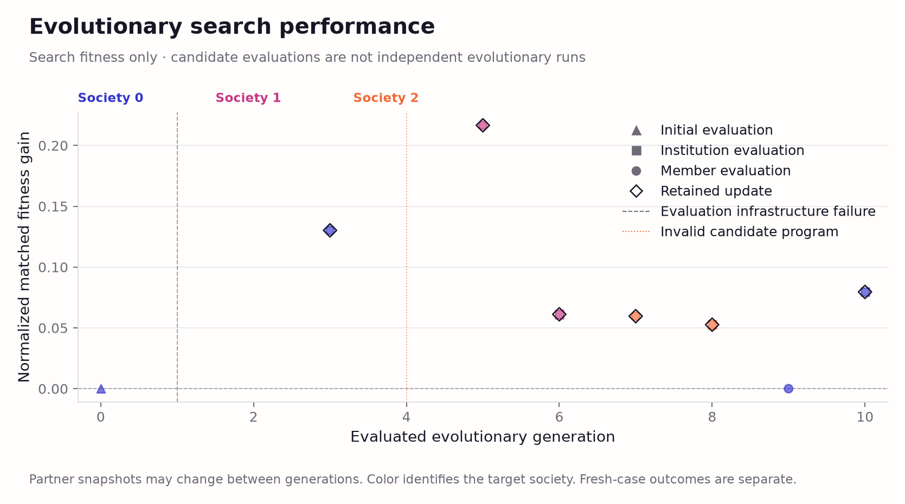
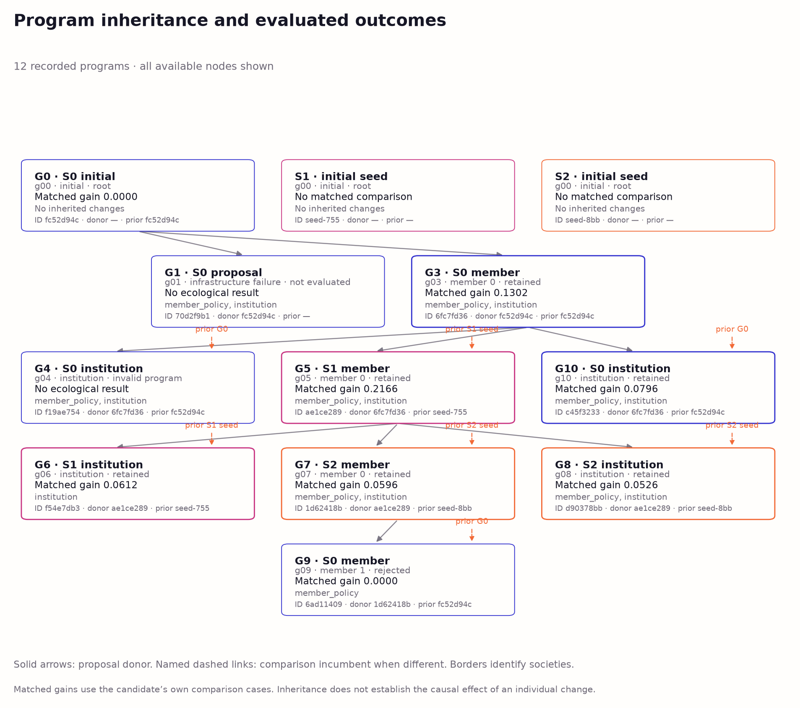
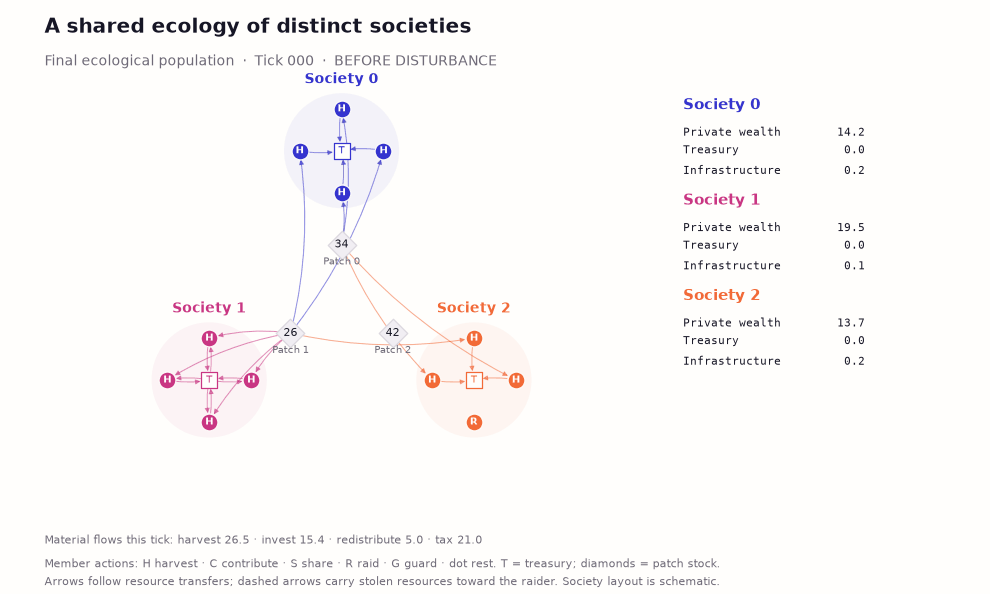

# Archived first-study report and project status

This preserves the README as it stood on **6 October 2026, before the first
numerical world-model implementation**. Status statements, test counts,
and proposed next experiments below belong to that historical snapshot.
The current living research report is [the repository README](../README.md).
Only relative link targets were relocated; the original report body follows.
Run all archived commands from the repository root.

Original README SHA-256: `e78efb7f3558f66bb4a82b1585e21bf2db0c22062b080649767084447eebb975`.

---

# Swarm Societies: Multilevel Coevolution of Collective Intelligence

An experimental platform for interacting societies whose member policies and executable institutions can evolve independently. This first increment implements a resource ecology with individual interests, society welfare, and effects on rival societies measured separately.

## Current results and research direction

The next feature is a **learnable world model**, in two stages selected by the
user: infer unknown parameters first, then discover rule structures. The
[proposal](../docs/world-model-proposal.md),
[30-source literature review](../docs/world-model-literature.md), and
[implementation plan](../docs/world-model-implementation-plan.md) specify private
and collective learners, observation boundaries, and measurements of learning
speed, prediction, uncertainty and intervention accuracy. This is a researched
design; the new simulator and learner are **not implemented yet**.
The [Chromatic Field architecture](../figures/world-model-design/README.md)
illustrates the proposed feature without presenting hypothetical results.

The consumption-focused follow-up is complete: one 30-minute search per arm,
followed by 648 local rollouts. Coevolution achieved consumption welfare
**0.847238**, versus **0.846405** for member-only evolution with fixed
institutions. The absolute difference was **0.000833** on a scale capped at
0.85. Unmet consumption was 23.2% lower, outward raid harm 65.2% higher, and
private utility 1.8% lower than in the fixed-institution arm. Both evolved
populations improved consumption over the initial population. These are
descriptions of one matched pilot, not replicated evidence for a better search
procedure. Welfare and consumption shortfall are algebraically linked.

The study removed the first experiment's direct infrastructure reward, varied
episode and drought timing, and used exact matched no-drought controls. See
the [completed pilot figures](../figures/consumption-v2/README.md),
[protocol](../docs/protocol-consumption-v2.md), and
[run/status/resume commands](../docs/consumption-v2-run.md). The first experiment
and its results below remain unchanged.

The [research roadmap](../docs/research-roadmap.md) reviews primary literature
through 6 October 2026 and prioritizes causal institution tests, ecological
stress, cross-play and invasion, distributed information, and replicated
multilevel evolution. A separate
[frozen-program transplant diagnostic](../docs/mechanism-study.md) crosses original
and evolved member policies with original and evolved institutions on new
environment seeds. It tests component effects without new inference.
Across 864 diagnostic rollouts, evolved institutions improved consumption for
the evolved members but increased their outward harm; the same institution
swaps produced no added harm with original members. This conditional effect
motivates focused tests of institutional rules and information channels.

All experiment figures follow [Chromatic Field v1](../docs/visual-reference.md).
The [active work record](../PROGRESS.md) records completed checks and next steps.

## Research question

Can inherited changes to member behavior and institutional programs improve collective outcomes and response to a resource disturbance when collaborators and competitors also change?

The broader project concerns societies with collective memory, institutions, governance, beliefs, world models, orchestration, and self-organization. This increment establishes the executable ecology and multilevel selection boundary. It implements private state, shared institutional memory, information routing, resource allocation, and program inheritance. General belief systems, general-purpose world models, demographic group reproduction, and additional environments remain future work.

## Model

Three societies of four members share finite renewable resource patches for 60 ticks. At tick 30, exogenous regeneration falls to approximately 36% of its previous rate. Member productivity, weather, initiative, raid success, and disturbance severity vary with the environment seed. Members observe their own state and two local patches; institutions observe their society's wealth and delayed member reports. Executing policies receive no future environmental draws, opponents’ private state, simulator runtime objects, or fresh evaluation cases. The mutation model receives the public dynamics, fitness equations and search feedback, including search seeds; it cannot inspect evaluator code or the fresh panel.

Members can harvest, contribute to a treasury, share resources with another society, guard, rest, or raid members of their own or another society. Institutions execute Python programs that set harvest taxes, infrastructure investment, defensive spending, reserve retention, redistribution weights, raid permissions, and shared broadcasts. Private and shared state persist within episodes and reset between episodes. Source programs persist across evolutionary updates.

Every material transfer is applied by the simulator. A conservation ledger checks resources entering through regeneration and leaving through consumption, action costs, destructive conflict, infrastructure investment, and defense spending. Resource pooling includes compulsory taxes and voluntary contributions; it is not an automatic measure of altruism.

Individual utility is cumulative consumption plus 0.2 times terminal personal wealth. Society welfare is mean per-tick consumption minus half the consumption shortfall, divided by member count, plus 0.03 times infrastructure. This direct infrastructure bonus is deliberate and consequential: welfare can rise without reducing unmet consumption. Outward harm, inward harm, other societies' welfare, inequality, voluntary contribution, and compulsory tax remain separate measurements. Full equations, observations, and action semantics are in [the model specification](../docs/model.md).

## Methods

### Actual evolutionary engine and subscription route

The experiment uses upstream [ShinkaEvolve](https://github.com/SakanaAI/ShinkaEvolve/tree/9912af12d423504b8d580f4179fd15f5f88b8c50), revision `9912af12d423504b8d580f4179fd15f5f88b8c50`. Its native Headless provider calls an audited adapter to the local Codex CLI. Shinka supplies mutation generation, parsing, archive sampling, and its SQLite lineage database. This project supplies ecological selection and evaluation. One Shinka search island contains an archive of eight programs; it is distinct from the three simulated societies.

The verified configuration is Codex CLI `0.160.0`, `gpt-6-astra`, `xhigh` reasoning, `fast` service tier, and ChatGPT subscription authentication. API-key fallbacks, embeddings, novelty judging, meta-model calls, prompt evolution, and external logging are disabled. Direct and native-provider probes completed successfully. [Route documentation and exact evidence](../docs/subscription-route.md) explain the settings and the corrected upstream timeout incident. Subscription token counts are not a per-call monetary estimate.

The search has a resumable **3,600-second cumulative active wall-clock budget**, including initialization. It runs one proposal and one evaluator at a time. The local benchmark measured 1.84 episodes/s with one process and 3.81 with two, with roughly 21 MiB peak simulator RSS. Fresh panels can run in two processes; ecological replacements remain serialized. The evaluator has an outer memory/CPU limit and candidates execute only through a bounded Python interface.

### Variation, inheritance, and selection

Shinka proposes substantive Python edits, including new helpers, branches, loops, memory algorithms, and allocation logic. The three seed programs are initial conditions, not a closed catalogue. Member and institution functions can change in the same proposal, but only the scheduled unit enters the ecology.

Candidate evaluations alternate a member replacement and an institution replacement, rotating across societies and member slots. A member replacement is accepted only when it improves that member's utility. An institution replacement is accepted only when it improves its society's welfare. Both sides face identical environmental seeds and an identical frozen population of partners and opponents. Accepted replacements change future contexts. Program snapshots, component hashes, proposal donors, and ecological comparison incumbents are preserved separately; an incumbent is not necessarily the source-code parent.

The Shinka archive score is `1 + (candidate objective − incumbent objective) / max(1, abs(incumbent objective))`. It is a proposal heuristic under changing contexts, not a stationary ranking. Final evaluation uses the final ecological population specified by the acceptance rule, without choosing a winner on fresh results. The [protocol](../docs/protocol.md) was recorded before fresh-case results were inspected.

This machinery permits within-society policy coevolution, institution–member coevolution, and intersociety coevolution through changing collaborators and competitors. Their empirical extent depends on which units actually receive and retain changes. Cooperative actions alone do not establish cooperative coevolution. No neural model weights are updated.

### Fresh evaluation and references

The initial population contains one initial, one cooperative, and one selfish society. The fixed reference attaches the cooperative institution to the same initial member policies. Each treatment faces **108 common cases**: 12 fresh environment seeds crossed with three immutable opponent panels and three focal society identities. The panels use initial, cooperative, or selfish programs. Each focal society keeps the treatment's own member composition; all nonfocal opponents are held constant across treatments.

Final descendants are evaluated with the same cases. Crossed interventions combine descendant members with initial institutions and initial members with descendant institutions. These diagnose component effects conditional on this trajectory; they are not independently evolved fixed-institution controls. Descriptive paired intervals resample environment-seed clusters. An independent evolutionary run, not a rollout, member, or society, is the replication unit for claims about the search procedure.

## Results

One **exploratory evolutionary run** completed its 3,600-second allowance and retained **six replacements: three member policies and all three institutions**. Fresh evaluation then completed 540 episodes, with 108 identical cases per condition. No fresh result influenced selection.

| Population | Welfare before drought | Welfare after drought | Member utility | Post-drought shortfall ↓ | Outward harm ↓ |
|---|---:|---:|---:|---:|---:|
| Initial | 0.8602 | 0.8610 | 56.24 | 0.770 | 37.78 |
| Fixed cooperative institution | 0.8630 | 0.8599 | 53.66 | 1.641 | 0.00 |
| Final descendants | **0.8908** | **0.9229** | 50.82 | 1.162 | 0.00 |
| Descendant members only | 0.8591 | 0.8580 | **57.85** | 0.798 | 28.07 |
| Descendant institutions only | 0.8779 | 0.9075 | 50.47 | 1.923 | 0.00 |

Welfare is a per-tick, per-member score with an infrastructure bonus. Utility is per member over the complete episode. Shortfall is the focal society's cumulative unmet consumption over the 30 post-drought ticks; harm is cumulative resources lost by other societies through raids over all 60 ticks. Means average the same 12 seeds × 3 opponent panels × 3 focal identities. The two component-only conditions are post-search interventions.



### What improved—and what did not

Descendants' post-drought welfare exceeded the initial population by **0.06189 (+7.19%)**, with a descriptive paired seed-cluster bootstrap interval of [0.05775, 0.06661]. The decomposition is decisive: **+0.06679** came from the explicit infrastructure bonus, while the consumption/shortfall term changed by **−0.00490**. Mean post-drought infrastructure rose from 0.687 to 2.913, but shortfall increased from 0.770 to 1.162. Member utility fell **9.65%**, and terminal personal wealth fell from 27.21 to 1.36. This run therefore does **not** demonstrate improved consumption resilience relative to the initial population.

The fixed cooperative institution had approximately flat overall welfare relative to the initial population: +0.00086, interval [−0.00048, 0.00239]. Descendants exceeded this reference in post-drought welfare by 0.06298 and reduced its post-drought shortfall by 0.479; total-episode shortfall was approximately unchanged (difference −0.043, interval [−0.486, 0.349]). All intervals describe variation across these environment seeds, not uncertainty across independent evolutionary runs. [Exact paired comparisons](../evidence/experiment/comparisons.json) retain every metric.

Frozen opponent identity materially changed outcomes: descendants averaged overall welfare 0.9299 against cooperative opponents, 0.9171 against initial opponents, and 0.8735 against selfish opponents (36 matched cases per panel). Their total shortfall rose from 0.145 against cooperative opponents to 4.843 against selfish opponents. The fitness landscape therefore depends on the interacting population.

The member-only intervention increased private utility to 57.85 while slightly reducing society welfare. Institutions account for most of the full population's welfare gain. Full descendants also had less total shortfall than the institutions-only intervention (1.823 versus 3.353), suggesting conditional complementarity along this trajectory. This is not evidence that the search procedure outperforms independently evolved fixed-institution controls.



### Inherited programs and within-episode learning

| Shinka generation | Retained unit | Executed change | Matched search outcome |
|---|---|---|---|
| G3 | Society 0, member 0 | Replaced contributions with harvesting and private buffer accumulation | Utility 50.64 → 57.23 |
| G5 | Society 1, member 0 | Stopped voluntary contributions; retained more private wealth | Utility 51.82 → 63.04 |
| G6 | Society 1 institution | Tax rose from 28% to 78%; persistent income/risk estimates, deficit-based redistribution and investment | Welfare 0.87852 → 0.93968 |
| G7 | Society 2, member 0 | Replaced raiding with harvesting; updated a private crowding model used in patch choice | Utility 62.61 → 66.34 |
| G8 | Society 2 institution | Introduced high taxation, short-horizon supply projections, redistribution/investment and outward-raid prohibition | Welfare 0.85000 → 0.90264 |
| G10 | Society 0 institution | Introduced high taxation, cash-flow/volatility estimates and deficit-based allocation | Welfare 0.86469 → 0.94427 |

These search comparisons use the incumbent and partner snapshot at each update, not the fresh panel. [Replayed search effects](../evidence/experiment/search-effects.json) reproduce the stored selection objectives and expose effects on peers and rival societies. Exact inherited sources and both kinds of ancestry are in [the evidence archive](../evidence/experiment/) and the lineage graph.

Institutions evolved operational shared memory and allocation programs beyond the seed designs. Member and institutional estimates update during an episode; their algorithms, not their learned state, are inherited. Some proposed code paths were never exercised, and memory/model benefits have not been isolated by ablation. Several descendants explicitly use the known 60-tick horizon, limiting claims of general adaptation.

Only one member lineage per society changed; reciprocal evolution among multiple member lineages within the same society was not observed. Members across three societies and institutions changed in a shared, successively updated ecology, implementing contextual member–institution and intersociety coevolution. Cooperative coevolution, understood as reciprocally evolving voluntary cooperation, was not demonstrated.

Across fresh cases, compulsory tax increased from 62.29 to 410.79 material units per episode while voluntary contributions fell from 54.72 to 0.30. No between-society aid or within-society theft occurred in any treatment. Descendants imposed zero outward harm, but members still attempted an average of 20 outward raids per episode: institutional enforcement prevented the transfers. Other societies' welfare increased slightly, from 0.86395 to 0.86551. Reduced conflict and increased compulsory pooling should not be described as learned altruism.





### Execution and scientific evidence

The native Shinka database contains **10 program rows: 8 valid and 2 invalid**. Nine unique programs reached the ecological evaluator: the valid initial program plus **8 mutations (7 valid, 1 invalid)**. Six mutations were retained and one valid mutation tied its incumbent. The other invalid database row was a pre-evaluator infrastructure timeout, preserved separately from candidate failure. Nine noninitial generation records were archived; two additional inference calls were interrupted. The timeout repair and terminal process/database audit are recorded in [recovery evidence](../evidence/engine-recovery.json) and [terminal evidence](../evidence/engine-terminal.json).

The active budget was exactly 3,600 monotonic seconds across two segments. Recorded UTC start-to-cutoff spans about 65.3 minutes, including restart downtime and differences between clock sources. Peak sampled search process-tree RSS was **438.4 MiB**. The live-process CPU sample peaked at 33.72 seconds and excludes exited children; it is not total CPU consumption. The final fresh-evaluation invocation used two workers and took 162.7 seconds.

Nine completed subscription calls reported **257,830 input tokens** (22,656 cached) and **131,185 output tokens** (99,926 reasoning). Cached and reasoning counts are subsets, not additions. Two interrupted calls have unknown usage. Route probes are recorded separately and excluded from those search totals. No paid API, embedding or judging calls were used.

The [compact evidence](../evidence/experiment/) contains fresh case outcomes including individual members, frozen opponent definitions, exact source snapshots, search comparisons, resource accounting, and the replay. Verification checks material conservation, common cases, source/protocol hashes, exact aggregates, and deterministic replay from the published sources. The repository test suite has 20 passing tests; the upstream recovery suite passed 40 tests.



The animation shows one recorded final-population episode at seed `424242`, including the drought boundary, stable society identities, member actions, and material flows. It is an illustration, not an extra evolutionary replicate. [Figure captions, vector/PDF exports, data tables and provenance](../figures/README.md) accompany every panel; [render inspection](../figures/render-review.json) records the visual checks.

## Reproduction

Use Python 3.13 to match the recorded runtime. Install the local experiment and pinned upstream engine:

```bash
uv venv --python 3.13 .venv
uv pip install --python .venv/bin/python -r requirements-lock.txt
.venv/bin/python -m pytest -q
```

The portable [requirements-lock.txt](../requirements-lock.txt) pins the recorded environment; [environment-freeze.txt](../evidence/environment-freeze.txt) preserves the original local installation record. The simulator itself uses the standard library; plotting and Shinka have separate dependencies. Inference requires the verified model to be available through `codex login` using ChatGPT. The runner refuses API-key authentication and does not switch models.

Start a new independent run:

```bash
.venv/bin/python -m swarm_societies.experiment prepare --run-dir runs/reproduction
.venv/bin/python scripts/run_evolution.py --run-dir runs/reproduction --budget-minutes 60
.venv/bin/python -m swarm_societies.experiment fresh --run-dir runs/reproduction --workers 2
.venv/bin/python -m swarm_societies.experiment export --run-dir runs/reproduction --output evidence/reproduction
.venv/bin/python -m swarm_societies.experiment replay --run-dir runs/reproduction --seed 424242 --output evidence/reproduction/replay.json
.venv/bin/python -m swarm_societies.visualize --summary evidence/reproduction/summary.json --replay evidence/reproduction/replay.json --output figures/reproduction
```

Replay the published population without new inference:

```bash
.venv/bin/python -m swarm_societies.experiment replay --run-dir evidence/experiment --seed 424242 --output /tmp/swarm-replay.json
.venv/bin/python -m swarm_societies.visualize --summary evidence/experiment/summary.json --replay /tmp/swarm-replay.json --output /tmp/swarm-figures
.venv/bin/python scripts/analyze_search.py --run-dir evidence/experiment --output /tmp/swarm-search-effects.json
.venv/bin/python scripts/verify_evidence.py --require-final
```

Resume the original local search after an interruption:

```bash
.venv/bin/python scripts/run_evolution.py --run-dir runs/first --budget-minutes 60 --resume
```

Only unused allowance is consumed; an exhausted budget is a no-op. Full native checkpoints, ecological state, source snapshots, prompts, response logs, and budget accounting are retained locally in ignored `runs/first/`. Compact evidence and source snapshots are committed under `evidence/experiment/`. Large run data, dependencies, and upstream checkouts stay outside ordinary Git. [PROGRESS.md](../PROGRESS.md) records the active objective and resumption point.

## Limitations and next experiment

This is one exploratory run in a small abstract economy, not evidence that multilevel search reliably improves cooperation or adaptation. Society membership is fixed; institutions are replaced in place rather than through demographic group reproduction. There is no death, migration, population growth, or persistence of episode memories across generations. The candidate language is intentionally bounded and is not a general hostile-code sandbox.

The disturbance always occurs at the same time, infrastructure is drought-independent, and consumption can saturate. These design choices can favor stockpiling or infrastructure construction without demonstrating general environmental adaptation. A post-minus-pre welfare increase also confounds disturbance response with infrastructure accumulating over time; there is no matched no-disturbance counterfactual in this increment. Fresh seeds test stochastic generalization, while frozen opponents do not cover every possible evolving ecology. The fixed reference and crossed interventions do not replace independently replicated, budget-matched evolutionary controls. Search fitness comparisons across changing populations are contextual.

The next justified experiment should remove the direct infrastructure reward and select institutions on consumption and unmet needs, while randomizing disturbance timing and episode length. Compare multilevel coevolution with a budget-matched fixed-institution search across independent evolutionary runs. This directly tests whether the observed allocation programs improve resilience when construction and a known terminal horizon cannot raise the score by themselves. Memory ablations can then test whether the evolved estimates causally improve decisions. These experiments are proposed, not performed here.

## Foundations and attribution

[SwarmWorld](https://github.com/lamm-mit/SwarmWorld/tree/6af7ae9fa36d98b07b0492cf139658e8af1f6eab), revision `6af7ae9fa36d98b07b0492cf139658e8af1f6eab`, informed the separation of local policies, authoritative material consequences, persistent state, event logs, replay, and analysis. A focused source inspection found direct embedding unnecessarily coupled this first selection experiment to its broader artifact physics. This increment therefore uses an independently authored compact simulator; it is not a SwarmWorld fork or a reproduction of its results. [The integration record](../docs/upstream.md) lists inspected files and the rationale.

Pal, S., Wang, F. Y., and Buehler, M. J. (2026). [*SwarmWorld: Stigmergic technological evolution in societies of language-model agents*](https://arxiv.org/abs/2608.26081). arXiv:2608.26081. Its fixed model weights do not demonstrate the multilevel selection studied here.

Sakana AI. [*ShinkaEvolve: Towards Open-Ended and Sample-Efficient Program Evolution*](https://github.com/SakanaAI/ShinkaEvolve). Actual upstream evolutionary engine, pinned above; Apache-2.0.

[actir-backprop-neat](https://github.com/ReloadLightly/actir-backprop-neat/tree/9472743f1cb7ea12eafcf489126b1a43b8f5735f) was used read-only as the visual reference. Warm paper, cobalt/magenta/orange society colors, restrained typography, and vector exports follow its Chromatic Field conventions. Its numerical results are not reused. [Visual inspection and provenance](../docs/visual-reference.md) record the relevant README and figure code.
