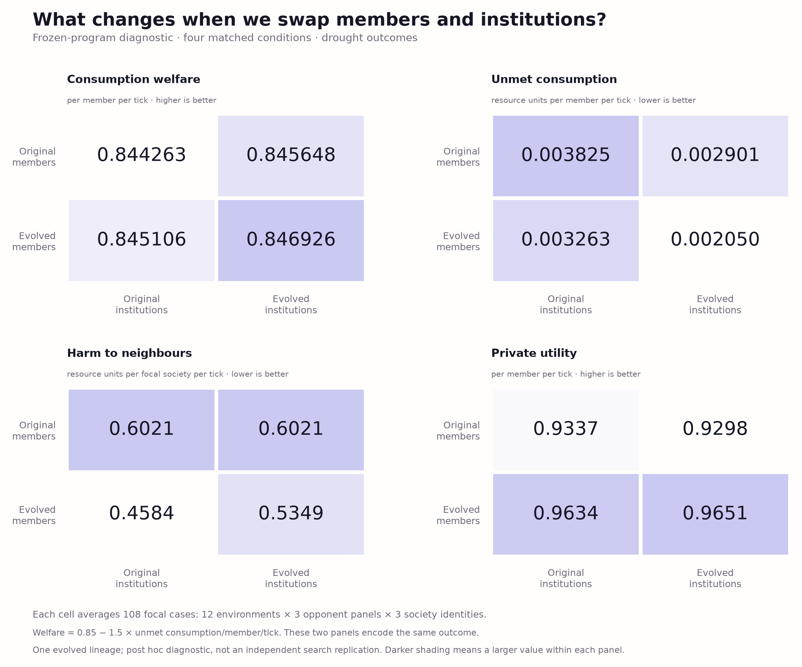
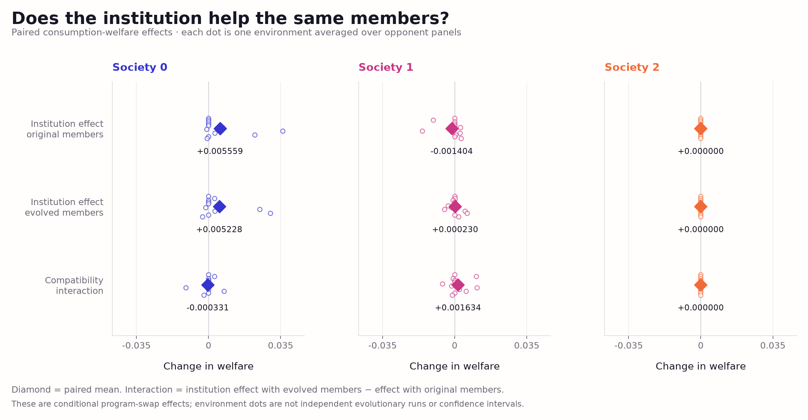

# Frozen-program transplant diagnostic

On 2026-10-06 we evaluated 864 rollouts to ask what the saved consumption-v2
member policies and institutions do separately and together. The new design
and program sources were frozen before these rollouts. This is an exploratory
follow-up to one evolved lineage, with no new model inference.

Twelve new environment/timing tuples were crossed with three frozen opponent
panels and three focal society identities. Each of the four component
combinations received the same 108 drought cases and 108 exact no-drought
counterparts. Only the focal society receives the transplant; opponents remain
fixed within each comparison. The new environment seeds are disjoint from
the previous search and fresh banks.

| Focal population | Consumption welfare | Unmet need per member-tick | Outward harm per tick | Private utility per tick |
|---|---:|---:|---:|---:|
| Initial members + initial institutions | 0.844263 | 0.003825 | 0.602067 | 0.933662 |
| Evolved members + initial institutions | 0.845106 | 0.003263 | 0.458416 | 0.963434 |
| Initial members + evolved institutions | 0.845648 | 0.002901 | 0.602067 | 0.929821 |
| Evolved members + evolved institutions | 0.846926 | 0.002050 | 0.534878 | 0.965109 |



The combined population has the highest mean consumption welfare in this
panel. Its additive interaction is only **+0.000434**, with a descriptive
environment-scenario cluster bootstrap interval **[−0.000550, +0.001612]**.
The interval includes zero: these results do not resolve a positive welfare
interaction. This contrast is the combined effect minus the sum of the two
isolated component effects, conditional on the selected programs.

The clearest conditional effect concerns harm. Transplanting evolved
institutions onto evolved members increases outward harm by **0.076462 material
units per tick**, interval **[0.041531, 0.113561]**. The same institution transplant
onto initial members has exactly zero effect on outward harm in these cases.
The increase comes entirely from society 1, where it is **0.229385 per tick**;
that society's welfare changes by only **+0.000230**. The inherited member and
institution combination therefore changes the external cost of the society's
behavior. The aggregate combined population still inflicts less harm than the
initial population, because society 2's changed member policy reduces harm.




Institution transplants also differ across societies. Society 0 improves
welfare on either member background. Society 1's institution lowers welfare
with original members and slightly raises it with evolved members. Society 2's
institution never changed during search, so its institution transplant effects
are exactly zero; the audit checks this negative control.

These are interventions on frozen programs inside the simulator, not evidence
that the evolutionary procedure reliably produces beneficial institutions.
There is still only one coevolution search lineage. Environmental bootstrap
intervals cannot replace independent evolutionary replications. Welfare is
bounded by 0.85 and equals `0.85 − 1.5 × unmet need per member-tick`, so welfare
and shortfall are two presentations of the same primitive outcome. The next
mechanistic tests should isolate reporting, shared memory, and raid permission,
then assess the effects across a scarcity range with less ceiling saturation.

The [portable evidence](../evidence/mechanism-v1/README.md) includes every case,
source snapshot, paired contrast, frozen design, and verification receipt.
The [complete summary](../evidence/mechanism-v1/summary.json) retains exact
values and uncertainty intervals; the [research roadmap](research-roadmap.md)
places these diagnostics before new inference campaigns.

Run the additive publication audit without altering the frozen runner:

```bash
.venv/bin/python scripts/verify_mechanism_evidence.py --write-receipt
.venv/bin/python -m pytest -q
```
