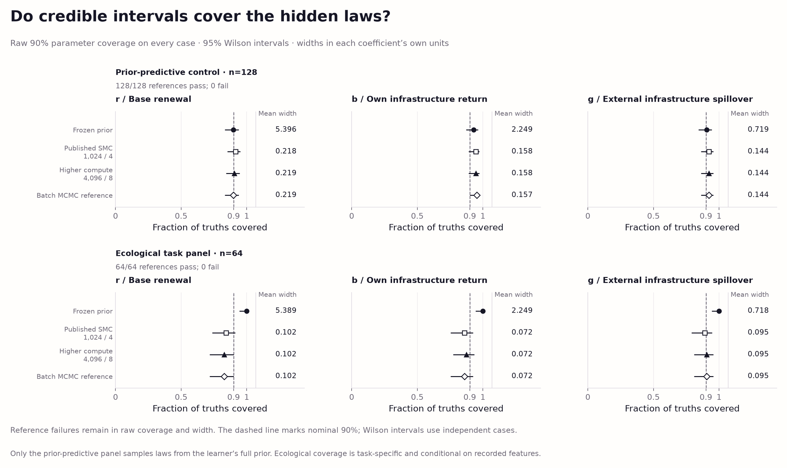
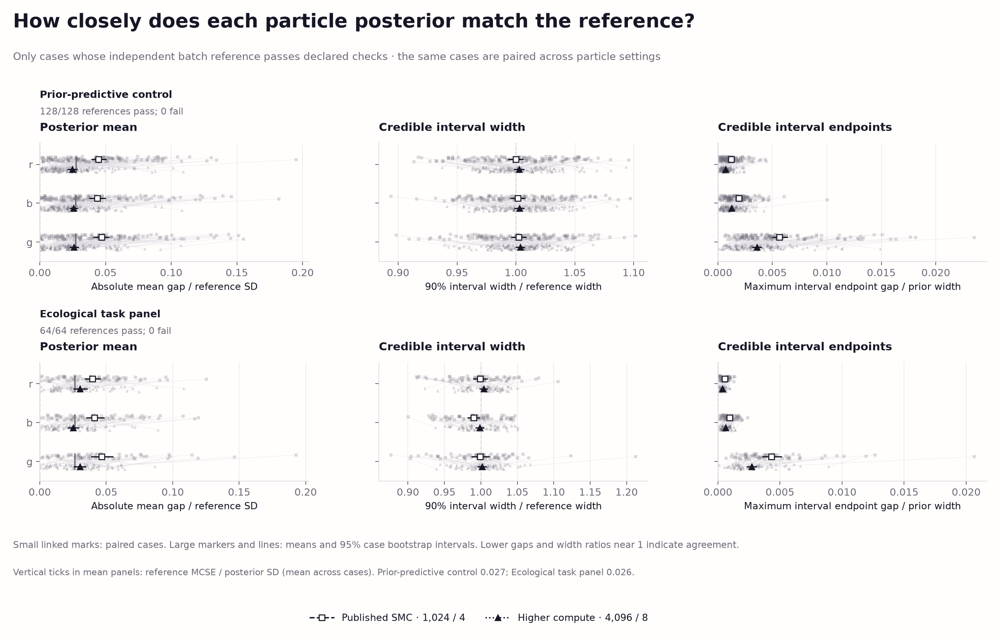
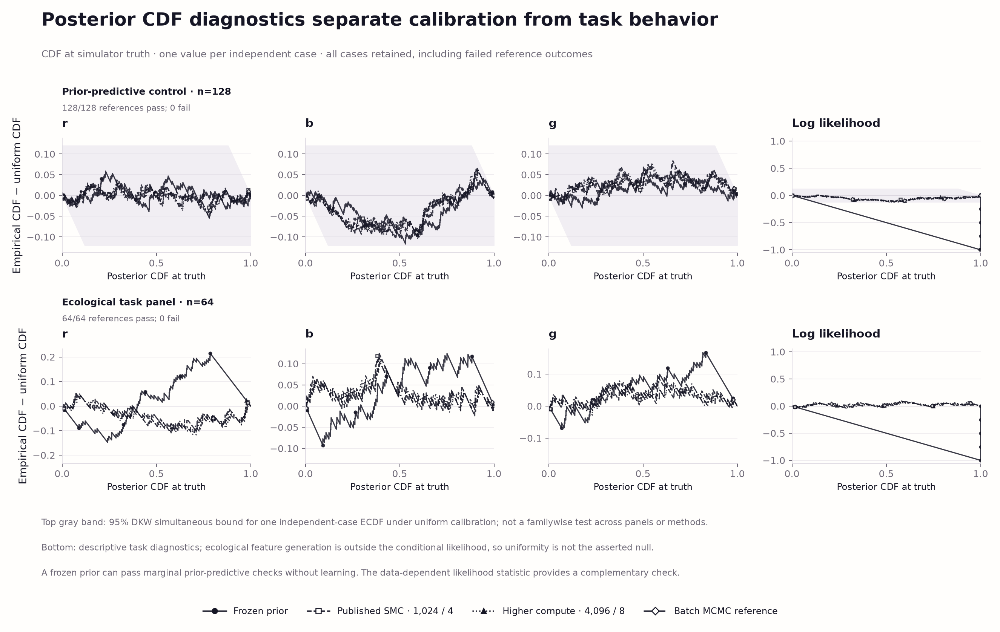

# World-model calibration: computation, coverage, and the next experiment

Completed 6 October 2026. This prospective numerical audit follows
[world-model-v1](world-model-v1.md), whose pooled spillover interval covered
truth in 18/24 arenas. It adds an independent posterior reference and a
reproducible calibration harness. The published learner, simulator, original
evidence and original parameter settings remain frozen.

## Abstract

We compare sequential particle inference with an independently implemented batch
posterior on 128 prior-predictive datasets and 64 fresh ecological arenas.
The published particle setting already approximates the reference closely:
average marginal posterior-mean discrepancies are 0.0451 and 0.0424 reference
standard deviations in the two panels. Increasing particles and rejuvenation
reduces those discrepancies to 0.0255 and 0.0284, at 4.26 and 4.91 times the fitting
CPU cost. New ecological spillover coverage is 57/64 for the published setting
and 58/64 for both higher compute and the reference. The earlier 75% result is
not reproduced on this panel. Small common departures in a likelihood-based
calibration diagnostic remain, so this is evidence of close numerical agreement,
not a blanket claim of calibrated ecological beliefs.

## 1. Prospective design and implementation

The [protocol](world-model-calibration-protocol.md) and
[machine-readable design](../evidence/world-model-calibration-v1/design.json)
were frozen before the evaluation run. Development used a separate case/seed
namespace. No evolutionary search or model-generation calls were made.

| Panel | Independent units | Observations per unit | Law distribution and purpose |
| --- | ---: | ---: | --- |
| Prior-predictive control | 128 datasets | 128 | Full learner prior; exogenous infrastructure and headroom; numerical calibration under the declared model |
| Ecological task | 64 arenas | 384 | Original interior law ranges; 128 ticks and three patch histories; conditional-model accuracy and task coverage |

The fitted renewal equation, uniform weather, capacity atom and Gaussian sensor
noise are unchanged. Every method receives the same legal observation packets.
Hidden coefficients enter data generation and post-fit evaluation only.
The prior control never updates. The two SMC settings process observations in
the same order, using 1,024 particles/four rejuvenation sweeps or 4,096/eight.

The new [reference implementation](../swarm_societies/world_model_v1/reference.py)
imports neither the simulator nor the online learner. Its capped-uniform-plus-
Gaussian likelihood is independently implemented and checked against numerical
integration and the frozen production likelihood. Four Metropolis chains use
evidence-only multistart optimization, curvature proposals and warmup adaptation;
retained samples use a frozen symmetric proposal. No true coefficient initializes
or tunes inference. Tests also compare posterior moments with independent
three-dimensional quadrature.

Reference qualification requires rank-normalized split/folded R-hat below 1.01
and bulk/tail ESS of at least 400 for each coefficient and nonconstant log
likelihood. Initial chains have 1,000 warmup and 4,000 retained iterations.
A failed gate triggers the declared retry: 2,000 warmup and 8,000 retained
iterations, with another fixed seed. Both attempts' samples and diagnostics are
retained. Diagnostic failures stay in coverage, CDF and cost denominators;
unqualified final references are excluded only from agreement claims.
Unhandled computation exceptions stop completion rather than drop a case.

All **192/192 final references qualified**. One prior-predictive case required
the prescribed retry because its first log-likelihood R-hat was 1.01106.
The largest final R-hat was 1.00960; minimum final bulk and tail ESS were
694.8 and 668.1. These are operational mixing diagnostics, not proof of global
convergence or exact posterior sampling.

The archive contains **40,960 distinct observations** and **81,920 successful
SMC updates**, with zero failed updates. There are 768 method/case outcomes,
2,304 coefficient rows and 3,072 CDF rows. Cases are independent replicates;
chains, particles, coefficients and successive observations are not.

## 2. Parameter interval coverage

Each entry is the count and percentage of true coefficients inside a nominal
90% marginal interval. The companion [coverage table](../figures/world-model-calibration-v1/coverage-statistics.csv)
contains 95% Wilson binomial intervals and mean interval widths for every method,
including the frozen prior.

| Panel | Method | Baseline renewal r | Own return b | External spillover g |
| --- | --- | ---: | ---: | ---: |
| Prior-predictive, n=128 | Published SMC | 117/128 (91.41%) | 121/128 (94.53%) | 118/128 (92.19%) |
| Prior-predictive, n=128 | Higher compute | 116/128 (90.63%) | 121/128 (94.53%) | 118/128 (92.19%) |
| Prior-predictive, n=128 | Batch reference | 115/128 (89.84%) | 122/128 (95.31%) | 118/128 (92.19%) |
| Ecological, n=64 | Published SMC | 54/64 (84.38%) | 55/64 (85.94%) | 57/64 (89.06%) |
| Ecological, n=64 | Higher compute | 53/64 (82.81%) | 56/64 (87.50%) | 58/64 (90.63%) |
| Ecological, n=64 | Batch reference | 53/64 (82.81%) | 55/64 (85.94%) | 58/64 (90.63%) |



Published ecological spillover coverage has Wilson interval **[79.10%, 94.60%]**.
Its new 57/64 result does not reproduce the original 18/24 result, but neither
panel identifies the cause of that difference. The reference's ecological
renewal coverage is only 53/64, with interval **[71.79%, 90.12%]**; a more accurate
particle approximation does not automatically improve task-distribution coverage.

The controlled reference's own-return coverage is conservative on this panel:
122/128, interval **[90.15%, 97.83%]**. Consequently even the reference should not
be summarized as passing every nominal-coverage check. These related diagnostics
were not multiplicity-adjusted, and a finite panel cannot certify exact coverage.

## 3. Numerical agreement and cost

Mean discrepancy is absolute SMC/reference mean difference divided by reference
posterior SD. Paired changes use the same independent cases; their intervals
bootstrap cases 2,000 times with the declared seed.

| Panel | Parameter | Published discrepancy | Higher-compute discrepancy | Paired change, higher minus published [95% CI] |
| --- | --- | ---: | ---: | --- |
| Prior-predictive | r | 0.04470 | 0.02481 | −0.01988 [−0.02653, −0.01322] |
| Prior-predictive | b | 0.04369 | 0.02576 | −0.01793 [−0.02487, −0.01114] |
| Prior-predictive | g | 0.04697 | 0.02591 | −0.02106 [−0.02765, −0.01441] |
| Ecological | r | 0.03965 | 0.03022 | −0.00943 [−0.01750, −0.00112] |
| Ecological | b | 0.04117 | 0.02500 | −0.01617 [−0.02387, −0.00849] |
| Ecological | g | 0.04645 | 0.03007 | −0.01638 [−0.02527, −0.00753] |

Published/reference mean interval-width ratios range from **0.9900 to 1.0023**
across the six panel/parameter combinations. The data do not show a large,
systematic particle-induced narrowing on these new panels. The largest individual
published posterior-mean discrepancy is 0.195 reference SD.



The reference itself has mean Monte Carlo standard error averaging **0.02725 SD**
in the controlled panel and **0.02635 SD** in ecology. Higher-compute discrepancies
are close to that scale. The paired results support improved agreement with this
reference; they do not measure exact residual error against an analytic posterior.

| Panel | Published SMC CPU seconds | Higher compute CPU seconds | Batch reference CPU seconds | Higher/published |
| --- | ---: | ---: | ---: | ---: |
| Prior-predictive | 0.492 | 2.094 | 2.898 | 4.26× |
| Ecological | 2.053 | 10.082 | 3.845 | 4.91× |

These are mean fitting CPU times on the recorded machine, including reference
diagnostics and retry work, but excluding separately measured CDF scoring.
SMC processes the stream sequentially; the batch reference fits the final history
once. This is work to obtain terminal beliefs, not a comparison of matched online
latency, planning performance or learning speed. The four-worker study took
451.90 elapsed seconds. [Compute figure and full intervals](../figures/world-model-calibration-v1/README.md#compute-accuracy).

## 4. Data-dependent calibration and negative control

The table gives the maximum absolute empirical-CDF departure from Uniform(0,1)
for posterior CDF values at true coefficients and at the true data log likelihood.
These are approximate posterior-CDF diagnostics, not exact ranks from independent
posterior samples. For 128 independent cases, the declared single-ECDF 95% DKW
bound is **0.12004**; it is not a familywise bound over this table.

| Prior-predictive method | r | b | g | Data log likelihood |
| --- | ---: | ---: | ---: | ---: |
| Frozen prior | 0.05859 | 0.11719 | 0.06836 | **0.99707** |
| Published SMC | 0.04532 | 0.10509 | 0.08354 | 0.11800 |
| Higher compute | 0.05591 | 0.10312 | 0.07881 | **0.12100** |
| Batch reference | 0.05569 | 0.09625 | 0.07475 | **0.12275** |



All coefficient curves stay within the declared band, including the unupdated
prior. The data-dependent statistic exposes that negative control's failure to
learn. Higher compute and the reference slightly exceed the likelihood-CDF band;
the published learner is just inside it. Their shared shape, finite reference
computation and the collection of related checks prevent attributing this small
departure specifically to SMC. It remains an open diagnostic, not a calibration
certificate or evidence that the lower-budget algorithm is superior.

## 5. Model scope, excitation, and implementation decision

Every generated feature matrix has rank three. Ecological design-matrix condition
numbers range from 6.07 to 7.75; own/external infrastructure correlations range
from −0.067 to 0.148. The mean fraction of physically saturated observations is
2.28%, with a range of 0–45.83%. The controlled panel deliberately includes more
saturation, averaging 42.00%. These summaries describe excitation and clipping;
matrix rank alone does not establish precise nonlinear parameter identification.

Ecological features depend on earlier latent physical outcomes while growth
measurements are noisy. The fitted product of one-step likelihoods conditions
on supplied features; it does not model their complete joint generation. The
ecological law distribution also differs from the learner's prior. Therefore
ecological coverage has no automatic universal 90% target. This distinction is
a modeling limitation to investigate, not a demonstrated explanation of every
coverage departure.

**Decision:** retain the published SMC default. Higher compute provides a modest
numerical improvement at substantial additional cost, without a demonstrated
general coverage repair. This audit does not support treating particle scarcity
as a large error source on the tested panels, and it does not erase the first
study's spillover limitation.

The next implementation stage is **private member belief state and bounded,
provenance-preserving institutional reports**. Start with fixed truthful report
rules and the existing instrumented observation contract, matched across message
budgets and learner settings. Compare no sharing, bounded sharing and the pooled
information ceiling; keep equal-time and equal-evidence scores separate. This
isolates information governance before introducing hidden external features or
uncertainty-driven report selection. Carry the unresolved likelihood-CDF and
ecological-model checks forward explicitly. Changing the observation model,
choosing confidence-based reports, or claiming robust calibrated beliefs requires
a separately frozen follow-up rather than silently reusing this evaluation panel.

## 6. Reproduction and evidence

```bash
OPENBLAS_NUM_THREADS=1 .venv/bin/python scripts/run_world_model_calibration.py verify
.venv/bin/python scripts/visualize_world_model_calibration.py
.venv/bin/python -m pytest -q
```

To rerun the same deterministic case bank in a fresh directory:

```bash
OPENBLAS_NUM_THREADS=1 .venv/bin/python scripts/run_world_model_calibration.py prepare --output runs/calibration-reproduction
OPENBLAS_NUM_THREADS=1 .venv/bin/python scripts/run_world_model_calibration.py run --output runs/calibration-reproduction --workers 4
OPENBLAS_NUM_THREADS=1 .venv/bin/python scripts/run_world_model_calibration.py verify --output runs/calibration-reproduction
```

Use the [pinned numerical environment](../requirements-world-model-v1.txt).
Numeric results reproduce under that environment; times, timestamps and archive
container bytes need not. Completed studies cannot be overwritten by the runner.
The verifier regenerates datasets, reevaluates stored sample likelihoods,
reconstructs reference qualification and posterior statistics, and checks
exported tables, summaries, source snapshots and artifact hashes. Tests exercise
the retry/failure path, legal observation boundaries, frozen-prior control and
semantic tampering after a checksum rewrite.

Portable [evidence](../evidence/world-model-calibration-v1/) includes exact data,
compressed posterior samples, both attempts for the retried reference, and the
completion manifest. The [figure archive](../figures/world-model-calibration-v1/README.md)
contains four inspected Chromatic Field figures in SVG/PDF/PNG, five derived
tables and source/output hashes. Methods use neutral markers so society colors
retain their existing meaning. The [protocol](world-model-calibration-protocol.md)
links the primary SBC, data-dependent calibration and MCMC-diagnostic research
on which this audit builds.
