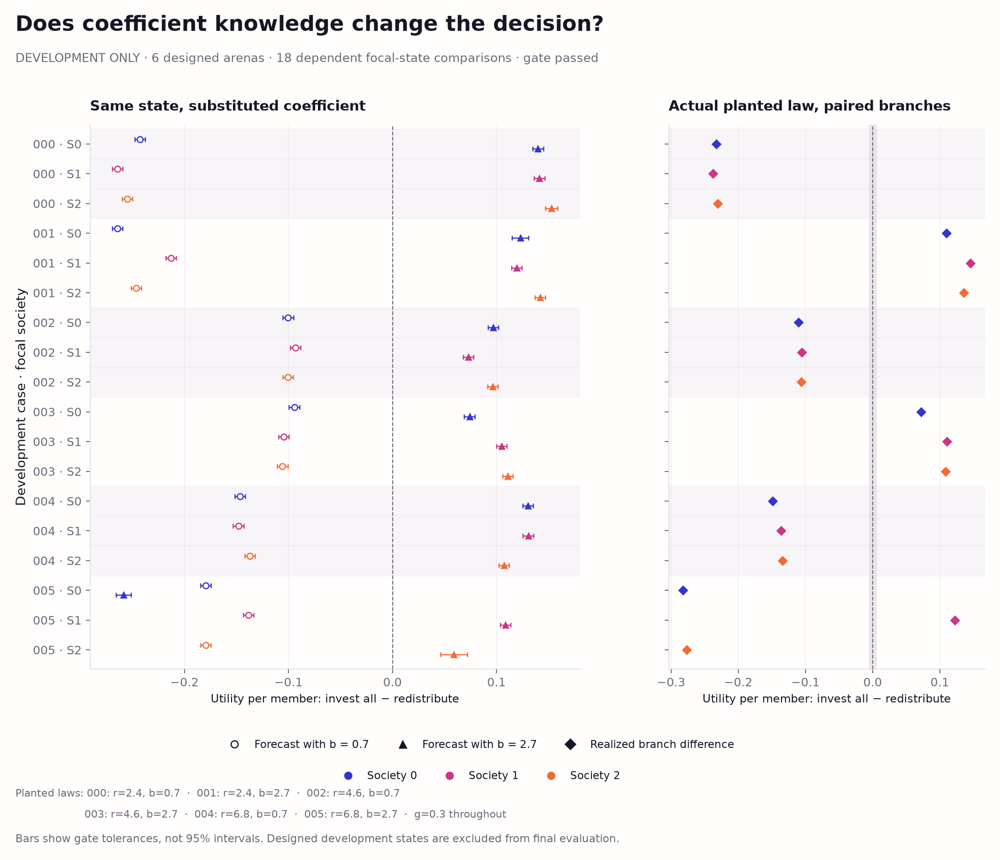
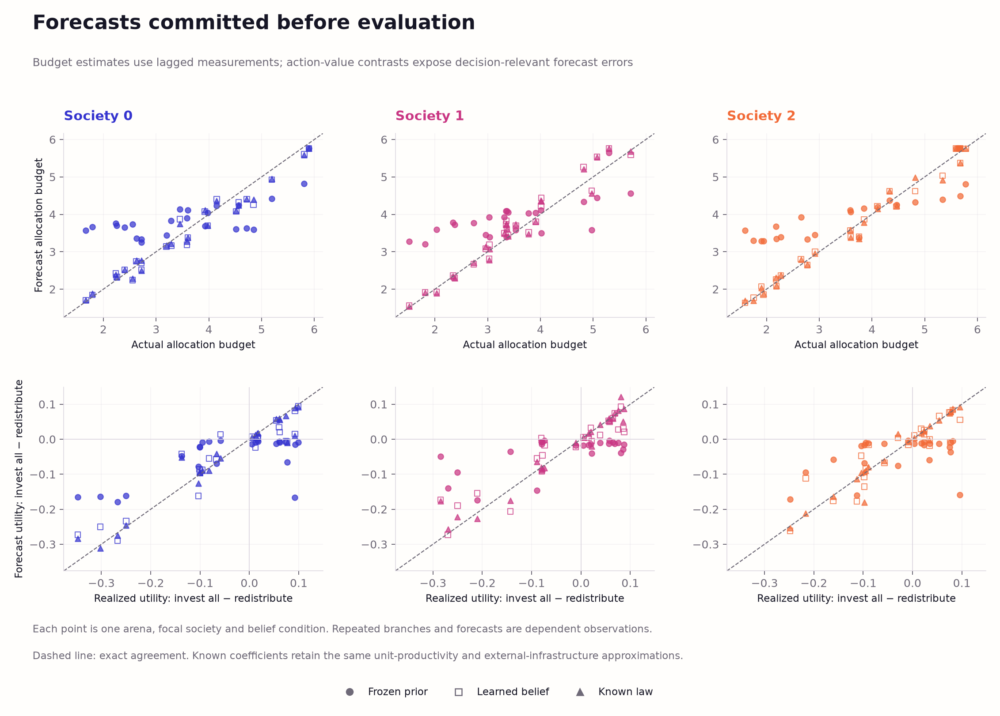

# From learned renewal laws to a material allocation

## Abstract

This control asks whether learned coefficients improve one allocation decision
under a fixed approximate planner. It separates the decision from information
acquisition: all conditions share the same warmup, legal state observations,
communication, action menu and continuation policy. A new stepwise engine
preserves the frozen simulator exactly while allowing protected interventions.
The objective is consumption plus 0.2-weighted terminal wealth, with consumption
welfare reported separately. After a passing development gate, a frozen
24-arena evaluation finds a learned-minus-prior utility gain of **0.021110 per
member**, with paired 95% interval **[0.009014, 0.033678]**. Most of the gain is
terminal wealth. The consumption difference is small and confined to one arena.
This supplies a first causal link from parameter learning to a useful decision
in this restricted task, without establishing general consumption benefits,
active experimentation or structural discovery.

## 1. Stepwise engine and observation boundary

The separately versioned
[stepwise ecology](../swarm_societies/ecology_stepwise_v1.py) exposes a strict
ready → institution decision → member decision → completed tick lifecycle.
Its episode wrapper matches the entire frozen result, including material and
sensor receipts, candidate payloads, replay, accounting and hashes. Tests cover
default and planted laws, disturbance settings, heterogeneous/stateful policies,
random-draw parity and restoration at every legal phase.

JSON-compatible snapshots preserve world state, pending within-tick randomness,
private/shared policy memory and supported mutable module objects. Unsupported
runtime objects, unordered set state and unsupported tuple cycles fail before
a checkpoint is returned. The study stores a compound world-and-sharing
checkpoint so delayed messages and private belief RNGs remain represented.
Restored evaluator branches have independent state. These are trusted evaluator
interfaces, not a sandbox against arbitrary Python introspection.

Current growth and accounting sensors become available only after tick
completion. At the institution decision, the planner receives the existing
institution payload's treasury, own infrastructure and rounded member wealth,
plus its own legally delivered prior-tick noisy growth event. It receives no
current exact patch stock, productivity, current realized tax budget, weather,
simulator snapshot, future draw or branch outcome.

## 2. Development and prospective design

The [frozen protocol](world-model-decision-protocol.md) separates exploratory
task development, a six-arena action-ranking gate, and the fresh evaluation.
Exploratory grids used one environment seed and varied warmup, initial wealth,
laws and fixed policies. The original investment/harvest schedules can leave
consumption at its ceiling, making a welfare-only decision uninformative even
when investment changes terminal wealth. These exploratory records are local
development artifacts, not independent evaluation replications.

The selected control retains physical constants, initial wealth 4, initial
stock 10, capacity 30 and need .85 per member/tick. All members harvest at home.
The first 32 ticks use the earlier staggered investment schedule, rotating policy
roles across arenas. The next 32 ticks make no public investment except a single
focal allocation at tick 32. Tax remains .6, redistribution is equal, and there
are no raids or defense expenditures. The menu is public fractions {0, .5, 1}.
This changes prescribed policies, not the physical transition equations.

All institutions learn from their own patch's bounded truthful reports under
the existing redundant-report condition. The choice supplies the lagged home
measurement needed by the planner; it is not a confidence-based routing rule.
One canonical noisy measurement exists per patch/tick, and duplicate reports
add no likelihood. At tick 32 start, pending reports from tick 31 arrive before
allocation. Keep 1,024 particles and four rejuvenation sweeps.

The development gate passed: **17 of 18 legal states** changed their preferred
extreme action when b changed from .7 to 2.7, with both forecast gaps exceeding
`max(.005, 3 × paired planning MCSE)`. Realized menu values supported redistribution
in **11 states** and full investment in **six**; the remaining state preferred
the intermediate action. In **seven states**, a known-law choice of full
investment improved realized utility over redistribution by more than .005 per
member. All forecasts were valid. These are six deliberately designed
development arenas and 18 dependent focal-state comparisons, not a sample of
final evaluation effects.



*Figure 1. Development-only checks on the same legal state under different
supplied return coefficients, alongside actual paired action consequences.
The plotted forecast tolerances are gate criteria, not population confidence
intervals. Final evaluation uses different laws and environment seeds.*

The tolerance and pass counts were fixed before this six-arena gate. Evaluation
preparation independently replayed its complete cases and archived its passing
provenance. The [development evidence](../evidence/world-model-decision-development-v1/)
retains all rows; failed or borderline states were not dropped.
The evaluation uses 24 fresh shared-law arenas and the earlier interior r/b/g
law ranges. Three focal society rotations within an arena are dependent.

## 3. A deliberately approximate fixed planner

The [planner](../swarm_societies/world_model_v1/decision.py) is a separate local
forecast implementation. Prior, learned and known-law inputs use the same
observations, objective, menu and 512-sample planning budget. The prior uses
each institution's initial particles; the learned condition uses its legally
updated posterior; the known-law reference supplies exact r/b/g through the
same coefficient interface. It is a reference for this planner, not an optimal
or full-state controller.

Forecasts reconstruct previous terminal stock from the last noisy growth packet
and nominal home harvest demand. They assume unit productivity and decay-only
external infrastructure, omitting any last-tick external investment. Current
budget is forecast treasury plus tax on predicted harvest. All conditions share
these approximations. Weather and scarcity-resolution order use an independent
planning random stream, coupled across actions. No forecast uses future engine
randomness. Analytical tests verify the timing of returns: the allocation tick
has no growth benefit, followed by 31 possible future renewals.

The objective is `(window consumption + .2 × terminal wealth) / 4`, using
sums across the four members,
matching the existing private-utility form after dropping common warmup
consumption. Report consumption, shortfall, mean consumption welfare, terminal
wealth and investment separately. A wealth-only improvement is not a consumption
or welfare improvement. The first maximum in ascending public fraction breaks
ties. Record every action forecast, predicted budget and choice before any
evaluation branch runs.

The evaluator restores the world component of the compound checkpoint and runs
three actions for each focal society: nine physical branches per arena. These paired branches
are reused to score all three belief inputs; they are not independent trials.
Action regret is relative only to this three-action menu over this 32-tick
window. Branch evaluation must leave live world, beliefs, queues, memories and
random streams unchanged.

## 4. Results

### Allocation quality

The completed prospective panel contains **24 independent shared-law arenas**,
24 common warmups and **216 protected physical continuation branches**: three
menu actions for each of three focal societies per arena. Each belief condition
makes 72 allocation choices; all three conditions reuse the same branch values.
There are **zero new evolutionary runs or model-generation calls**. The six
development arenas and 54 development branches are separate.

| Belief input | Utility/member | Mean consumption welfare/tick | Consumption/member, 32 ticks | Terminal wealth/member | Finite-menu regret/member |
| --- | ---: | ---: | ---: | ---: | ---: |
| Public prior | 31.282372 | 0.809674 | 26.339709 | 24.713315 | 0.026949 |
| Learned posterior | 31.303481 | 0.809816 | 26.342737 | 24.803725 | 0.005840 |
| Known-law reference | 31.307353 | 0.809771 | 26.341783 | 24.827853 | 0.001968 |

The primary learned-minus-prior gain is **+0.021110 [0.009014, 0.033678]**
utility per member. This is a small absolute effect—about **0.0675%** of the
prior condition's full decision-window utility. The mean finite-menu regret
falls from **0.026949 to 0.005840**, a **78.33%** reduction. Regret uses the same
best-menu reference in both conditions, so its paired improvement is algebraically
the utility gain, not a second independent finding.

| Paired contrast | Utility/member difference [95% CI] |
| --- | --- |
| Learned − prior, primary | +0.021110 [+0.009014, +0.033678] |
| Known − prior | +0.024982 [+0.013239, +0.036747] |
| Learned − known | −0.003872 [−0.007663, −0.000590] |


*Figure 2. Paired whole-arena contrasts, averaging the three focal rotations
within each arena. Utility combines consumption and terminal wealth; the other
panels preserve their distinct material meanings. Secondary intervals have no
multiplicity adjustment. Society colors identify focal society, not condition.*

Learned beliefs change 35 of 72 focal choices across 15 of 24 arenas. Utility
increases in 33 changed focal states and decreases in two; the other 37 choices
are identical to the prior. This heterogeneity is retained rather than reporting
only successful allocations. The known-law reference does better on average
but has nonzero regret. Coefficient knowledge does not remove the planner's
state approximations, finite planning samples or uncertainty about realized
weather; this experiment does not isolate their individual contributions.

### Consumption, wealth and choice

Learned minus prior terminal wealth is **+0.090409 per member
[0.037642, 0.142692]**. Its .2 objective weight contributes approximately 86%
of the utility gain. Consumption is only **+0.003028 [0, 0.009084]** per member
over all 32 ticks, and mean consumption welfare changes by **+0.000142
[0, 0.000426]** per tick. All positive consumption differences occur in one
arena, `decision-evaluation-001`, across its three dependent focal rotations.
These data do not establish a general consumption-welfare improvement.
Per-tick welfare is `(consumption − .5 × shortfall) / members`; at fixed need
and horizon, its contrast is a rescaling of consumption rather than independent
evidence.

| Belief input | Redistribute (0) | Split (.5) | Invest (1) |
| --- | ---: | ---: | ---: |
| Public prior | 72 | 0 | 0 |
| Learned posterior | 37 | 3 | 32 |
| Known-law reference | 33 | 5 | 34 |

Counts describe 72 dependent focal choices per condition, clustered within
24 arenas. Learned and known-law choices agree in **62/72** focal states.
Every evaluated branch has zero outward harm because the fixed policies never
raid. That negative control does not test whether a learned planner restrains
harmful behavior under a richer action menu.


*Figure 3. Choice frequencies and realized regret relative to the evaluated
three-action menu. The reference knows the coefficients, while retaining the
same legal state information and forecast assumptions as the other conditions.*

### Forecast quality and approximation limits

| Belief input | Mean absolute utility forecast error, all menu actions | Mean absolute initial-budget forecast error |
| --- | ---: | ---: |
| Public prior | 2.583180 | 0.773477 |
| Learned posterior | 0.194750 | 0.192044 |
| Known-law reference | 0.118242 | 0.186414 |

Each arena averages its focal states; utility errors also average its three menu
forecasts. Budget is measured in whole-society resource units, while utility is
per member. The remaining known-law errors show why coefficient knowledge alone
does not make these forecasts exact. Nominal productivity, lagged-stock
reconstruction, missing last-tick external investment and unpredictable future
weather remain relevant. The control changes the belief input, not those
assumptions.



*Figure 4. Budget predictions committed before receipts, and predicted versus
realized investment advantages. Focal points and action forecasts within an
arena are dependent. Better absolute predictions do not guarantee every action
ranking is correct.*

The [final figure gallery](../figures/world-model-decision-v1/README.md) contains
three SVG/PDF/PNG figures and four derived statistical tables. The separate
[development gallery](../figures/world-model-decision-development-v1/README.md)
records the gate. Both include captions and source/output hashes.

## 5. Verification, scope and reproduction

The verifier checks archived source/artifact hashes and independently reruns
the complete deterministic cases, including warmup learning, legal packet
construction, forecasts and all protected action branches. It then reconstructs
scalar tables and paired whole-arena summaries. Tests cover semantic tampering
after hash rewrites, source mismatches, failed gates, immutable branches,
observation timing, and refusals to overwrite completed evidence.

Final verification replayed all **24 evaluation cases**, reconstructing
**216 condition choices and 216 physical branches**, and checked **41 main
artifact hashes**. It also recursively replayed the archived **six-case
development proof**, including its **54 condition choices, 54 branches and
36 counterfactual gate forecasts**, and checked that proof's **24 artifact
hashes**. The complete test suite passes **282 tests and 102 subtests**.

The evaluation contains **2,304 distinct warmup measurements**, **360 member
and institutional learners**, **20,736 accepted owner-specific updates** and
**20,160 duplicate attempts**, with zero failed updates. All **216 allocation
forecasts** are valid. Every arena preserves its protected world, sharing and
sensor-RNG state through planning and branch evaluation.

All uncertainty intervals resample independent shared-law arenas, after averaging
their three focal rotations. Members, actions and planning samples are nested
observations. Primary inference is the learned-minus-prior utility contrast;
secondary intervals are descriptive without multiplicity adjustment.

This task supplies the mechanism family, nominal physical constants, fixed
policies and licensed infrastructure measurements. It does not implement active
experimentation, hidden-feature inference, evolved planning/reporting or rule
discovery. The shared borderline likelihood-CDF diagnostic and the distinction
between conditional ecological beliefs and a full joint model remain unresolved
from the earlier calibration audit. A decision benefit would not certify
calibration. Zero new evolutionary searches or model-generation calls are used.

Use the [pinned numerical environment](../requirements-world-model-v1.txt).
Verify the existing evaluation and its nested development proof, render both
recorded-data galleries, and run the tests with:

```bash
OPENBLAS_NUM_THREADS=1 .venv/bin/python scripts/run_world_model_decision.py verify --output evidence/world-model-decision-v1 --workers 4
.venv/bin/python scripts/visualize_world_model_decision_gate.py
.venv/bin/python scripts/visualize_world_model_decision.py
.venv/bin/python -m pytest -q
```

For a fresh reproduction, retain development and evaluation in separate new
directories. Evaluation preparation verifies the completed development bank
and refuses to proceed if its gate fails:

```bash
OPENBLAS_NUM_THREADS=1 .venv/bin/python scripts/run_world_model_decision.py prepare --development --output runs/decision-development-reproduction
OPENBLAS_NUM_THREADS=1 .venv/bin/python scripts/run_world_model_decision.py run --output runs/decision-development-reproduction --workers 4
OPENBLAS_NUM_THREADS=1 .venv/bin/python scripts/run_world_model_decision.py prepare --output runs/decision-evaluation-reproduction --development-gate runs/decision-development-reproduction
OPENBLAS_NUM_THREADS=1 .venv/bin/python scripts/run_world_model_decision.py run --output runs/decision-evaluation-reproduction --workers 4
OPENBLAS_NUM_THREADS=1 .venv/bin/python scripts/run_world_model_decision.py verify --output runs/decision-evaluation-reproduction --workers 4
.venv/bin/python scripts/visualize_world_model_decision_gate.py --source runs/decision-development-reproduction --output runs/decision-development-reproduction-figures
.venv/bin/python scripts/visualize_world_model_decision.py --source runs/decision-evaluation-reproduction --output runs/decision-evaluation-reproduction-figures
```

Completed studies cannot be overwritten. Numerical records reproduce under
the pinned environment; timestamps, elapsed times and completion-file hashes
need not. The [evaluation evidence](../evidence/world-model-decision-v1/)
preserves full cases, compound checkpoints, forecasts, branches, scalar tables,
source snapshots and the passing development proof.
