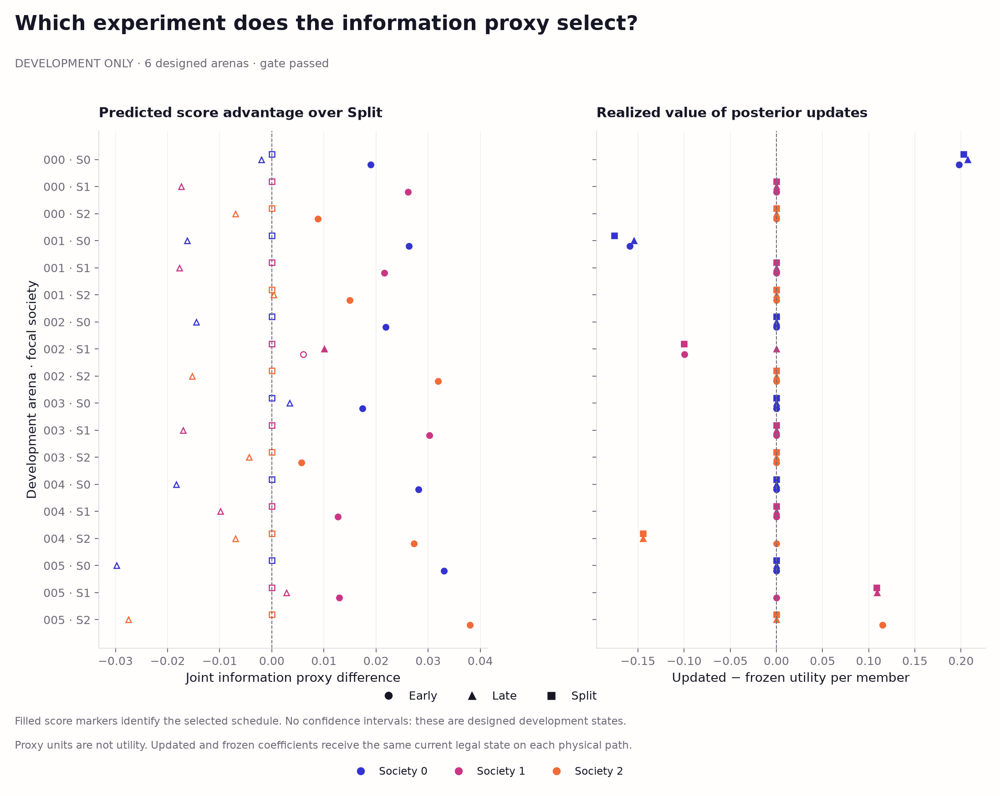
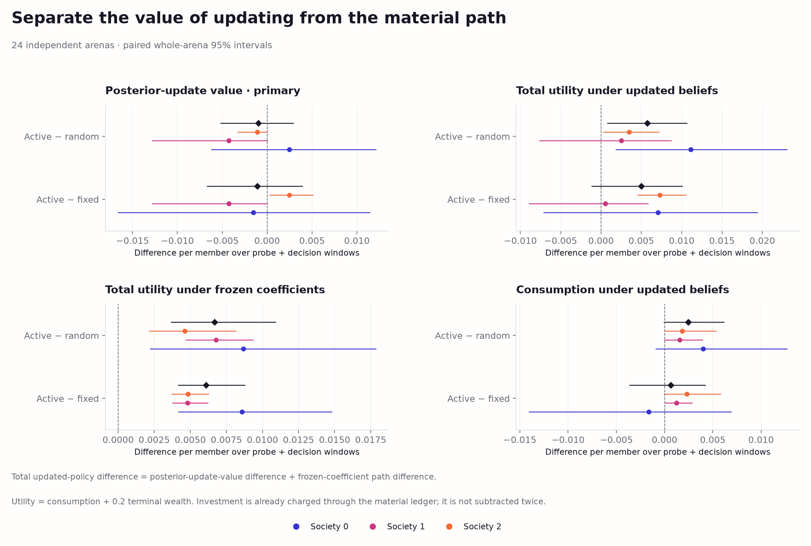
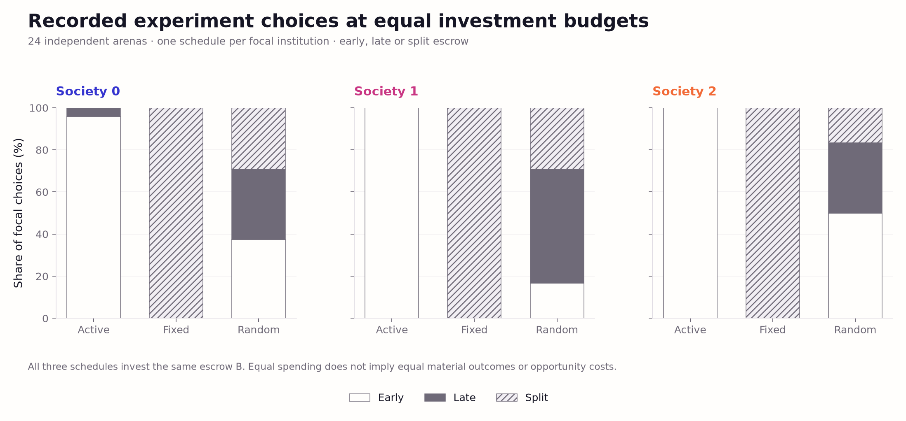
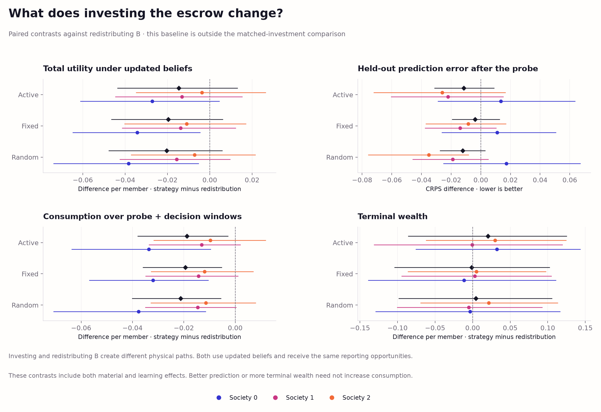

# Choosing a costed investment experiment

This stage implements one-shot, institution-selected physical experiments under
an exactly matched investment budget. It follows the
[fixed-planner allocation control](world-model-decision-v1.md), which showed a
small useful-decision effect from learned coefficients, mainly in terminal
wealth. The new question is whether selecting an experiment improves the value
of subsequent parameter updates over fixed or random experiment schedules.

The six-arena development gate and separate 24-arena evaluation are complete.
Active selection did not show a clear advantage in the value of posterior
updates: **−0.000969 per member [−0.005181, 0.002920]** relative to random
selection. A small total-utility gain was already present with frozen
coefficients. The selector chose Early in 71 of 72 states, limiting any claim
that adapting experiments to beliefs improves on fixed timing.

## Methods

The [protocol](world-model-experiment-protocol.md) fixes an eight-tick warmup,
eight-tick probe window and 32-tick allocation continuation. Societies keep the
existing supplied renewal mechanism, private numerical learners and redundant
truthful reporting contract. The working learner remains 1,024 particles with
four rejuvenation sweeps. Earlier simulators and evidence are unchanged.

At the final warmup tick, each institution reserves its tax receipts. This
creates an observed escrow B from existing resources. During the probe window,
tax is zero and other incoming transfers are absent. A focal institution can
invest B early, invest B four ticks later, or split B between those times. All
three schedules invest exactly B, receive eight home measurements each and
have the same report budget. Other institutions redistribute their escrow at the start.
The ordinary stepwise engine implements every transfer and investment; no new
physical law or resource endowment is introduced.

The [selector](../swarm_societies/world_model_v1/experimentation.py) chooses the
entire schedule before any probe outcome. Active selection maximizes a joint
Gaussian moment information proxy; Fixed selects Split; Random commits one
uniformly sampled schedule. All see the same legal institution observation and
512 draws from its current posterior. The selector integrates capped-uniform
weather moments analytically, separates between-coefficient disagreement from
weather/sensor variance, and scores their joint eight-tick covariance. It uses
a nominal stock path, unit productivity and decay-only external infrastructure.
This is an approximate information score, not exact expected information gain
or an estimate of decision value. Its diagonal residual covariance omits
stock-mediated temporal dependence.

A separate redistribution path returns B at the start and makes no probe
investment. It is an opportunity-cost baseline outside the equal-investment
comparison. Equal investment and report budgets do not imply equal material
outcomes, foregone consumption or realized information.

After the probe window, the same fixed allocation planner receives either the
updated posterior, frozen pre-probe coefficients or known coefficients. It
chooses among public-investment fractions 0, .5 and 1 over 32 ticks; subsequent
investment is zero. Current legal state and the latest delivered noisy home
measurement are identical across these belief inputs on each physical path.
The known-law reference retains the same state and planner approximations.

## What the ablation identifies

The updated-minus-frozen utility contrast measures the value of parameter
updating on the same realized physical path. Both controllers retain current
state information; this does not remove every benefit of new observations.
The primary active-minus-random contrast compares this update value across
experiment schedules. Physical state can interact with information usefulness,
so that contrast does not hold post-experiment worlds equal.

Total utility includes probe consumption, continuation consumption and .2
terminal wealth per member. Investment is already charged through the material
ledger and is not subtracted again. The active-minus-random difference under
updated beliefs decomposes exactly into the difference in update value plus
the contrast under frozen coefficients. The frozen-coefficient term describes
the material paths under a specified controller, rather than isolating every
physical mechanism. Consumption, wealth, investment, harvest and outward harm
are reported separately.

The [runner](../scripts/run_world_model_experiment.py) commits every schedule
selection before any probe path and every allocation forecast before its
physical outcome branch. Each counterfactual path has distinct event provenance
and cloned private learners, transport queues, world and RNG state. Common
warmup observations remain shared. Protected evaluation never feeds another
path or the live checkpoint. Held-out renewal predictions are scored before
and after probing on the same independent queries; those targets never update
beliefs or choose experiments.

## Development and evaluation boundary

The six designed development arenas cross three baseline-renewal values and
two infrastructure returns, holding spillover fixed. Their 18 focal states are
dependent within arenas. The gate requires varied active choices, at least two
nonfixed choices with proxy advantage above 1e-4, and at least two cost-matched
physical paths where updating changes the subsequent allocation. Exact budget,
communication, delay, isolation and failure checks must also pass. It does not
require a positive active-minus-random result.

Synthetic fixtures test belief-responsive selection, including zero information
under known coefficients and fully capped growth. A separate full-budget
implementation smoke run used one development case before source freeze; only
execution success and runtime were inspected. Its artifacts and sources remain
under `runs/world-model-experiment-smoke/` and in a separate
[portable smoke archive](../evidence/world-model-experiment-smoke-v1/README.md).
Gate criteria were specified earlier
and were not changed. The recorded gate bank is run after source freeze.

Only a passing gate permits a fresh 24-arena evaluation. Three focal rotations,
four physical probe paths per focal state and three allocation continuations
per path yield 288 probe paths and 864 continuations, with 24 common
warmups. These are nested comparisons, not independent evolutionary runs.
Evaluation intervals bootstrap 2,000 whole arenas after averaging their focal
contrasts, using seed 9501. Development cases receive descriptive summaries
and are excluded from population intervals. Secondary evaluation intervals
have no multiplicity adjustment.

## Recorded development gate

All six designed arenas completed, retaining **18 focal states**, **72 physical
probe paths** and **216 allocation continuations**. The active selector chose
Early in **17 states** and Late in **one**. Every active choice exceeded the
fixed Split proxy score by more than 1e-4. Posterior updating changed **13 of 54
cost-matched** downstream choices, or 15 of 72 including redistribution paths.
The 13 cost-matched changes concern six focal states in five designed arenas,
not 13 independent effects. There were no failed updates or forecasts.

Escrow ranged from **1.428272 to 5.240232 resource units**. All cost-matched
schedules spent their state's exact B, and the redistribution baseline spent
zero on probe investment. Each path added eight institutional home events and
sent and delivered **80 KiB per focal society**, or 240 KiB across all societies.
Effort charges differed among schedules in two focal states because the frozen
engine caps action costs by available wealth. Matching investment and report
bytes does not match those realized consequences.

The descriptive active-minus-random update-value contrast was **−0.006280 per
member**. The gate therefore passed despite an adverse development contrast;
it establishes varied selection and consequential updating, not superiority.
No development interval is interpreted as population uncertainty, and these
cases are excluded from the subsequent evaluation panel.



*Figure 1. Designed development states. Left: proxy advantage relative to Split;
filled markers identify the active choice. Right: updated-minus-frozen utility
on each identical physical path. A larger acquisition score need not improve
realized decisions. Colors identify focal society and shapes identify schedules.*

The [development gallery](../figures/world-model-experiment-development-v1/README.md)
also shows utility decomposition and redistribution-baseline contrasts, with
separate consumption and terminal wealth. It contains three inspected
SVG/PDF/PNG figures, two tables, captions and source/output hashes.

## Evaluation results

The evaluation completed **24 independent law/environment arenas**, with
**72 nested focal states**, **288 physical probe paths** and **864 allocation
continuations**. The 864 physical-path belief forecasts and 864 mapped
strategy/belief score rows reuse these paths; they are not additional
independent observations. The six designed development arenas remain separate.

All entries below average focal societies within arenas. Utility, consumption
and terminal wealth are per member. Consumption includes both the eight probe
ticks and 32 continuation ticks; warmup consumption is common and excluded.
CRPS scores the updated institutional learner on the same held-out uncapped
queries, before the continuation. It is a path metric, repeated across
downstream belief rows, rather than a new score for frozen or known beliefs.

| Experiment strategy | Updated utility ↑ | Consumption ↑ | Terminal wealth ↑ | Updated−frozen utility | Post-probe CRPS ↓ |
| --- | ---: | ---: | ---: | ---: | ---: |
| Active proxy selection | 38.148018 | 33.275753 | 24.361322 | +0.002450 | 0.375088 |
| Fixed Split | 38.143045 | 33.275123 | 24.339611 | +0.003562 | 0.382742 |
| Random schedule | 38.142296 | 33.273298 | 24.344989 | +0.003420 | 0.374337 |
| Redistribute, zero probe investment | 38.162703 | 33.294543 | 24.340801 | +0.003475 | 0.386579 |

The primary active-minus-random difference in update value is
**−0.000969 [−0.005181, 0.002920]**. Against Fixed Split it is
**−0.001111 [−0.006679, 0.003894]**. These intervals do not establish an
advantage from active selection, nor do they establish that updating is
universally useless. Across all physical paths, updating changed 66 of 288
allocation choices, including 52 cost-matched paths: 40 changes improved
realized utility and 26 worsened it, spread across 16 independent arenas.

The active-minus-random total-utility gain is
**+0.005722 [0.000791, 0.010645]**. Its exact decomposition is:

| Active minus Random | Mean per member | 95% whole-arena interval |
| --- | ---: | ---: |
| Total utility, updated coefficients | +0.005722 | [0.000791, 0.010645] |
| Utility under frozen coefficients | +0.006691 | [0.003687, 0.010896] |
| Value of coefficient updates, primary | −0.000969 | [−0.005181, 0.002920] |

Thus the small total gain is already present under frozen coefficients;
the experiment does not attribute it to improved use of newly learned
parameters. All intervals use 2,000 paired whole-arena bootstrap draws, with
seed 9501. Secondary intervals have no multiplicity adjustment.
Consumption contributes **+0.002455 [−0.000060, 0.006149]** and weighted
terminal wealth contributes **+0.003267 [−0.000814, 0.007160]** to the mean
gain. Neither component is individually resolved by its paired interval.



*Figure 2. Active minus Random and Active minus Fixed Split. The primary
update-value contrast is separated from total utility, the frozen-coefficient
path contrast and consumption. Black diamonds average the three focal
societies within each independent arena. Intervals resample whole arenas;
society colors retain their identities.*

Active chose **Early 71 times and Late once**; Fixed selected Split in all 72
states, while Random selected Early/Late/Split **25/29/18** times. All three
invested the same escrow within each state, averaging **3.396947 resource
units per focal institution**, and received eight institutional home events
with **80 KiB sent and delivered per focal society**. Outcomes can differ
despite equal investment and report budgets. Escrow ranged from 1.417727 to
5.115893, and wealth-capped effort charges differed among schedules in five
of the 72 focal states. All paths had zero failed updates and forecasts.



*Figure 3. Recorded schedule choices by focal society. The 72 choices per
strategy are nested in 24 arenas. Early dominance describes this evaluation
panel; the designed development gate had demonstrated varied selection without
requiring a favorable performance result. Synthetic fixtures separately test
responses to different beliefs at the same observed state.*

A **post hoc fixed-Early diagnostic** uses the already evaluated Early paths.
Active differs from always Early in only one state. All corresponding updated
and frozen controllers select zero downstream investment there; Active's
update-value difference from always Early is exactly zero throughout the
panel. Its descriptive total-utility difference is −0.000100 per member,
entirely terminal wealth. This is exploratory, not a replacement for the
predeclared Random comparison. Fixed Split alone cannot establish a benefit
over fixed timing in general.

Common pre-probe uncapped CRPS was **0.402211**. Active-minus-random post-probe
CRPS is **+0.000751 [−0.010876, 0.011920]**, leaving the predictive contrast
unresolved. Active-minus-Split CRPS is **−0.007654 [−0.016246, −0.000140]**
as an unadjusted secondary contrast; this does not establish greater decision
value. Query targets are withheld from both learning and experiment selection.

Against redistribution, Active's total-utility contrast is
**−0.014685 [−0.043589, 0.013016]**, and its CRPS contrast is
**−0.011491 [−0.031140, 0.008950]**. Both remain unresolved. Redistribution
invests zero in the probe and is outside the equal-investment comparison;
these results do not establish that probing repays its opportunity cost.
Total consumption relative to redistribution is
**−0.018790 [−0.037911, −0.002780]**, while weighted terminal wealth is
**+0.004104 [−0.017098, 0.024994]**. These are unadjusted secondary contrasts.
The fixed no-raid policy makes outward harm zero throughout, rather than
demonstrating a learned reduction.



*Figure 4. Active, Fixed Split and Random relative to immediate redistribution.
All downstream planners use updated beliefs. Separate panels report utility,
held-out uncapped CRPS, consumption and terminal wealth. These contrasts
combine material and learning effects; redistribution spends zero on probe
investment. Intervals resample whole arenas and are unadjusted secondary
comparisons.*

The [evaluation gallery](../figures/world-model-experiment-v1/README.md) contains
all three SVG/PDF/PNG exports, exact paired and absolute tables, captions and
source/output hashes. The [complete evidence](../evidence/world-model-experiment-v1/)
preserves selections, acquisition diagnostics, physical paths, forecasts,
branches, noisy event provenance and the copied development proof.

## Scope

The equation family, infrastructure sensor access, report routing and planner
remain supplied. Communication and computation are recorded but do not acquire
new monetary prices in this control. Selecting a fixed schedule once is less
general than adaptively choosing each next intervention. There are no new
evolutionary searches or experimental model-generation calls.

The conditional ecological likelihood and the calibration audit's shared
borderline likelihood-CDF departure remain unresolved. A useful experiment
would not certify universal calibration, rule discovery or evolved governance.

## Verification

Full semantic verification independently refitted the learners, regenerated
the committed selections and forecasts, and replayed every probe and allocation
branch for all **24 evaluation arenas** and the copied **six-arena development
proof**. Reconstructed tables, summaries and gate results match exactly.
All **49 evaluation** and **32 development** artifact hashes pass. Both
**14-source freezes** match the workspace; all 33 copied proof files are
byte-identical to the canonical development archive. The separately archived
pre-freeze smoke case and its provenance also match their receipt hashes.

The full suite passes **352 tests and 102 subtests**, including 31 selector
tests and 39 runner tests. Independent calculations from the saved tables
reproduce the reported whole-arena contrasts and intervals. All six rendered
figures were inspected, and all **26 gallery files** repeat byte-identically,
including SVG/PDF/PNG exports, tables, captions and manifests. Execution logs
and a hash-linked verification receipt are retained under
`runs/world-model-experiment-verification/`; the reproduction commands below
verify the published evidence directly.

## Reproduction

Use the [pinned numerical environment](../requirements-world-model-v1.txt).
The runner defaults to two workers. Aggregation decodes one full case at a time,
checks its invariants, then retains a small scalar projection. This changes
memory use without changing tables, gates or the full semantic replay.

```bash
OPENBLAS_NUM_THREADS=1 .venv/bin/python scripts/run_world_model_experiment.py verify --workers 2
.venv/bin/python scripts/visualize_world_model_experiment.py
.venv/bin/python scripts/visualize_world_model_experiment.py --source evidence/world-model-experiment-development-v1 --output figures/world-model-experiment-development-v1
.venv/bin/python -m pytest -q
```

Reproduce the deterministic banks in new directories:

```bash
OPENBLAS_NUM_THREADS=1 .venv/bin/python scripts/run_world_model_experiment.py prepare --development --output runs/experiment-development-reproduction
OPENBLAS_NUM_THREADS=1 .venv/bin/python scripts/run_world_model_experiment.py run --output runs/experiment-development-reproduction --workers 2
OPENBLAS_NUM_THREADS=1 .venv/bin/python scripts/run_world_model_experiment.py prepare --output runs/experiment-evaluation-reproduction --development-gate runs/experiment-development-reproduction
OPENBLAS_NUM_THREADS=1 .venv/bin/python scripts/run_world_model_experiment.py run --output runs/experiment-evaluation-reproduction --workers 2
OPENBLAS_NUM_THREADS=1 .venv/bin/python scripts/run_world_model_experiment.py verify --output runs/experiment-evaluation-reproduction --workers 2
.venv/bin/python scripts/visualize_world_model_experiment.py --source runs/experiment-development-reproduction --output runs/experiment-development-reproduction-figures
.venv/bin/python scripts/visualize_world_model_experiment.py --source runs/experiment-evaluation-reproduction --output runs/experiment-evaluation-reproduction-figures
```

Evaluation preparation refuses a failed gate and copies the independently
replayed development proof. Completed studies cannot be overwritten. For an
interrupted run, the same `run` command semantically checks completed cases
before reusing them and retains failures. Numerical results reproduce under
the pinned environment; execution times, timestamps and completion-file hashes
need not.
