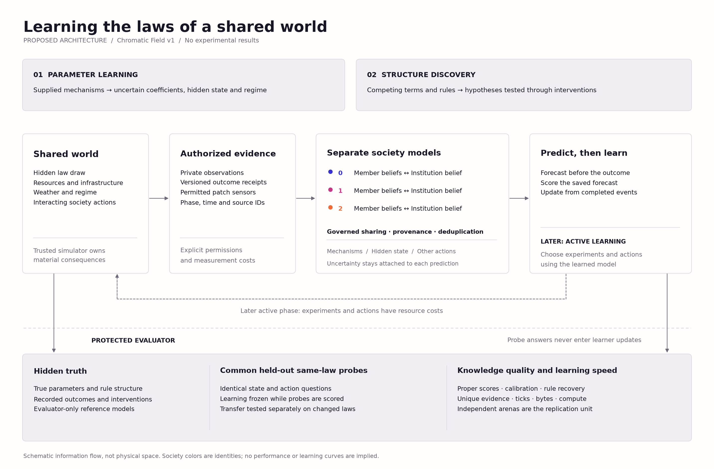

# Learnable world models for Swarm Societies

**Research and design proposal, 6 October 2026.** The user selected both
parameter learning and rule discovery, in stages. The first stationary
parameter-learning implementation and its initial results are now documented
in [world model v1](world-model-v1.md). The broader architecture below still
includes future stages. Existing experiments remain frozen. Supporting material:
[research review](world-model-literature.md) and
[implementation plan](world-model-implementation-plan.md).

Build a **structured probabilistic world model for each society**, with private
member learners and explicitly governed knowledge sharing. Each model should
maintain uncertainty about physical mechanisms, hidden environmental state,
and other societies' behavior. Start with online numerical learning; add
equation-structure discovery after the observation and evaluation contracts
work. Treat improved decisions as a separate test from improved knowledge.

The research question becomes concrete:

> Which institutions help a society acquire accurate, transferable knowledge
> of a shared world fastest, and at what cost to its members and neighbours?



## Why this architecture fits the repository

The world is small, structured, and governed by explicit resource transfers,
renewal, depreciation, and stochastic conflict. It does not require image
generation or a large visual encoder. Interpretable mechanism models allow us
to inspect what was learned and compare it to simulator truth outside the
learner. A neural model remains a useful comparison, especially for hidden
state and residual dynamics, but its latent vectors do not automatically
identify the world's laws.

Probabilistic dynamics ensembles provide a practical precedent for learning
uncertain transitions and planning, while recurrent models address incomplete
observations. [PETS](https://proceedings.neurips.cc/paper_files/paper/2018/hash/3de568f8597b94bda53149c7d7f5958c-Abstract.html),
[PlaNet](https://proceedings.mlr.press/v97/hafner19a.html).
Recent multiagent work supports separating agent-specific dynamics from the
environment and measuring communication costs explicitly.
[DMAWM, ICML 2026](https://proceedings.mlr.press/v306/xue26e.html),
[decentralized information sharing, RLC 2025](https://rlj.cs.umass.edu/2025/papers/Paper103.html).
The proposed combination is our design, not an established result in this
ecology or a claim of unique priority.

Three objects must stay distinct:

| Object | Meaning here | Persistence |
| --- | --- | --- |
| World dynamics | The actual transition law and hidden parameters used by the trusted simulator | Fixed within a declared regime; changes only through the scenario protocol |
| Learned world model | Estimated mechanisms, beliefs and predictive distributions | Updates from authorized observations during a lifetime |
| Evolution | Changes to inherited member/institution programs or, later, learning algorithms | Between independently evaluated candidate lifetimes |

The current private/shared state dictionaries permit memory, but there is no
standard learner, prediction interface, calibrated belief state, or
law-learning benchmark. A policy that stores stock estimates is not yet this
feature. Existing evolved programs also contain constants and heuristics
derived from the known simulator. They can generate behavior for passive
experiments, but cannot be treated as blank-slate law-discovery agents.

## Fix observability before claiming law discovery

Current members observe their own wealth, productivity, infrastructure, tax,
two pre-action patch stocks, institutional messages, and last action name.
Institutions observe local wealth and treasury plus previous member reports.
Action resolution, extraction by others, weather and many transfers are hidden.
[Current implementation](../swarm_societies/ecology_consumption_v2.py).

For illustration, a stock increase of one unit is compatible with three units
of renewal and two of extraction, or seven of renewal and six of extraction.
Those are algebraic examples, not experiment results. More observations of
the same confounded quantity need not resolve the ambiguity. Parameter
identification requires suitable observations, variation and assumptions;
good prediction on one policy distribution is insufficient.
[Controlled-world-model identifiability](https://arxiv.org/abs/2607.22430).

Use two explicitly named observation tracks:

1. **Experience prediction:** retain existing legal observations. Learn the
   distribution of next observations under own actions. Score forecasting and
   calibration; do not claim recovery of all physical coefficients.
2. **Instrumented law learning:** introduce a versioned receipt/sensor contract
   and controlled experiments. Score only those laws the measurements and
   interventions can identify. Compare communication conditions under the
   same instrument permissions and costs.

| Mechanism | Current ambiguity | Proposed information or experiment | Interpretation |
| --- | --- | --- | --- |
| Harvest response | Requested effort does not reveal realized yield; competitors can exhaust stock first | Private realized-yield receipt, own productivity/effort, capacity-limitation flag where justified by the sensor contract | An uncensored exact receipt can reveal a linear coefficient immediately; this is a validation control |
| Action cost | Wealth also changes through tax, redistribution and theft | Itemized private cost receipt and starting wealth | Another simple control; distinguish wealth clipping from a different cost law |
| Renewal and saturation | Stock differences mix extraction, growth and capacity clipping | Same-patch end-of-action stock and next pre-action stock, with phase stamps; optional paid environmental audit | Identifies realized net renewal without giving its equation; capped observations remain censored |
| Infrastructure dynamics | Depreciation and investment occur in different phases | Local investment receipt and infrastructure before/after the relevant phases | Learn decay and construction response with independently varied investment |
| Cross-society spillover | Other infrastructure may be invisible and correlated with local infrastructure | Authorized reports/sensors of relevant infrastructure plus independently varied interventions | Missing features stay latent; claim coefficient recovery only when the measurement design supports it |
| Drought/weather | Low renewal could be a regime shift, noise, or altered extraction | Repeated phase-aligned renewal measurements and uncertainty over regime | Learn effective renewal and change detection before trying to separate every weather component |
| Raid/defense dynamics | Failure, empty victims and hidden defense can produce similar outcomes | Later: limited conflict receipts and controlled defense/action variation | Defer full mechanism identification; do not label every zero gain a failed raid |

Own action receipts alone do **not** solve regeneration identification. The
extra patch readings and experimental variation are separate additions with
explicit costs/permissions. They must not silently reveal other societies'
private state. If a parameter remains unidentifiable, retain broad uncertainty
and score predictions over its equivalence class rather than forcing a point
estimate.

## Stage 1 Learn unknown parameters and hidden state

For society `s`, maintain a belief `b_s,t` over physical parameters `theta`,
hidden ecological state `z_t`, and social-behavior parameters `phi_s`. A useful
factorization is:

```text
physical mechanisms:  p(next_state | state, joint_actions, theta, regime)
social behavior:      p(other_actions | permitted_history, phi_s)
observation model:    p(authorized_measurements | state, sensor_contract)
belief update:        b_s,t+1 <- update(b_s,t, own_actions, new_authorized_evidence)
prediction:           integrate over hidden state, other actions and uncertainty
```

This does not grant access to joint actions. Missing actions and state are
integrated out or predicted; a privileged joint-action model is a separately
labeled evaluator reference. A neighbour changing strategy must not
automatically rewrite the estimated law of resource renewal.

### First learner

Use a small **mechanism-specific probabilistic model**, implemented with
NumPy before adding a neural training dependency:

- A **bounded sequential Monte Carlo posterior** is the primary renewal
  learner. Parameter particles carry joint uncertainty in regeneration and
  infrastructure effects; integrate the declared weather distribution and
  explicitly modeled missing state in each observation likelihood. Include
  capacity point masses and sensor quantization. Freeze public priors, particle
  count and compute limits before comparison; log effective sample size,
  resampling and rejuvenation. Particle collapse is a numerical failure, not
  evidence that a law is certain.
- Unconstrained normal–inverse-gamma Bayesian linear regression is an
  **approximate sanity baseline**, restricted to complete-feature controls
  whose capacity limits cannot bind anywhere in the public parameter/weather
  support. Its Gaussian noise assumption differs from the bounded weather
  process. Simply discarding observed saturated outcomes selects the data and
  can bias inference. Hard parameter constraints also break ordinary conjugacy;
  do not describe constrained particles as conjugate regression.
- A discrete regime filter for normal/reduced renewal, with an online
  change-point baseline. Regime timing is hidden. A scheduled drought is an
  environmental mode change, not automatically discovery of a new formula.
- Simple action-frequency/contextual social models, updated on observed or
  legitimately reported actions. Do not train on hidden realized opponents'
  actions unless that observation regime explicitly permits it.

Begin with harvest/cost controls, infrastructure decay/construction, and
renewal with local and external infrastructure effects. Add conflict once
outcome semantics and sufficient excitation are established. The first
milestone should not attempt every physical and social mechanism at once.

A mechanistic family might contain
`renewal = base × weather × regime + own_return × own_infrastructure +
spillover × other_infrastructure`, followed by a capacity cap. In Stage 1
this formula is **supplied inductive bias**; its coefficients and regime are
learned. If conservation or a graph structure is built into the learner, do
not claim it discovered those properties. Heteroskedastic weather and boundary
point masses require a likelihood that matches the modeled observation
process; ordinary Gaussian regression is only a restricted baseline.

Sample hidden law parameters independently for each arena from a frozen,
physically admissible family. Societies within an arena face the same shared
law draw, with explicitly modeled productivity/patch heterogeneity. Do not
hand them the simulator's published constants or configuration. Priors,
normalization and model-selection choices are fitted on development worlds,
then frozen before the evaluation panel.

### Private and collective knowledge

Every member starts with a private learner. A society also has an institutional
learner that receives only information its reporting rules admit. Keep local,
institutional and cross-society knowledge separate; global weight sharing
would invalidate an isolation treatment.

Represent evidence with world/event identity, mechanism, entity, source,
measurement phase, timestamp, units, visibility and provenance. A forwarded
receipt is not a new observation. Multiple members observing one patch in one
weather realization do not create multiple independent experiments. Begin
with deduplicated raw evidence, not products of member posteriors: the latter
can count the prior and recycled observations repeatedly. Account for
correlated weather even after exact duplicates are removed.

Make information governance an experimental factor: private-only learning,
random bounded sharing, evidence-prioritized bounded sharing, and complete
pooling of permitted evidence. Hold the numerical learner and total update
budget fixed where possible. Report bytes, unique evidence and computation;
complete pooling is an information reference, not a guaranteed optimum.
Cross-society exchange is a later factor, not an automatic side channel.

### Update and decision timing

At each tick, ingest only outcomes from completed events. Issue and record
action-conditioned predictions before resolving the actions they concern.
After outcomes become available, score those saved predictions, then update
the learner. Schema phase stamps must prevent accidentally training on the
same outcome that is presented as a forecast. Current institutions act before
current member actions, so their legal information differs from members'.

Initially run learners in **shadow mode** beside fixed policies: predictions
do not affect actions. Next give the same short-horizon planner either a
learned model, frozen prior, deliberately broken model, or known-law reference.
The learned planner simulates only its learned dynamics; it must not query
the real simulator to choose actions. Evaluator-only branches are different.

## Stage 2 Discover and revise rule structure

Distinguish three levels of achievement:

1. Fitting unknown numbers in a supplied equation is parameter learning.
2. Choosing among supplied linear/saturating/threshold equations is model
   selection within a declared library.
3. Adding/removing terms, interactions, or piecewise conditions is structural
   discovery within a declared expression grammar.

Start Stage 2 with a finite hypothesis library as a diagnostic baseline, then
sparse symbolic regression and bounded expression search. Compare, for
example, additive versus multiplicative spillovers, linear versus diminishing
infrastructure returns, and alternative renewal/capacity mechanisms. Generate
the evaluation world family before inspecting outcomes; do not give a model
credit for rediscovering an equation it was initialized with.

For each proposed structure, fit coefficients numerically on the same data,
evaluate prequential predictive performance and complexity on development
evidence, and retain plausible alternatives. Select affordable experiments
where their predictions differ. Return an unresolved model set when the
available evidence cannot distinguish structures. Compare functional
equivalence on intervention domains as well as canonical symbolic matches;
different syntax can encode the same law.

Sparse equation discovery supplies an interpretable baseline; code-based
world modeling demonstrates executable hypotheses. The recent ALDER preprint
is particularly relevant because it separates structure proposals, coefficient
fitting, verification, and informative interventions.
[SINDy](https://doi.org/10.1073/pnas.1517384113),
[WorldCoder](https://proceedings.neurips.cc/paper_files/paper/2024/hash/820c61a0cd419163ccbd2c33b268816e-Abstract-Conference.html),
[ALDER, September 2026](https://arxiv.org/abs/2609.33728).
These results motivate a comparison; they do not establish that LLM-proposed
equations are necessary or superior here.

An optional later proposer can evolve typed equation ASTs or restricted
programs using Shinka/LLM infrastructure. Keep equation discovery separate
from institution/policy search so attribution remains possible. It needs a
new explicit inference budget. Ordinary online coefficient fitting and the
initial symbolic baselines can run locally without new model calls.

Use four evidence partitions: fitting, public development diagnostics,
admission validation, and final evaluation. Repeated admission feedback is
itself information; it is never the untouched final test. No final-probe label,
true coefficient, law-family identifier, or simulator source enters proposal
feedback. Record pretrained-model exposure and supplied scientific vocabulary
when interpreting structural discovery.

## How to measure learning speed and quality

The primary learning endpoint should be **area under common-probe predictive
loss versus unique evidence**, reported by mechanism and society. Also show
the same curves against arena ticks, received bytes, and CPU time. This
separates fast evidence collection from efficient inference on that evidence.
Integrate over a common preregistered evidence range and divide by its width;
do not compare areas accumulated over different budgets. Freeze interpolation
and mechanism-specific evidence units, and report treatments that fail to
reach the common range separately. An empty or repeated report contributes
communication cost but no new evidence.

| Question | Metric | Necessary control |
| --- | --- | --- |
| How fast is useful knowledge acquired? | Area under the held-out learning curve; observations/ticks to a development-chosen accuracy threshold sustained for three checkpoints | Keep non-attainment as right-censored; do not average only successful runs |
| How accurate are forecasts? | CRPS for numerical outcomes; Brier/log score for discrete events; normalized MAE as a readable supplement | Fixed development-set scales and common probes; scores by mechanism, not just one aggregate |
| Are beliefs calibrated? | Predictive interval coverage and width; reliability curves | Broad intervals alone are not success; distinguish parameter credible intervals from outcome intervals |
| Are physical parameters learned? | Normalized parameter error and posterior coverage, where identifiable | Report conditioning/rank or profile-likelihood diagnostics; evaluate unidentified combinations honestly |
| Are structures learned? | Held-out functional equivalence, intervention loss, complexity and unresolved-model rate | Supplied grammar/library and initial hypotheses recorded; symbolic string match is insufficient |
| Are imagined futures reliable? | Open-loop 1/4/8-step forecast loss and conservation violations | No teacher forcing after the initial context; use the same action plan for each model |
| Can models predict action effects? | Error in expected outcome differences under withheld randomized interventions | Separate direct physical effects from effects propagated through other agents |
| Can societies distinguish changes? | Detection delay, false alarms, wrong-mechanism attribution and relearning loss | Independently change laws/regime, opponent policy and observation channels |
| Does knowledge help society? | Welfare, unmet need, private utility, harm, experiment cost and planning compute | Same planner with learned/prior/ablated/reference models |

For predictive samples `x_1,...,x_K` and target `y`, use the empirical CRPS
`mean(|x_k-y|) − 0.5×mean(|x_k-x_l|)`. It accommodates continuous outcomes
and boundary mass at zero or capacity. A Gaussian density score can be
misleading for these clipped outcomes. Proper predictive scores reward both
calibration and useful precision. Freeze the predictive sample count `K` and
use equal-weight forecast samples across all arms; this formula scores that
empirical forecast distribution. Check sensitivity to `K` on development data
because finite Monte Carlo error can otherwise change apparent performance.
Resample weighted parameter particles into predictive samples using a separate
evaluation RNG; the scoring RNG must never advance live learner state.
[Gneiting and Raftery](https://sites.stat.washington.edu/people/raftery/Research/PDF/Gneiting2007jasa.pdf).

Maintain both **prequential scores on experienced data** and a **common probe
bank**. Experienced-data error alone can fall because a society visits easier
states. At declared checkpoints, fork and freeze the model; ask it to predict
from sanitized legal histories and action plans on the common bank. Belief
conditioning on a supplied context is allowed, parameter learning from probe
targets is not. Freeze the context length and observation schema. Share the
probe design across arenas, but instantiate each bank under **that arena's own
hidden law draw**, with independent starting states and randomness. Societies
within one arena receive the same bank, filtered to the declared observation
regime. Probes drawn under different laws belong to a separately labeled
transfer test. Discard evaluation forks and verify training-state hashes.
The evaluator obtains true outcomes from separate simulator copies, with
future randomness integrated over enough draws for distributional targets.

Use two references: known physical laws with the same observation limitations,
and privileged full-state dynamics. The first isolates parameter uncertainty;
the second reveals a different information advantage. Neither necessarily
provides an attainable control optimum. Weather produces irreducible error,
so zero one-step error is not the universal success criterion.

Same-randomness simulator branches define a useful coupled counterfactual,
but recovering that exact noise coupling is a stronger target than estimating
an intervention distribution. Label both explicitly. Do not score a society
against hidden state it was never given while describing the result as a
fair prediction of its experience.

## First experiment sequence

**A. Instrument and validate.** Reproduce the v2 material trajectory at its
reference parameters when new sensing/control is disabled. Demonstrate that
the harvest/cost controls learn on uncensored examples and remain uncertain
on censored ones. Construct confounded renewal examples where a learner must
remain uncertain, then add independently varied inputs that identify the
coefficients. Run sensor and intervention ablations.

**B. Compare collective learning on identical trajectories.** Keep behavior
fixed and replay the same legal evidence streams through private-only,
random-sharing, prioritized-sharing and full-permitted-pooling learners.
Measure each society's private and public knowledge separately. Compare
equal-time, equal-unique-evidence and equal-bandwidth views; the same advantage
need not appear in all three.

**C. Let societies experiment.** Compare fixed exploration, random probes and
disagreement-guided probes at matched opportunity/resource budgets. Include
an institution-coordinated version. Randomized effort, investment and brief
extraction reductions can provide excitation, but participation by opponents
cannot be assumed. Log actual compliance and distinguish assigned from
executed interventions. Count foregone production and harms imposed on others.

**D. Test changing worlds.** Cross a physical/regime intervention with an
opponent-policy switch, then add report delays or corruption separately.
Test whether a society updates the appropriate model component. Later use
new rule families and longer horizons for transfer.

**E. Test learned-model control and structural discovery.** First isolate the
value of predictions using a fixed planner; only then combine evolving
institutions, active experiment selection and structural revision. This
prevents an opaque bundle of improvements from being called faster learning.

A concrete **planning pilot**, not a frozen protocol or power guarantee, is
24 independent hidden-law/arena blocks, 256 ticks, and checkpoints at
0/4/8/16/32/64/128/256. Replay four information treatments on each trace.
Rotate the three founder policies across society identities within each block;
six rotations remain nested observations, not six independent worlds.
Benchmark learner throughput before fixing the final panel and stopping rule.
Use separate pilot worlds to set tolerances and choose useful regimes.

An arena is the replication unit because societies interact and share shocks.
Cluster uncertainty by independent arena/law draw, nesting rotations and
learner seeds; report paired arena differences. Additional evolutionary
replications are needed to compare evolved learning institutions as search
procedures. Our currently saved populations represent individual lineages.

## Implementation and visual deliverables

Implement new modules alongside frozen v1/v2 code: a stepwise versioned
ecology, receipt/observation schemas, per-society learners and evidence stores,
an experiment runner, an independent probe evaluator, and recorded-data
renderers. Large learned state belongs in the trusted learner host with
explicit limits, not inside the candidate API's 8,192-character memory field.
Expose compact forecasts and uncertainty summaries to candidate programs.
The [implementation plan](world-model-implementation-plan.md) specifies
interfaces, lifecycle, tests and milestones.

Every empirical release should include the following Chromatic Field figures:

- Learning curves by society with arena-level uncertainty, against both ticks
  and unique observations, plus threshold non-attainment.
- Parameter-belief trajectories with evaluator-only truth markers and clear
  distinction between confidence in parameters and predictive uncertainty.
- A held-out intervention matrix and multi-step forecast-error plot.
- Calibration/precision plots, and knowledge gained versus communication and
  experiment cost.
- Stage 2 hypothesis histories showing unresolved alternatives and rejected
  laws, with forecasts before and after informative interventions.

The architecture illustration accompanying this proposal is a design diagram,
not experimental evidence. No hypothetical learning curve is presented as a
measurement. The first implementable release is a receipt-based learner,
identifiability controls, passive comparisons and reproducible learning
figures; structural search and closed-loop adaptation follow after those pass.
