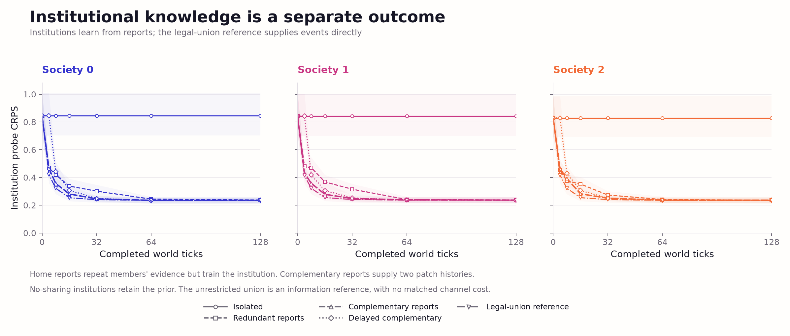
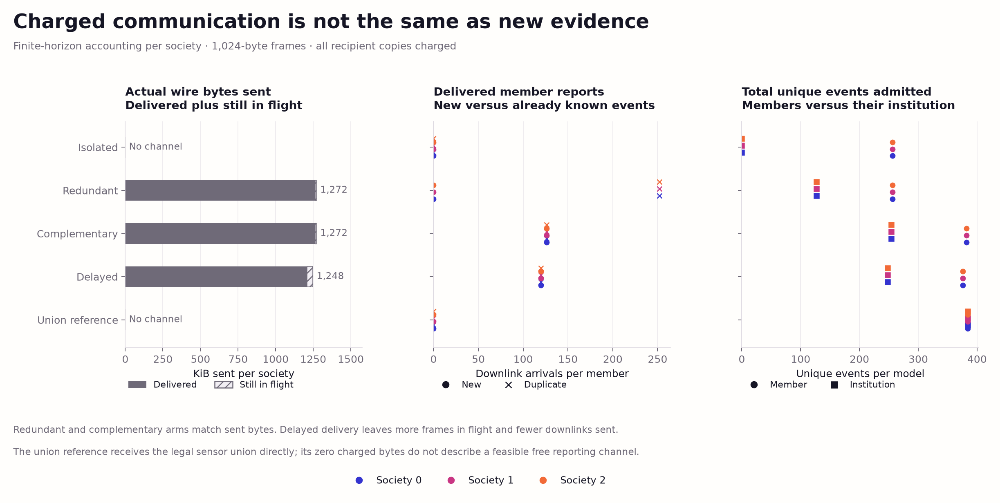
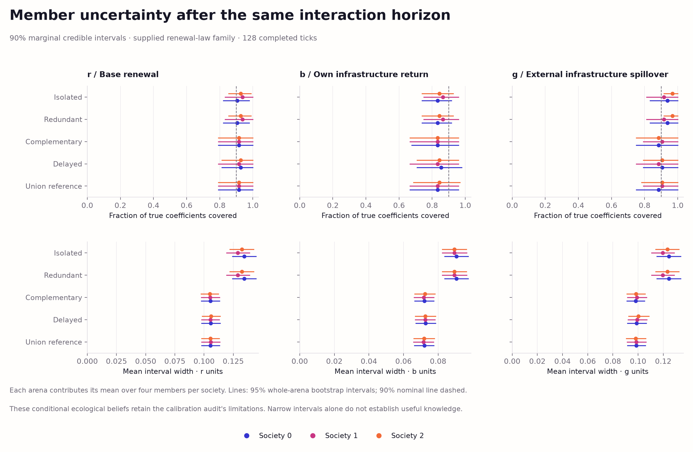

# Private beliefs and bounded institutional knowledge sharing

## Abstract

This study asks whether an institution can accelerate its members' learning by
forwarding truthful observations that their own sensors missed. A separately
versioned runtime gives each of twelve members and three institutions a private
Bayesian world model. Five passive information conditions share the same
physical trajectories, learner settings and forecast probes. The primary
intervention changes report content while holding communication bytes and
latency fixed. This is an experiment on information access within a supplied
renewal equation, not a test of learned ecological decisions or rule discovery.
Across 24 fresh arenas, complementary reports reduce member time-average CRPS
by 0.001778 (0.68%) relative to redundant reports, with paired 95% interval
[−0.002939, −0.000604]. The terminal difference remains unresolved and the
equal-evidence comparison favors private sensing. Truthful information routing
has a small time advantage here; it does not establish inference efficiency or
material benefits.

## 1. Implemented feature

[SharingRuntime](../swarm_societies/world_model_v1/sharing.py) maintains separate
particle, evidence and random-generator state for every member and institution.
Each member observes its home patch and one rotating other patch. In the ordinary
conditions, institutions start without observations and learn only from admitted
reports; the legal-union reference instead supplies events directly. Canonical
events identify a single physical patch/tick measurement; all legal copies
retain the same sensor noise, identity and payload. Repeated arrivals do not
multiply evidence or advance the inference random stream.

A trusted harness binds each actor to its own member port. The reporting API
checks sender eligibility, ownership, current-tick provenance, content and the
fixed reporting rule. Ports expose current private measurements and selected
belief summaries. The runtime and full snapshots belong to the evaluator;
this in-process boundary is not a sandbox for arbitrary hostile Python code.
Payload hashes detect changes; they are not cryptographic identity proofs.
Sensor identity is implicit in the arena-qualified event ID and the frozen
one-measurement-per-patch/tick contract; frames carry no separate sensor
identifier. This is a single-sensor control, not a multi-sensor provenance system.

Each wire frame serializes the event and routing provenance into exactly 1,024
bytes, including explicit padding. Every member delivery is charged separately.
Institutions forward duplicate envelopes as well as novel ones so that the
content ablation retains equal traffic. Evidence admission deduplicates them
at the receiving learner. Full snapshots preserve pending deliveries, accepted
histories, numerical state and random generators for exact continuation.

## 2. Prospective design

The [frozen protocol](world-model-sharing-protocol.md) specifies 24 fresh
independent law/environment arenas, three societies and four members per society,
128 ticks, and five conditions. No earlier evaluation arena enters this panel.
Development uses a separate seed namespace. The numerical learner remains the
published 1,024-particle SMC with four rejuvenation sweeps, following the
[independent calibration audit](world-model-calibration-v1.md).

| Condition | Report rule | Uplink + downlink delay | Purpose |
| --- | --- | ---: | --- |
| Isolated | No communication | — | Private-sensor baseline |
| Redundant | Members 0 and 1 report the home event | 1 + 1 ticks | Equal-byte content control |
| Complementary | The same members report their different other-patch events | 1 + 1 ticks | Informative institutional routing |
| Delayed complementary | Same complementary content and channel capacity | 4 + 4 ticks | Latency intervention |
| Union reference | All three events supplied immediately to every learner | 0 | Unpriced information reference |

Queued messages arrive at tick start; current private observations and reports
follow at tick end. Messages still in flight at the horizon remain undelivered.
The union reference has no channel charges and cannot establish budget-matched
institutional efficiency. It is a ceiling on access to available information,
not a mathematical guarantee of best finite-sample predictive performance.

The world retains fixed investment and harvest policies, stationary shared
renewal coefficients, hidden weather, capacity clipping and Gaussian sensor
noise. Licensed infrastructure audit features remain available. No hidden law,
weather draw, exact growth, evaluator target or future event enters a learner.
This is still the instrumented observation control, not inference over missing
external infrastructure or the full joint ecological process.

Each learner predicts 64 common same-law queries with 512 predictive samples at
completed ticks 0, 4, 8, 16, 32, 64 and 128. The primary score uses 32 guaranteed
uncapped probes; the other 32 are capacity controls. The primary estimand is
member-mean CRPS integrated over ticks and divided by 128, complementary minus
redundant. Lower values are better. Member models also receive exact evidence-count
checkpoints immediately after 0, 8, 16, 32, 64, 128 and 256 unique updates.
Equal counts need not contain the same examples or order; this secondary axis
does not isolate inference efficiency.

Bootstrap intervals use 2,000 draws of whole arenas, seed 9301. Members,
societies, probes and repeated checkpoints are dependent within an arena.
Paired contrasts preserve that dependence. Secondary intervals are descriptive
and are not adjusted for multiple comparisons. The panel size is fixed and
does not constitute a prospective power guarantee.

## 3. Results

The panel contains **24 independent arenas**, 128 ticks each, with five
information replays of each common physical trajectory. Its 1,800 terminal
models comprise twelve member and three institutional models per condition and
arena. There are **zero new evolutionary runs and zero model-generation calls**.
Members, societies, conditions and message copies are not independent arenas.

### Member learning over time and evidence

Lower CRPS is better. Time averages integrate the recorded completed-tick
checkpoints over 0–128 ticks; evidence averages integrate exact unique-event
checkpoints over 0–256 events. Each arena first averages its twelve members.

| Condition | Time-average CRPS | Terminal CRPS | Evidence-average CRPS | Terminal unique events/member |
| --- | ---: | ---: | ---: | ---: |
| Isolated | 0.260293 | 0.235840 | 0.260293 | 256 |
| Redundant | 0.260293 | 0.235840 | 0.260293 | 256 |
| Complementary | 0.258516 | 0.235725 | 0.263656 | 382 |
| Delayed complementary | 0.259564 | 0.235773 | 0.262921 | 376 |
| Legal-union reference | 0.257289 | 0.235693 | 0.263616 | 384 |

The primary complementary-minus-redundant time-average contrast is
**−0.001778 [−0.002939, −0.000604]**, a **0.68%** reduction relative to the
redundant mean. The relative percentage is a ratio of panel means, not the mean
of arena percentages. Redundant and isolated member posteriors and scores are
exactly equal; repeated copies consume bandwidth without adding evidence.


*Figure 1. Member CRPS by completed tick and unique-event count. Colors retain
society identity, and markers identify conditions. Curves average independent
arenas after averaging their dependent members; bands are pointwise 95%
whole-arena bootstrap intervals. Isolated and redundant curves overlap.*

| Paired member contrast | Time-average CRPS difference [95% CI] | Terminal CRPS difference [95% CI] |
| --- | --- | --- |
| Complementary − redundant | −0.001778 [−0.002939, −0.000604] | −0.000114 [−0.000238, +0.000010] |
| Delayed − complementary | +0.001048 [+0.000382, +0.001842] | +0.000047 [−0.000060, +0.000176] |

Longer delivery delays diminish the time advantage. Terminal member differences
are much smaller and their intervals include zero. At equal evidence counts,
complementary minus redundant is **+0.003363 [+0.001506, +0.005242]**: the
direction reverses. More timely access to additional events therefore does not
establish better performance per event. Counts do not match event contents or
processing order, so this axis is descriptive, not an isolated inference test.
All secondary intervals are unadjusted for multiple comparisons.


*Figure 2. Paired whole-arena contrasts for report content, sharing and delay.
Black diamonds summarize all members; colored points show society-specific
estimates without treating societies as independent worlds. The prospectively
declared primary endpoint is the content contrast over world time.*

### Institutional learning and communication

Institutions have their own beliefs; their improvement is not automatically
their members' improvement. Institutional time-average CRPS is **0.838759**
without reports, **0.286090** with redundant reports, **0.265057** with
complementary reports, **0.282820** with delayed reports, and **0.257397** in the
legal-union reference. Even reports redundant to members train an initially
uninformed institution, once per unique physical event.



*Figure 3. Separately owned institutional models learn from admitted uplinks,
except the legal-union reference, which receives events directly.
The isolated institution stays at its prior. Whole arenas are resampled for
pointwise intervals; three institutional models within an arena are dependent.*

| Condition | KiB sent/society | Frames delivered / pending per society | Novel / duplicate downlinks per member | Terminal events/institution |
| --- | ---: | ---: | ---: | ---: |
| Isolated | 0 | 0 / 0 | 0 / 0 | 0 |
| Redundant | 1,272 | 1,262 / 10 | 0 / 252 | 127 |
| Complementary | 1,272 | 1,262 / 10 | 126 / 126 | 254 |
| Delayed complementary | 1,248 | 1,208 / 40 | 120 / 120 | 248 |
| Legal-union reference | Unpriced | 0 / 0 | 0 / 0 | 384 |

These deterministic counts hold in every arena and society. Each frame costs
1 KiB, including provenance and padding; delivery to four members costs four
frames. Ordinary downlinks arrive two ticks after observation, and delayed
downlinks arrive eight ticks afterward. Delayed sharing matches capacity and
the original sender schedule but sends fewer downlinks before the horizon.
The union reference receives its events directly without transport charges.
Its zero charged traffic does not represent a feasible free reporting channel.



*Figure 4. Sent bytes, delivered novelty and terminal evidence are distinct
quantities. Pending frames remain in flight at tick 128. Member-update counts
count recipient admissions, not independent physical events.*

Across the panel there are **9,216 distinct physical measurements**, **549,288
successful owner-specific updates**, **152,568 duplicate attempts**, and **zero
failed updates**. Duplicate copies add no likelihood factors. Material
trajectories are common to conditions because beliefs do not choose actions;
this is not a welfare comparison.

### Uncertainty and model scope

Terminal member predictive 90% coverage is **90.59%** for isolated/redundant,
**90.27%** for complementary, **90.33%** for delayed, and **90.44%** for union.
The following coefficient coverage averages members within each arena before
averaging the 24 arenas. The 288 dependent member intervals per condition are
not 288 independent calibration trials.

| Condition | Baseline renewal r | Own return b | External spillover g |
| --- | ---: | ---: | ---: |
| Isolated / redundant | 92.36% | 84.72% | 94.10% |
| Complementary | 91.67% | 83.33% | 89.24% |
| Delayed complementary | 92.36% | 84.38% | 89.93% |
| Legal-union reference | 91.67% | 83.68% | 89.93% |

Complementary coverage has wide 95% whole-arena intervals: **[79.17%, 100%]**
for r, **[67.01%, 95.83%]** for b, and **[76.39%, 100%]** for g. These are
conditional ecological beliefs under an interior task-law distribution, not a
full joint ecological model or a new full-prior calibration audit. The earlier
audit's shared borderline likelihood-CDF departure remains unresolved; this
sharing experiment does not repair or retest it.



*Figure 5. Terminal coefficient coverage and interval width, retaining society
identity. The nominal 90% line is descriptive on this ecological task panel.
Narrow intervals alone do not establish useful or universally calibrated belief.*

The [figure archive](../figures/world-model-sharing-v1/README.md) contains all
five figures in SVG/PDF/PNG, captions, source/output hashes, and five tables
covering endpoints, paired contrasts, parameters, communication and CPU cost.

## 4. Verification and reproduction

The semantic verifier regenerates each world, noisy sensor packet and held-out
query; independently reconstructs ownership, routing, delays, byte charges and
admission order; checks cached terminal likelihoods; and regenerates terminal
forecasts from saved posteriors. Intermediate aggregate scores are reconstructed
from archived prediction primitives. Reconstructing every intermediate posterior
requires a rerun of the frozen sources. Direct event-stream replay of all fifteen
owners is an acceptance test, not a second production fit of every trajectory.

The completed audit verifies **281 artifact hashes**, **22,680 checkpoints**,
**68,040 parameter rows** and **1,451,520 recorded prediction rows**, and
regenerates **115,200 terminal forecasts**. Its unchanged per-arena checks were
dispatched to four workers before the original verifier checked the complete
tables, summaries and manifest; inventory hashes were unchanged throughout.
The complete test suite passes **194 tests and 35 subtests**, including recovery
and semantic-tampering controls. All five figure PNGs were inspected, and all
22 figure-directory files reproduce byte-for-byte, including the manifest.

```bash
OPENBLAS_NUM_THREADS=1 .venv/bin/python scripts/run_world_model_sharing.py verify
.venv/bin/python scripts/visualize_world_model_sharing.py
.venv/bin/python -m pytest -q
```

To repeat the same deterministic arena bank in a fresh directory:

```bash
OPENBLAS_NUM_THREADS=1 .venv/bin/python scripts/run_world_model_sharing.py prepare --output runs/sharing-reproduction
OPENBLAS_NUM_THREADS=1 .venv/bin/python scripts/run_world_model_sharing.py run --output runs/sharing-reproduction --workers 4
OPENBLAS_NUM_THREADS=1 .venv/bin/python scripts/run_world_model_sharing.py verify --output runs/sharing-reproduction
```

Numerical results are reproducible under the recorded software versions; CPU
cost and wall time depend on the machine. The source archive, design hash,
per-arena data, full runtime snapshots, scores, transport records and completion
manifest make the experiment auditable. Frozen earlier simulators and results
remain intact. This study requires no evolutionary search or model-generation
calls.

The interrupted production run is recovered with a separately versioned
[recovery command](../scripts/resume_world_model_sharing.py), leaving the frozen
runner unchanged:

```bash
OPENBLAS_NUM_THREADS=1 .venv/bin/python scripts/resume_world_model_sharing.py --workers 4
```

It semantically verifies complete arenas before reusing their files unchanged,
archives partial arenas under `runs/world-model-sharing-recovery/`, and recomputes
only unfinished arenas from the same frozen seeds and sources. Partial arenas
restart from their beginning because intermediate aggregate scores were not
checkpointed. The recovery manifest records preserved files and source hashes.
Production recovery reused twelve complete arenas, preserved fourteen partial
files and recomputed the remaining twelve arenas in **920.13 seconds** with four
workers. This covers recovery only; the interrupted run's full wall time is
unavailable. A completed study cannot be overwritten with this command.

## 5. Interpretation and next step

This intervention can identify the effect of truthful report content and delay
on knowledge under fixed policies. It cannot establish improved welfare,
strategic communication, evolved governance, decentralized consensus or
structural discovery. Communication is measured in bytes but does not subtract
material wealth. Finite-panel parameter coverage and the ecological conditional
likelihood retain the limitations documented in the calibration audit.

The transport is scoped to the frozen short event identifiers. Review identified
a generalization edge case: an unusually long escaped identifier can fit an
uplink but overflow a forwarded frame after routing metadata is added. That
would interrupt delivery without a rejected-downlink record. Supporting arbitrary
identifier lengths needs atomic descendant-size validation in a separately
versioned runtime; the current evaluation uses the frozen identifier format.

The following next-step rationale records the state at completion of this
sharing study. The allocation control has since been implemented and evaluated;
see the [completed decision report](world-model-decision-v1.md).

The [next causal bridge](world-model-decision-plan.md) is useful decisions.
First implement a versioned,
stepwise ecology interface and a development-only action-ranking audit under
known laws. Investment acts after the current growth and harvest phase, so a
one-step planner can be insensitive to the very coefficients being learned.
Establish a scarcity regime and delayed-return horizon where feasible actions
have different consequences before comparing planners.

Then expose legally timed learned beliefs to a fixed planner and compare it
with the same planner using the prior and an evaluator-only known-law reference.
Record predictions before outcomes. Measure consumption, scarcity, outward harm
and information costs separately. Active experimental design is a later contrast
against budget-matched fixed or random interventions, not an automatic property
of model-based control. Model selection among supplied equation families,
followed by bounded structural discovery, remains the subsequent staged objective.
