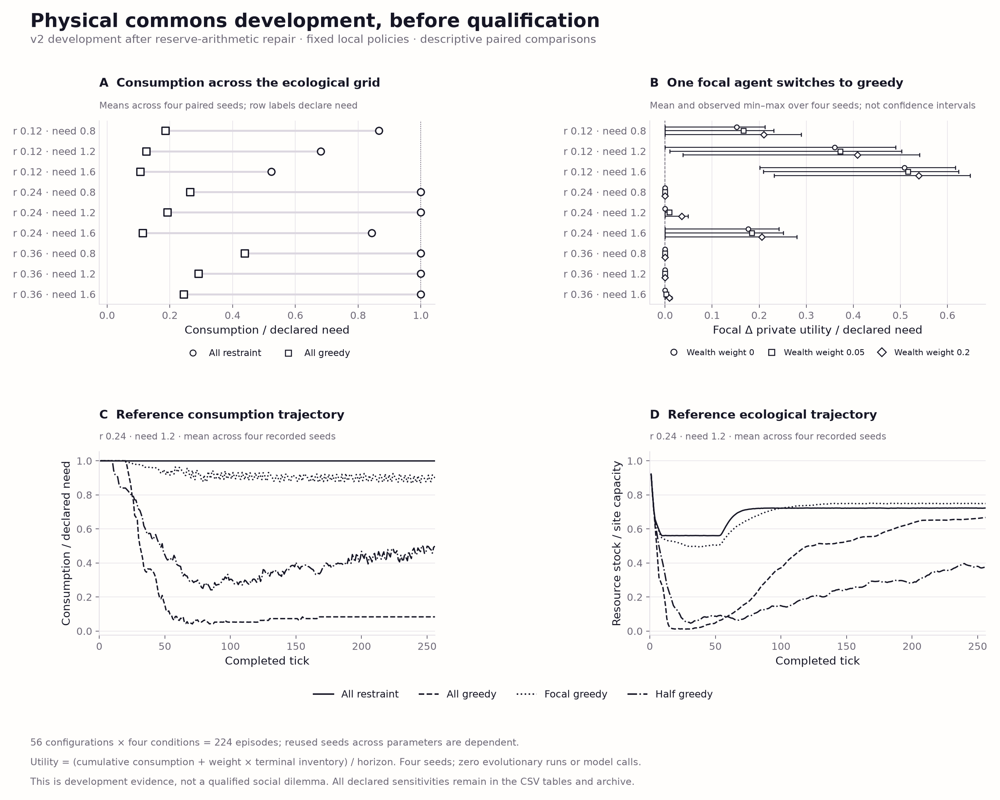
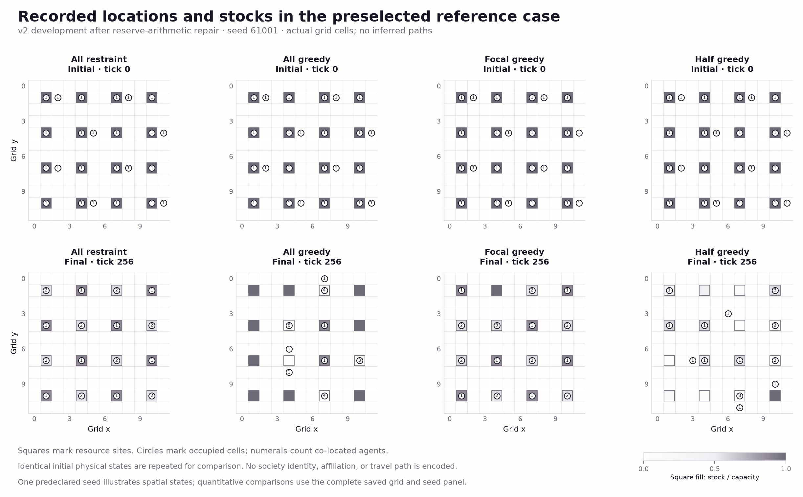

# Physical commons development · Chromatic Field v1

**v2 development after reserve-arithmetic repair.** This v2 bank repeats the declared development panel after the reserve-arithmetic repair. The failed v1 navigation control remains preserved separately; the physical engine is unchanged. Neither bank is a completed qualification.



[SVG](development-outcomes.svg) · [PDF](development-outcomes.pdf) · [PNG](development-outcomes.png)

**Quantitative caption.** Panel A compares mean consumption divided by declared
need for all-restraint and all-greedy populations across the full ecological
grid. Panel B replaces one focal policy, leaving peers unchanged, and shows
the mean and observed minimum–maximum paired utility difference over four seeds.
These ranges are descriptive, **not confidence intervals**. Wealth weights
0, 0.05 and 0.2 are separately marked. Utility is `(consumption + weight ×
terminal inventory) / horizon`, then divided by need for the plot. Focal IDs
vary with seed, not as independent replicates. Both extraction and navigation
may change with the focal policy. Panels C and D use the predeclared reference
cell and show per-tick means over all four saved seeds, without smoothing.
Conditions use neutral markers and line styles; no society colors are assigned.



[SVG](recorded-spatial-states.svg) · [PDF](recorded-spatial-states.pdf) · [PNG](recorded-spatial-states.png)

**Spatial caption.** Actual initial and final frames from the preselected case
`grid-r0.24-n1.2-s61001` show sites as squares, stock/capacity
as a common grayscale, and occupied agent cells as circles with co-location
counts. Agent positions are not jittered. The same initial physical state is
repeated across four conditions; no trajectories, affiliations or unrecorded
interactions are inferred. This single case is an illustration, not the
quantitative replication unit.

The archive contains 56 configurations and 224 episodes,
including the complete declared sensitivities. Four environment seeds are reused
across parameter cells and sensitivities, so these comparisons are dependent.
There are zero evolutionary runs and zero experimental model calls. This is
exploratory physical development, not a completed social-dilemma qualification
or evidence that institutions are useful. Consumption and unmet need are
complementary accounting outcomes, not independent welfare measures.

Recorded tables:

- [All condition means and sensitivities](condition-means.csv)
- [All paired effects, wealth sensitivities and descriptive ranges](focal-effects.csv)
- [Reference-cell mean trajectories](reference-trajectories.csv)
- [Exact plotted spatial coordinates, stocks and inventories](spatial-frames.csv)

The renderer dispatches explicitly on the archive version to
`development.verify(source, replay=False)` for v1 or
`development_v2.verify(source, replay=False)` for v2 before loading plot data.
Unknown versions are rejected. It validates the source freeze, artifact hashes, full case inventory,
and recomputed aggregate; it does not rerun policies or physics. Full semantic
replay is the separate study verifier's responsibility. The figure manifest
pins every evidence artifact, renderer/helper source, software version and
output. Same-runtime rerenders are deterministic; cross-version rendering
identity is not asserted.

Re-render from the repository root:

```bash
.venv/bin/python scripts/visualize_commons_v3_development.py \
  --source evidence/commons-v3-foundation-v2 \
  --output figures/commons-v3-foundation-v2
```
