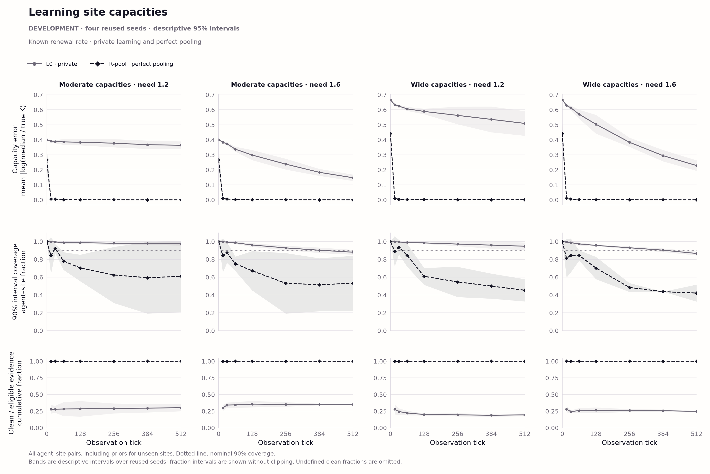
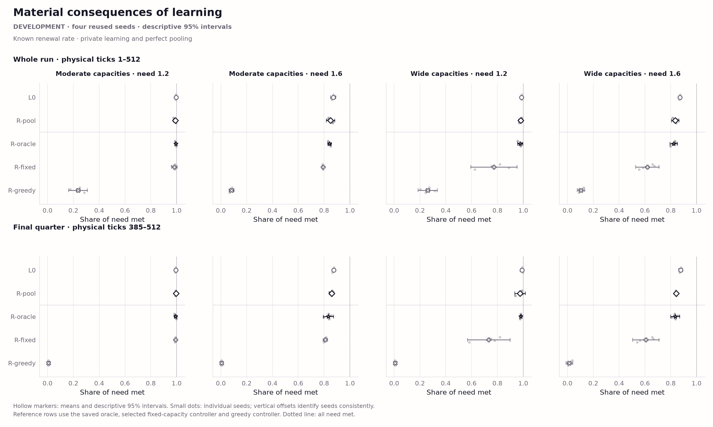

# Known-rate pooling: recorded development results

Four reused development seeds; descriptive comparisons after selection. These are not fresh evaluation results.

G3-prime **fails**: paired R-pool minus L0 in the wide/need-1.6 cell is **-0.036122 of need**, against the fixed +0.02 criterion. For sharing reports, this is the prerequisite A2 result.

Recorded decision: use approved unknown-rate fallback once, after joint G2 recalibration.

| World | Need | L0 need met | R-pool need met | Paired difference |
|:--|--:|--:|--:|--:|
| moderate | 1.2 | 0.994932 | 0.989764 | -0.005168 |
| moderate | 1.6 | 0.870312 | 0.849600 | -0.020712 |
| wide | 1.2 | 0.986909 | 0.980514 | -0.006396 |
| wide | 1.6 | 0.870962 | 0.834840 | -0.036122 |

The oracle is a true-capacity heuristic, not a consumption ceiling. Inference accuracy and consumption are reported separately. No evolutionary runs or experimental model calls are represented.

Learning in all four development cells. Points are the recorded observation checkpoints (tick zero through the terminal observation); segments join checkpoints without implying additional measurements. Capacity error is the within-episode mean absolute log ratio of posterior median to true site capacity over all agent–site pairs, including prior beliefs for sites an individual has not seen. Coverage is the fraction of those pairs whose 90% posterior interval contains true capacity; the dotted line is 0.90. The bottom panels show the recorded cumulative (clean own transitions + clean receipts) / eligible-transition fraction; an undefined denominator is omitted. For R-pool, receipt counters are privileged pooled transitions counted per recipient, not paid messages. Lines show four-seed means and bands the saved descriptive 95% Student-t intervals, without clipping them to fraction bounds. The same four reused development worlds occur in each arm; these are not fresh evaluation intervals or independent evolutionary runs.

Mean share of material need met over physical ticks 1–512 (top) and 385–512 (bottom), shown separately in all capacity-width and need cells. Each raw dot is an episode's total consumption divided by population, ticks and individual need. Hollow markers and whiskers give means and saved descriptive 95% Student-t intervals over four reused development seeds. Deterministic vertical jitter follows seed order, so the same seed has the same offset in each arm. Reference rows come from the selected, preserved consequence-map cases; the oracle is the supplied known-capacity policy, not an optimal controller or a consumption upper bound. Whole-run and final-quarter measures are never substituted for each other. The dotted line marks one unit of consumption per unit of need. No fresh evaluation or Holm-adjusted tests are represented.

The belief-versus-evidence figure is unavailable at this stage: this bank contains no L2/L3 or biased-minority sharing outcomes.

[Condition means and intervals](condition-means.csv) · [Recorded learning checkpoints](learning-trajectories.csv) · [Paired seed differences](paired-effects.csv)

The loader reconstructs saved aggregates and checks their declared inventories and prerequisites; rendering runs no episodes, policies or physical transitions and is not an episode replay. SVG, PDF and PNG exports use Chromatic Field v1. The existing-style figure manifest connects recorded inputs, rendering sources and outputs. Use a new output directory for another rendering; prior exports are preserved.
