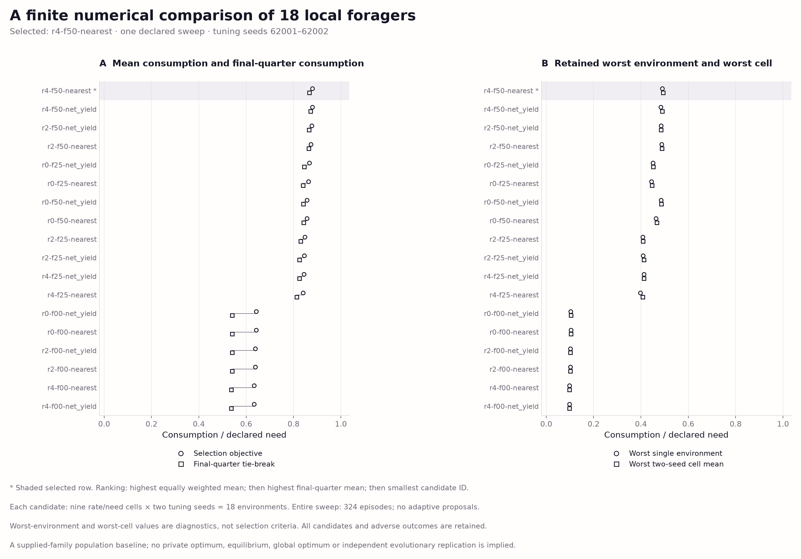
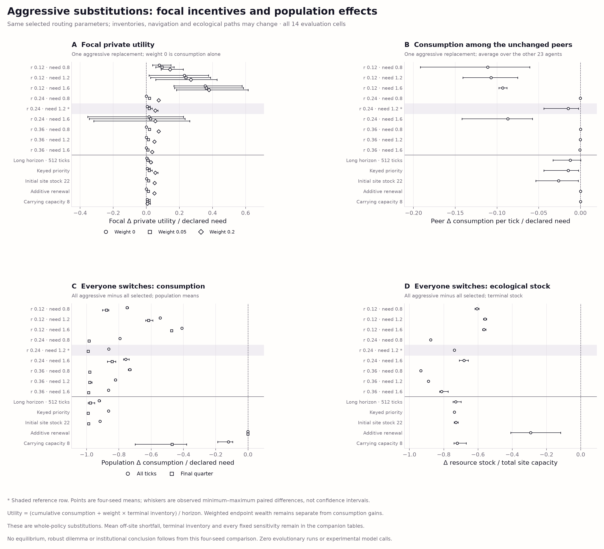

# Purposeful local navigation · Chromatic Field v1

All figures use the completed recorded numerical-selection and fresh-evaluation
bank. No figure rendering executes policies or physics. There is one declared
finite numerical sweep, zero independent evolutionary runs and zero experimental
model calls. Selection and evaluation are separate, and neither is the larger
ecological/incentive qualification gate.



[SVG](candidate-selection.svg) · [PDF](candidate-selection.pdf) · [PNG](candidate-selection.png)

**Selection caption.** All 18 supplied combinations of reserve 0/2/4 needs,
voluntary stock floor 0/0.25/0.5, and nearest/net-yield routing are retained.
Each candidate runs on nine grid cells and tuning seeds 62001–62002, yielding
18 environments and 324 total episodes. Panel A shows mean consumption divided
by case need (the primary objective) and mean final-quarter consumption divided
by need (the exact-tie secondary criterion). Rows follow descending primary,
then secondary score, then ascending candidate ID. The shaded starred candidate
`r4-f50-nearest` was selected before evaluation. Panel B retains
the worst single environment and worst two-seed cell mean; neither diagnostic
enters selection. Vertical marker offsets reveal coincident values. A numerical
baseline from this finite family is not a private optimum or global optimum.


[SVG](evaluation-performance.svg) · [PDF](evaluation-performance.pdf) · [PNG](evaluation-performance.png)

**Evaluation caption.** The 56 fresh configurations use seeds 63001–63004,
disjoint from tuning and previous development banks. Panel A includes all nine
grid cells and five fixed sensitivities: longer horizon, keyed priority, lower
starting stocks, additive renewal and carrying capacity 8. Four baseline
populations are compared on identical physical starts. Panel B uses paired
selected-minus-legacy/fixed-forager/fixed-floor consumption differences;
symbols identify the subtracted baseline. Points are four-seed means and
whiskers are observed min–max, **not confidence intervals**. The shaded starred
row is the predeclared reference, r=0.24,
need=1.2, 256 ticks. Panels C–F
show all six conditions' unsmoothed mean reference trajectories over four seeds.
Panel E counts individuals with positive current-tick shortfall who end that
tick off-site; panel F reports stock at sites unoccupied at tick end, divided
by total site capacity. These are evaluator-only diagnostics. Unoccupied stock
does not establish reachability or sustainable harvest. Conditions use labels,
markers and neutral line styles; society colors are not assigned. The selected parameters differ from both fixed anchor settings.



[SVG](aggressive-effects.svg) · [PDF](aggressive-effects.pdf) · [PNG](aggressive-effects.png)

**Aggressive-substitution caption.** Panels A and B replace one predeclared
selected focal agent with the aggressive version while its 23 peers retain
the selected baseline. Focal private utility is `(consumption + weight ×
terminal inventory) / horizon`, then divided by need; weight zero measures
consumption alone. Peer effects average over peers before pairing across seeds.
Panels C and D substitute the aggressive controller for everyone and show
population consumption (all ticks and final quarter) and terminal-stock
differences from the all-selected population. All 14 cells and all wealth
weights are retained. Whiskers again show the observed four-seed min–max,
not confidence intervals. Aggressive controllers retain selected routing
parameters but realized navigation, inventory and ecological paths can differ;
these are whole-policy interventions, not isolated harvesting mechanisms.

Complete recorded tables:

- [All candidate scores, parameters and exact selection rank](candidate-scores.csv)
- [Every tuning environment/candidate outcome](tuning-case-scores.csv)
- [All six evaluation condition means in every cell](condition-means.csv)
- [All paired selected-minus-baseline diagnostics](selected-effects.csv)
- [All focal effects, including terminal inventory](focal-effects.csv)
- [All widespread-aggressive effects](widespread-effects.csv)
- [All six reference trajectories and saved diagnostic means](reference-trajectories.csv)

Effect tables retain the original units in their field names; focal terminal
inventory is an unnormalized endpoint. Reference columns prefixed `mean_`
are four-seed means of the named recorded tick field; normalized plotting
columns explicitly name their denominator. Consumption and shortfall are
complementary outcomes, not independent welfare measures. The same environment
seeds recur across cells and conditions, so agents, ticks and parameter cells
are not independent replications. Evaluation contains 336
episodes; tuning and evaluation together contain
660 episodes. No curve uses
earlier-bank means from unmatched seeds. Once inspected, evaluation outcomes
are available to later development and are not untouched for a later study.

The renderer first calls `development_navigation_v1.verify(source, replay=False)`.
That verifies the source freeze, complete inventories and hashes, exact tuning
selection, selection bindings and recomputed saved aggregates, without semantic
replay. Full semantic replay remains the study verifier's separate job. The
figure manifest pins every input artifact, renderer/helper source, software
version and output hash. Same-runtime rerenders are deterministic; byte identity
across software versions is not asserted.

```bash
.venv/bin/python scripts/visualize_commons_v3_navigation_v1.py \
  --source evidence/commons-v3-navigation-v1 \
  --output figures/commons-v3-navigation-v1
```
