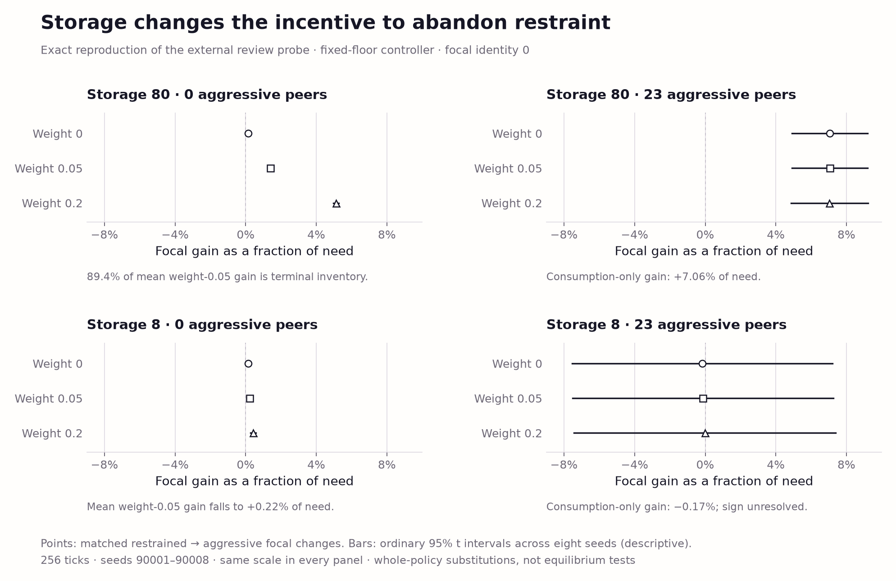

# External temptation probe, 7 October 2026

Focal private gain from switching the frozen fixed-floor controller to its supplied aggressive variant, divided by need, at storage capacities 80 and 8 and with 0 or 23 aggressive peers. Utility weights 0, 0.05 and 0.2 rescore identical trajectories. Points are eight-seed means; bars are the supplied probe's ordinary descriptive 95% Student-t intervals (critical value 2.365, df=7). Weight 0 is consumption only. At capacity 80 with restrained peers, 89.4% of mean weight-0.05 gain is terminal inventory. At capacity 8 with aggressive peers, the consumption-only sign is unresolved. Focal identity is fixed at 0; these 64 episodes do not establish a private optimum or a formal assurance-game classification.

Exports: [SVG](temptation-storage.svg), [PDF](temptation-storage.pdf), [PNG](temptation-storage.png). Source and output hashes are in [manifest.json](manifest.json).
