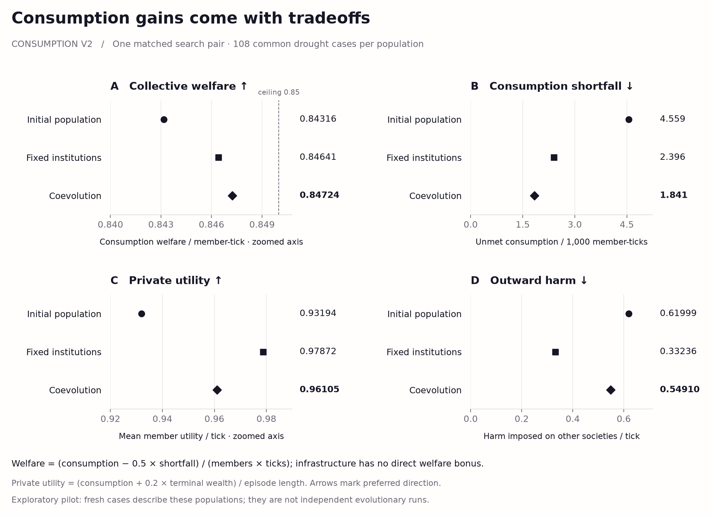
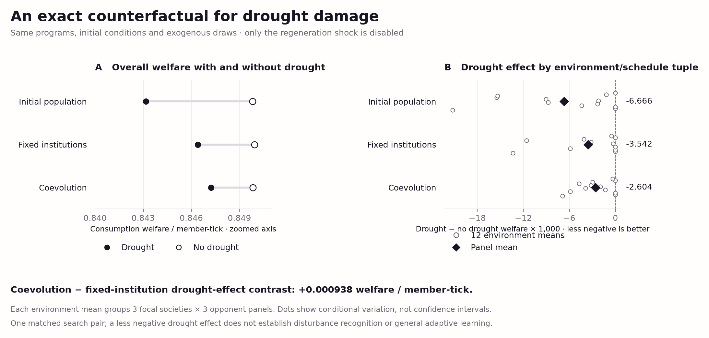
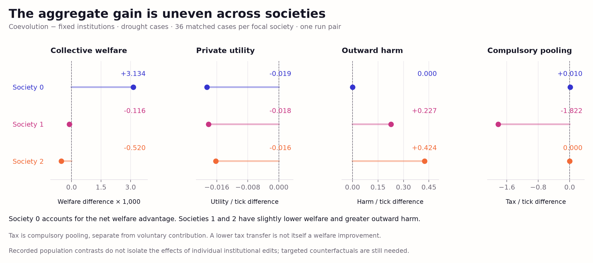

# Consumption-v2 pilot figures

Recorded outcomes from **one matched search pair**: 30 minutes of coevolution
and 30 minutes of member-only evolution with fixed institutions. Each final
population and the common initial population received 108 drought cases and
108 matched no-drought rollouts: 648 rollouts in total. The cases cross twelve
environment/schedule tuples, three opponent panels, and three focal societies.
They are not independent evolutionary replications.

The figures follow [Chromatic Field v1](../../docs/visual-reference.md).
[The manifest](manifest.json) records captions, source/output hashes, and
software versions; [the render review](render-review.json) records visual and
reproduction checks.

**Consumption welfare and private tradeoffs**



[SVG](outcome-tradeoffs.svg) · [PDF](outcome-tradeoffs.pdf) · [PNG](outcome-tradeoffs.png)

Equal-weight drought-case means show slightly higher welfare and less unmet
consumption under coevolution than under fixed institutions, alongside lower
private utility and more outward harm. Welfare and utility axes are zoomed.
The four panels are not four independent endpoints: with consumption need
fixed at 0.85,

`welfare = (consumption − 0.5 × shortfall) / (members × ticks)`

`welfare = 0.85 − 1.5 × shortfall per member-tick`.

Infrastructure earns no direct welfare bonus. Private utility is
`(consumption + 0.2 × terminal personal wealth) / episode length`, averaged
over members. Outward harm measures material harm imposed on other societies
per tick; it is not a welfare score or a per-member rate.

**Matched drought effects**



[SVG](matched-drought-effects.svg) · [PDF](matched-drought-effects.pdf) · [PNG](matched-drought-effects.png)

The left panel compares drought welfare with its exact no-drought
counterfactual. Programs, initial conditions, and exogenous random draws are
matched; only the regeneration shock is disabled. The right panel shows
twelve environment/schedule means, each grouping all nine focal-society and
opponent combinations. Diamonds show full-panel means. Dots describe
conditional environmental variation, not confidence intervals or independent
searches. The coevolution-minus-fixed contrast is **+0.000938** welfare per
member-tick: less damage from this modeled drought, without establishing
disturbance recognition or general adaptive learning.

**Differences across societies**



[SVG](society-tradeoffs.svg) · [PDF](society-tradeoffs.pdf) · [PNG](society-tradeoffs.png)

Each contrast is coevolution minus fixed institutions, averaging 36 common
drought cases per focal society. Society 0 accounts for the net welfare
advantage; societies 1 and 2 have slightly lower welfare and greater outward
harm. Private utility decreases in all three. Stable colors identify
societies. Tax is compulsory pooling, separate from voluntary contribution.
These population contrasts do not isolate causal effects of institutional
changes.

Reproduce all figures from the portable [recorded scalar data](plot-data.json),
without search, simulation, or access to the full local run archives. Run from
the repository root:

```bash
.venv/bin/python -m swarm_societies.visualize_consumption \
  --data figures/consumption-v2/plot-data.json \
  --output figures/consumption-v2
```

[Aggregate results](results.csv) and
[society/opponent means](society-opponent-means.csv) retain the metric units
and drought/no-drought distinction. The
[prospective protocol](../../docs/protocol-consumption-v2.md) defines the
comparison and its interpretation limits.
